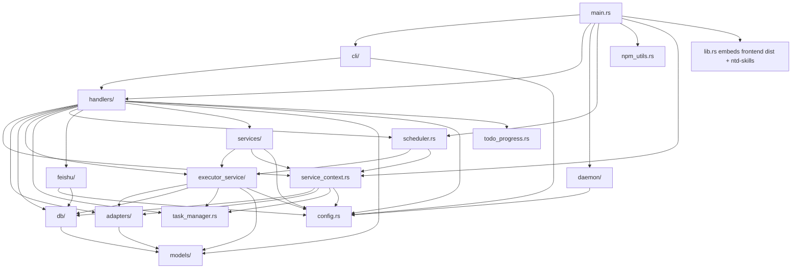

# ntd Backend 架构

> 配套文档：[README.md](./README.md) · [SEQUENCE.md](./SEQUENCE.md) · [CONFIG.md](./CONFIG.md)

本文档面向需要快速理解后端全貌的工程师：模块依赖、关键流程、数据模型、跨切关注点。
关键流程的 step-by-step 时序图见 [SEQUENCE.md](./SEQUENCE.md)。

---

## 1. 总览

ntd 后端是一个单进程 async 应用：

- HTTP/WebSocket 服务（Axum）+ CLI 子命令（Clap）
- SQLite（WAL + 外键）
- Cron 调度器（tokio-cron-scheduler）
- 多路飞书长连接（每 bot 一条 WebSocket）
- 多执行器子进程池（Claude Code / Codex / OpenCode / Hermes / Kimi / MiMo / MobileCoder / CodeWhale / Pi / CodeBuddy / AtomCode / Zhanlu / Kilo）

**核心思想**：所有"用户视角的工作单元"都是 Todo；执行时把 Todo 的 `prompt` 喂给一个 AI CLI 子进程，解析 stdout/stderr，把进度、产物、统计通过 broadcast 通道实时推到前端。

---

## 2. 模块依赖图



> **`service_context`** 是依赖容器：db、executor_registry、tx（broadcast::Sender<ExecEvent>）、task_manager、config。所有需要这些依赖的模块都通过它获取，避免显式传 5+ 参数。

---

## 3. 数据模型 ER

```mermaid
erDiagram
    todos ||--o{ execution_records : "has many"
    todos ||--o{ todo_tags : "labeled"
    tags ||--o{ todo_tags : "applied to"
    execution_records ||--o{ execution_logs : "stdout/stderr lines"
    execution_records ||--o| execution_records : "auto review (source_execution_record_id)"
    executors ||..|| todos : "executor column (loose FK)"
    project_directories ||--o{ todos : "workspace"
    todo_templates ||..o{ todos : "spawned from"
    review_templates ||..o{ execution_records : "auto review"

    loops ||--o{ loop_steps : "has many"
    loops ||--o{ loop_executions : "executions"
    loops ||--o{ loop_triggers : "triggers"
    loops ||--o{ loop_tags : "labeled"
    loop_steps ||--o{ loop_step_executions : "step runs"
    loop_executions ||--o{ loop_step_executions : "step runs"

    agent_bots ||--o{ feishu_homes : "p2p chats"
    agent_bots ||--o{ feishu_messages : "received"
    agent_bots ||--o{ feishu_history_chats : "polled groups"
    agent_bots ||--o{ feishu_project_bindings : "chat→project"
    agent_bots ||--o{ feishu_push_targets : "push level config"
    agent_bots ||--o{ feishu_response_config : "per-target debounce"
    agent_bots ||--o{ feishu_group_whitelist : "sender allowlist"

    sync_records }|..|| todos : "cloud sync delta"
    sync_records }|..|| tags : "cloud sync delta"
    sync_records }|..|| todo_templates : "cloud sync delta"
    sync_records }|..|| project_directories : "cloud sync delta"

    usage_stats ||--o{ usage_executor_daily : "per executor per day"
    usage_stats ||--o{ usage_model_breakdown : "per model per day"

    todos {
        i64 id PK
        string title
        string prompt
        string status
        string executor
        bool scheduler_enabled
        string scheduler_config
        string scheduler_timezone
        string task_id
        string workspace
        bool worktree_enabled
        string hooks
        string acceptance_criteria
        int todo_type
        i64 parent_todo_id
        bool auto_review_enabled
    }

    execution_records {
        i64 id PK
        i64 todo_id FK
        string status
        string command
        string stdout
        string stderr
        string result
        string usage
        string executor
        string model
        string started_at
        string finished_at
        string trigger_type
        int pid
        string task_id
        string session_id
        string todo_progress
        string execution_stats
        i64 source_todo_id
        string source_todo_title
        i64 source_hook_id
        int rating
        i64 source_execution_record_id
        string last_review_status
        string last_reviewed_at
    }

    execution_logs {
        i64 id PK
        i64 record_id FK
        string stream
        string content
        int64 ts_ms
    }

    executors {
        i64 id PK
        string name UK
        string display_name
        string path
        string session_dir
        bool enabled
    }

    tags {
        i64 id PK
        string name UK
    }

    todo_tags {
        i64 id PK
        i64 todo_id FK
        i64 tag_id FK
    }

    loops {
        i64 id PK
        string name
        string description
        bool enabled
    }

    loop_steps {
        i64 id PK
        i64 loop_id FK
        string name
        string prompt
        string executor
        int sort_order
    }

    loop_triggers {
        i64 id PK
        i64 loop_id FK
        string trigger_type
        string config
        bool enabled
    }

    loop_executions {
        i64 id PK
        i64 loop_id FK
        string status
        string started_at
        string finished_at
    }

    // 「黑板」并不是一个独立列,而是 loop_step_executions.conclusion 按
    // sequence_index ASC 排序后渲染的虚拟视图。运行时通过 `build_blackboard_text`
    // 在每步执行前组装（services/loop_runner.rs），注入到下一步的 prompt。
    // CLI 端用 `ntd loop execution blackboard <eid>` 查看（docs/loop-blackboard-cli.md）。
    loop_step_executions {
        i64 id PK
        i64 loop_execution_id FK
        i64 loop_step_id FK
        i64 execution_record_id FK
        string status
        i32 sequence_index
        string conclusion  "黑板写入内容"
    }

    loop_tags {
        i64 id PK
        i64 loop_id FK
        i64 tag_id FK
    }

    review_templates {
        i64 id PK
        string name
        string prompt_template
        bool is_default
    }

    agent_bots {
        i64 id PK
        string app_id
        string app_secret
        string domain
        string name
    }

    feishu_messages {
        i64 id PK
        i64 bot_id FK
        string message_id UK
        string chat_id
        string sender_open_id
        string content
        bool processed
        i64 processed_todo_id
        i64 execution_record_id
    }

    project_directories {
        i64 id PK
        string name UK
        string path
        string description
    }

    sync_records {
        i64 id PK
        string entity_type
        i64 entity_id
        string operation
        string payload
        string synced_at
    }

    todo_templates {
        i64 id PK
        string title
        string prompt
        string category
        string source_url
        bool is_custom
    }
```

### 3.1 关键表说明

- **`todos.hooks`**：JSON 数组，每项是一条 `TodoHookItem`（id / trigger / target_todo_id / enabled）。父 todo 完成时按 trigger 匹配并启动子 todo。
- **`todos.todo_type`**：0=normal / 1=review template（系统内置）/ 2=auto review instance（运行时派生）。1 和 2 都属于评审链路，不参与普通 UI。
- **`execution_records.source_*`**：hook 触发的执行会快照 source_todo_id / source_todo_title / source_hook_id，便于事后排查；source 改了名字 UI 仍能显示当时的内容。
- **`execution_records.last_review_status`**：自动评审链路状态机，pending → success/failed/interrupted/skipped。
- **`executors.path`**：可执行器二进制路径；空字符串表示直接用 `binary_name`（让 `$PATH` 解析）。
- **`feishu_messages.processed`**：消息是否已被某个 todo 消费；与 `processed_todo_id` 配合做幂等。
- **`sync_records`**：云端同步的 delta 日志；按 entity_type + entity_id 去重。

---

## 4. 关键流程一览

### 4.1 Todo 执行链路（HTTP 触发）

```
HTTP POST /api/execute
  → handlers/execution.rs::start_todo_execution
  → executor_service::run_todo_execution
      ├─ task_manager.register(uuid)              // 申请 cancel 通道
      ├─ 并发上限检查 (max_concurrent_todos)
      ├─ adapters::ExecutorRegistry::get_or_default  // 选执行器
      ├─ db.create_execution_record               // 落 status=Running
      ├─ tx.send(Started)                         // 推 WebSocket
      ├─ spawn child process via command-group    // setpgid
      ├─ async BufReader 读 stdout/stderr         // 解析日志
      ├─ tx.send(Output) per line                 // 实时推 UI
      ├─ db.update_execution_record(status=ok/failed)
      ├─ tx.send(Finished)
      ├─ hooks.fire_for_todo(todo_id, ctx)        // 父→子级联
      └─ task_manager.remove(uuid)
```

详细时序见 [SEQUENCE.md §1](./SEQUENCE.md#1-执行-todo-的端到端流程)。

### 4.2 Cron 调度链路

```
config.yaml 启动 → scheduler.load_from_db(&ctx)
  → 遍历 todos WHERE scheduler_enabled=1
  → for each: convert_cron_to_utc(cron, tz)
  → JobScheduler::new(Job::new_async)
  → sched.start()
  → 每 tick: Job 回调 executor_service::run_todo_execution(trigger_type="cron")
```

### 4.3 飞书消息链路

```
飞书 WS 接收事件
  → feishu/channel.rs codec 解码
  → services::feishu_listener::on_message
  → feishu_project_bindings 查找 chat_id → project_dir
  → todo 解析（按 slash command 匹配 / 落到 default_response_todo_id / 走绑定）
  → MessageDebounce.push(PendingMessage)
      ├─ 同 (bot_id, chat_id) 已有 buffer → abort 旧 timer、合并消息
      └─ 新 key → 注册 timer (debounce_secs 后 flush)
  → flush: executor_service::run_todo_execution(trigger_type="feishu")
```

### 4.4 Hook 触发链路

```
子 task Finished(success=true)
  → hooks/service.rs::fire_for_todo(parent_id, ctx)
  → 读 parent.hooks JSON → 解析 TodoHookItem[]
  → 过滤 trigger 匹配项
  → chain 检测（含 target_todo_id 即跳过，防环）
  → executor_service::run_todo_execution(source_todo_id=parent.id, trigger_type="hook:...")
```

### 4.5 自动评审链路

```
子 task Finished
  → 若 parent.auto_review_enabled=true 且 todo_type=normal
  → services::auto_review::spawn_review(parent_id, record_id)
  → review_templates 表 ensure_default_review_template() 拿默认模板 id
  → 合成评审 prompt (截断原 output + 模板占位符替换)
  → db::todo::create_review_instance_todo() 新建 todo_type=2 实例
     (parent_todo_id=原 todo, review_template_id=模板 id, executor=原 todo.executor)
  → executor_service::run_todo_execution(trigger_type="auto_review")
  → 评审完成 → execution_records.rating + last_review_status="success"
```

注：V15 之后评审模板独立成 `review_templates` 表（不再挂 todo_type=1 行）。
loop 评分闸门路径走同一条 `create_review_instance_todo`，但 parent_todo_id=0
（loop step 无单一 source todo），executor 继承自被评审的 record。

---

## 5. 跨切关注点

### 5.1 并发与取消

- **单 todo 并发上限**：`max_concurrent_todos`，按 todo_id 计数（全局默认 3，可通过 HTTP `/api/config` 调）。
- **全局执行上限**：通过 `TaskManager` 已注册任务数间接控制；DB 里 `status='running'` 记录数与 `TaskManager.tasks` 大致对齐。
- **取消**：`TaskManager.cancel(task_id)` 通过 `mpsc::UnboundedSender<()>` 发送信号；`executor_service` 收到后调用 `child.kill()`（command-group 自动 kill 整个进程组）。
- **孤儿清理**：启动时 `cleanup_orphan_execution_records` 把 status=running 但进程已退出的记录标为 failed。

### 5.2 超时

- `Config.execution_timeout_secs`：默认 3600 秒；设 0 表示不限制；上限 604800（7 天）。
- 超时由 `executor_service` 中 `tokio::time::timeout` 包裹的 future 实现；超时会 kill 子进程并写 `status='timeout'`。
- YAML 直接编辑时 `clamp_execution_timeout_secs()` 是统一 enforcement 点。

### 5.3 事件总线

- 类型：`broadcast::Sender<ExecEvent>`（容量 100，详见 issue #503）。
- 事件：`Started` / `Output` / `Finished` / `Sync` / `TodoProgress` / `ExecutionStats` / `ReviewStatusChanged` / `LoopFinished`。
- 前端 WebSocket 收到 `Sync` 时清空当前列表并用服务端推的 `TaskInfo[]` 重建。
- 高负载下容量可能不足，需要按需调大。

### 5.4 路径与配置归一化

- `Config::normalize_paths()`：展开 `~`、相对路径转绝对；裸命令名（无 `/`）原样保留供 `$PATH` 解析。
- `Config::clamp_execution_timeout_secs()`：YAML 级别的兜底校验，防止用户绕过 HTTP 验证。
- 配置文件写入走 `temp + rename` 原子写，崩溃时不损坏。

### 5.5 飞书去抖

- `MessageDebounce`：按 `(bot_id, chat_id)` 聚合；新消息到达时 abort 旧 timer，新 timer 在 `debounce_secs` 后 flush。
- 设计目的：用户在群里连发多条只触发一次 todo 执行；保留最后一条消息 + 历史摘要。

### 5.6 Hook chain 防环

- `RunTodoExecutionRequest.chain`：当前路径上所有 todo_id。
- hook fire 时若 `target_todo_id ∈ chain` 直接跳过；避免 A→B→A 死循环。

---

## 6. 进程模型

### 6.1 子进程组

- 所有 AI CLI 通过 `command-group::AsyncGroupChild` 启动，自动 `setpgid`。
- 取消时 `kill()` 会 kill 整个进程组，避免留下孤儿孙子进程。
- Unix only；macOS / Linux 行为一致。

### 6.2 Daemon 管理

- macOS：launchd plist，标签 `com.weibaohui.ntd`。
- Linux：systemd user unit，文件 `~/.config/systemd/user/ntd.service`。
- `ntd daemon install` 写对应描述文件；`start` 调用 `launchctl bootstrap` / `systemctl --user start`。

### 6.3 升级路径

- `ntd upgrade`：当前实现是 `npm install -g @weibaohui/ntd@latest` + 重新部署 daemon。
- 已知耦合问题（issue #517）：硬编码 npm 包名；非 npm 安装（cargo install / deb / 手动下载二进制）走不通。

---

## 7. 测试策略

| 层 | 类型 | 工具 |
|----|------|------|
| 单元 | 配置归一化 / 时区换算 / 占位符替换 | `#[cfg(test)] mod tests` |
| 集成 | HTTP 路由 / DB CRUD | `tests/` + `tempfile` |
| 异步 | 并发上限 / 取消 / 超时 | `#[tokio::test]` |
| 端到端 | Playwright（前端） | `frontend/tests` |

新增模块请至少覆盖：
- 公共 API 正常路径
- 边界（空 / max / 非法输入）
- 异步时序（race / cancel / timeout）

---

## 8. 已知技术债（部分）

- `db/mod.rs` 单文件约 2150 行，可拆 entity repository。
- `daemon.rs` 单文件约 1044 行，可拆 platform-specific launchd / systemd。
- `executor_service.rs` 单文件约 1031 行，可拆 process spawn / log parser / timeout。
- `CodeExecutor` 适配器 boilerplate 重复 11 次，可考虑宏生成（issue #504）。
- 详见 issue 列表。
