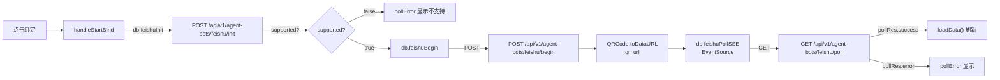
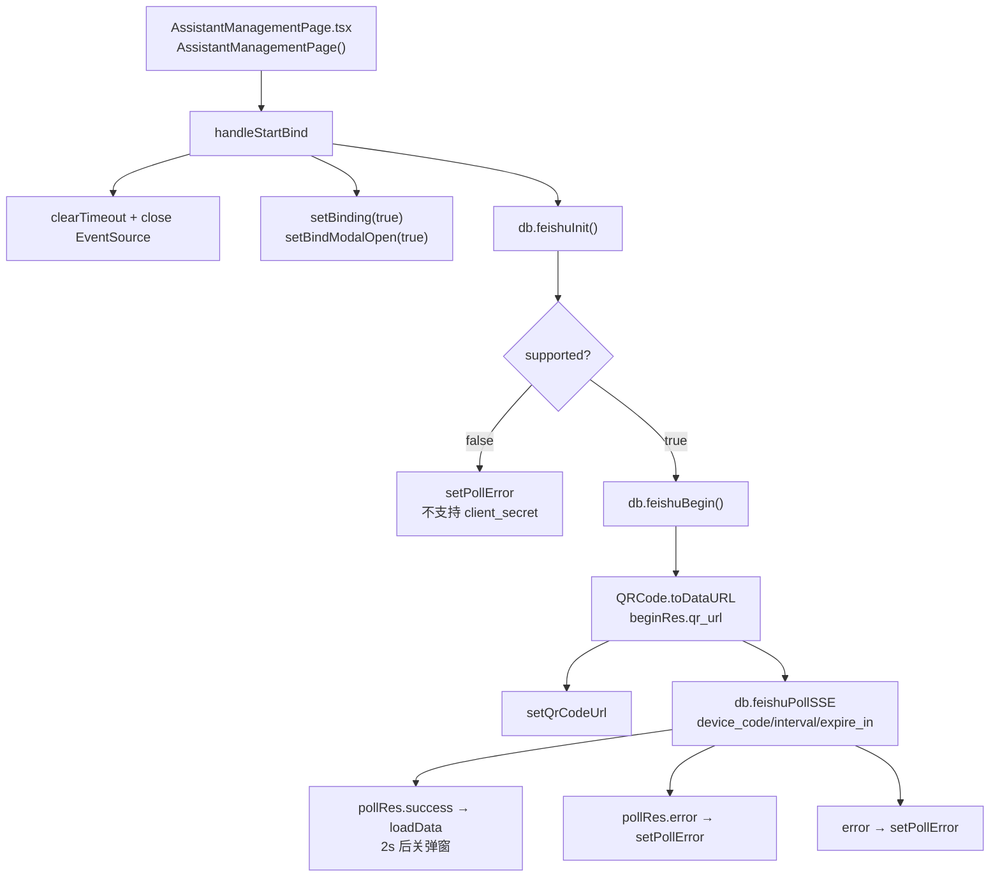
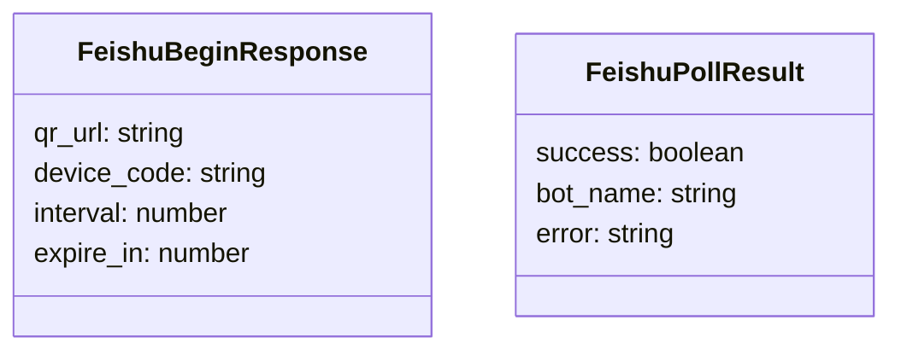
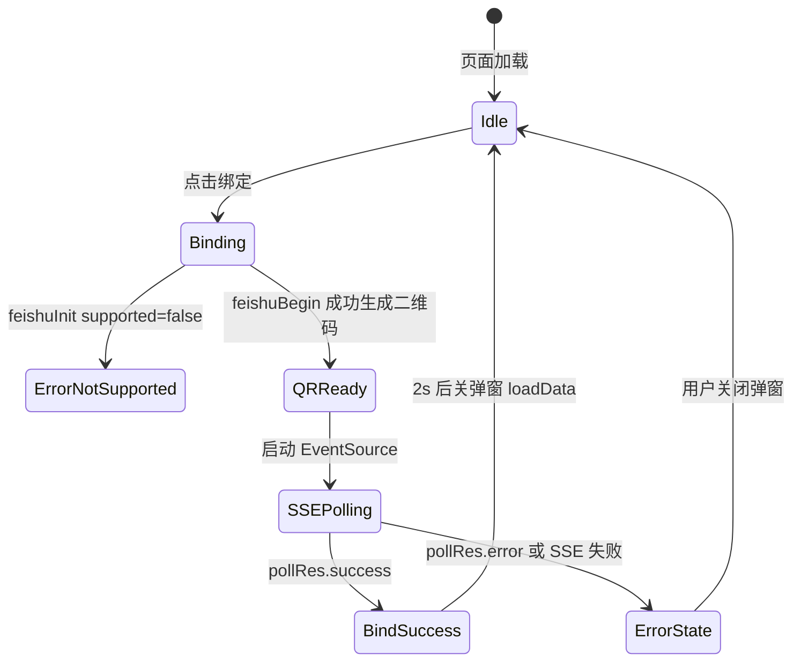

# 绑定智能助手

## 功能位置
智能助手页 → 页面右上角「绑定智能助手」按钮（`PlusOutlined`，type=primary）

## 数据流图（前端 → 后端）

## 谑用关系链路图

## 数据结构图

## 数据变更图

## 开发指导
- **前端入口**：`frontend/src/components/assistant-management/AssistantManagementPage.tsx` 的 `handleStartBind` 回调；`feishuPollSSE` 来自 `frontend/src/utils/database/bots.ts`
- **后端入口**：`backend/src/handlers/agent_bot.rs` 处理 `feishu/init`、`feishu/begin`、`feishu/poll`（SSE）
- **注意**：绑定时不传 `workspaceId`，绑定的 Bot 默认不分配工作空间，用户可在配置抽屉中选择服务工作空间；组件卸载时必须 `feishuEventSource?.close()` 和 `clearTimeout` 清理资源
- **扩展**：新增其他平台绑定时复用二维码 + SSE 轮询模式，`bot_type` 追加值并在 `feishuInit` 之前做平台分发
