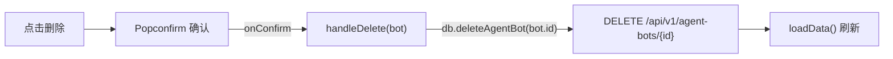
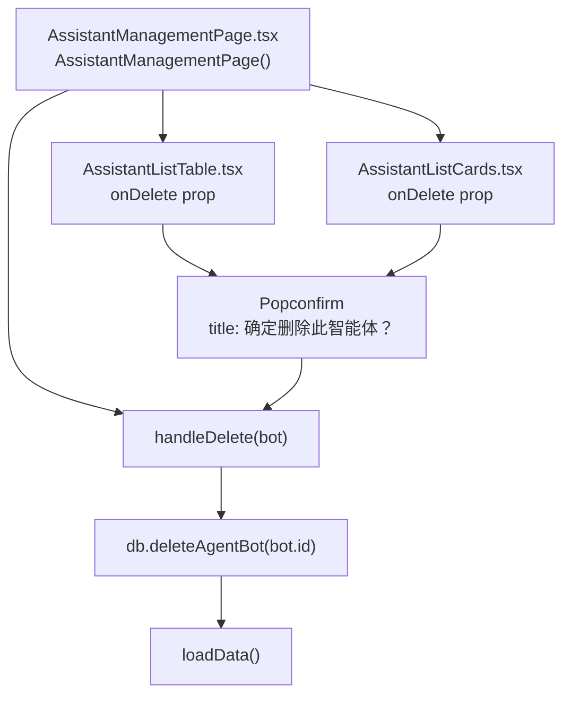
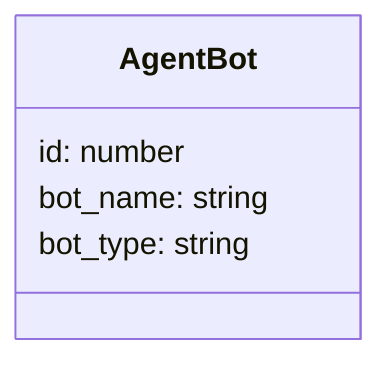
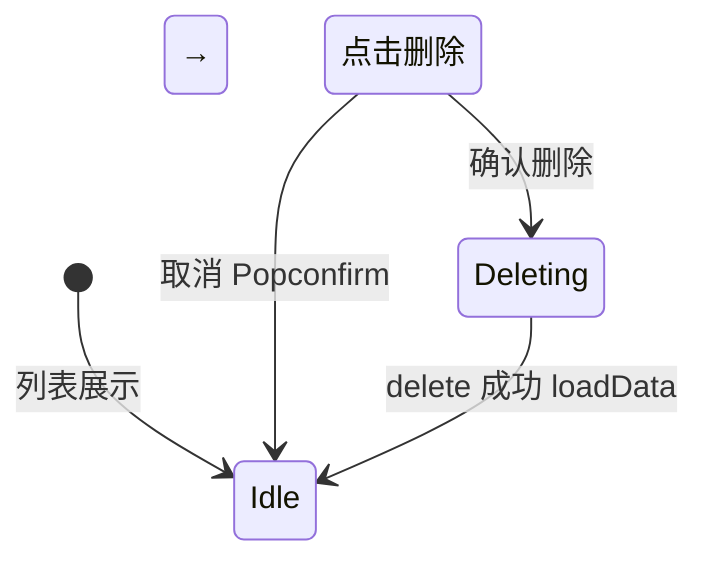

# 删除智能助手

## 功能位置
智能助手页 → 列表/卡片「删除」按钮（`DeleteOutlined`，danger）→ `Popconfirm`「确定删除此智能体？」

## 数据流图（前端 → 后端）

## 谑用关系链路图

## 数据结构图

## 数据变更图

## 开发指导
- **前端入口**：`frontend/src/components/assistant-management/AssistantManagementPage.tsx` 的 `handleDelete` 回调；传递给 `AssistantListTable` / `AssistantListCards` 的 `onDelete` prop
- **后端入口**：`backend/src/handlers/agent_bot.rs` 处理 `DELETE /api/v1/agent-bots/{id}`，删除 bot 及关联的推送规则、白名单等
- **注意**：删除前用 `Popconfirm` 二次确认；`deleteAgentBot` 无返回体（`await api.delete`），失败时 catch 静默不弹错误
- **扩展**：如需删除前检查是否仍有运行中任务，后端 delete handler 追加前置校验并返回 409
