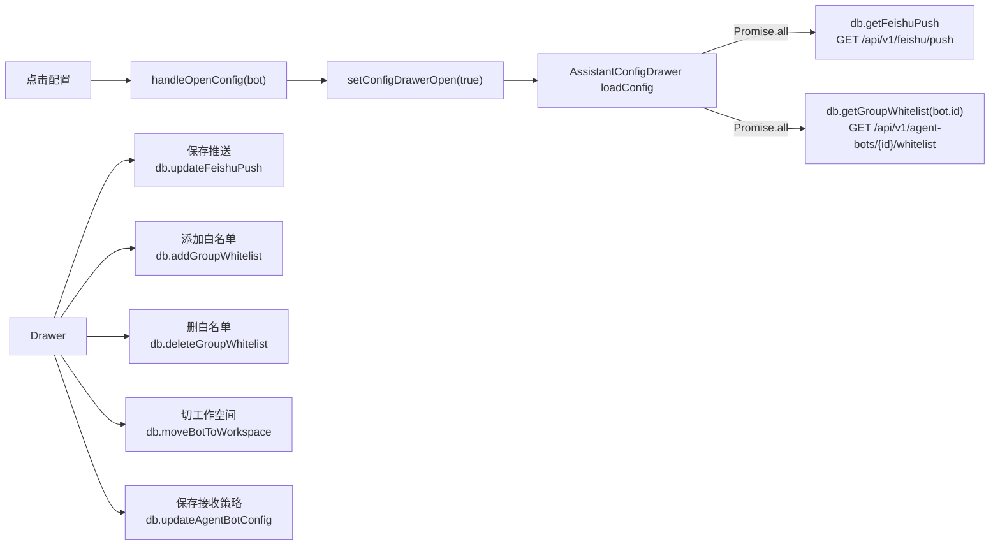
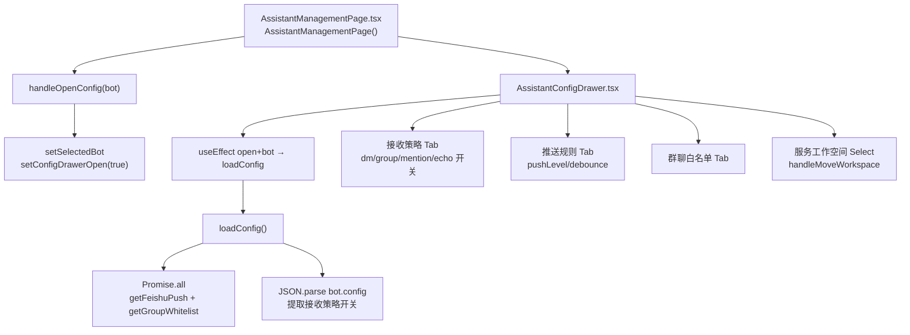
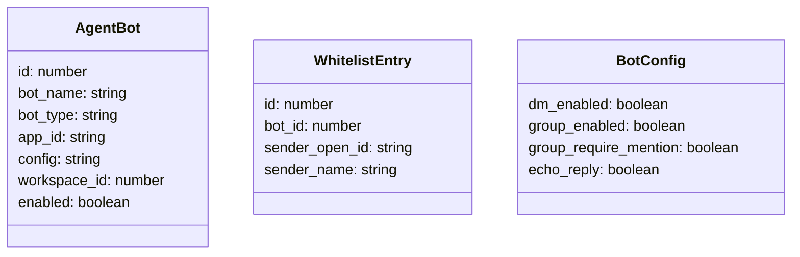
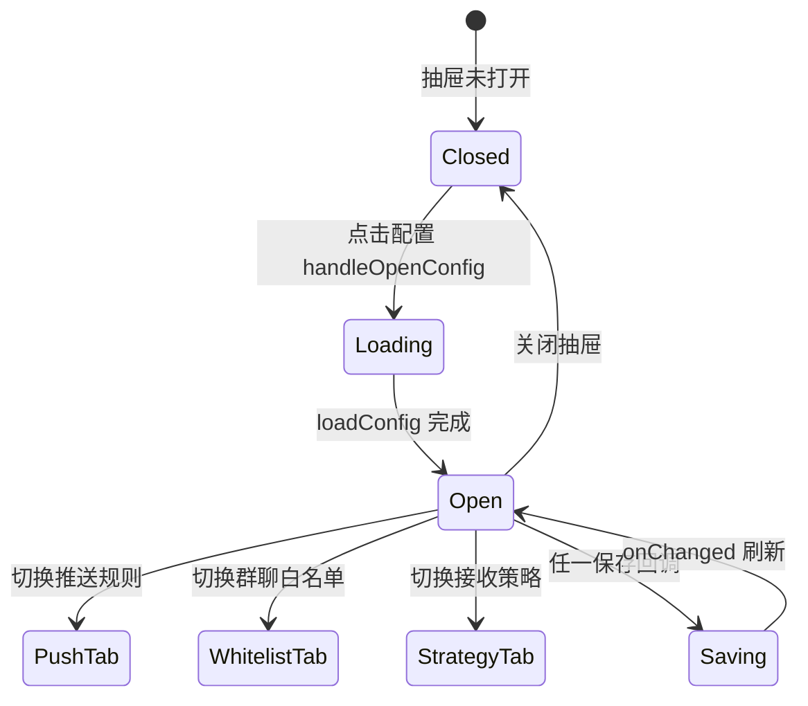

# 打开配置抽屉

## 功能位置
智能助手页 → 列表/卡片「配置」按钮（`SettingOutlined`）→ `AssistantConfigDrawer` 抽屉

## 数据流图（前端 → 后端）

## 谑用关系链路图

## 数据结构图

## 数据变更图

## 开发指导
- **前端入口**：`frontend/src/components/assistant-management/AssistantConfigDrawer.tsx` 的 `AssistantConfigDrawer` 组件；由 `AssistantManagementPage` 的 `handleOpenConfig` 驱动
- **后端入口**：`backend/src/handlers/agent_bot.rs` 处理 whitelist / workspace-move；飞书推送规则接口见 `backend/src/handlers/` 对应的 feishu push handler
- **注意**：`bot.config` 是 JSON 字符串，接收策略开关（`dm_enabled` 等）存在其中，保存时需 `JSON.stringify` 后调 `db.updateAgentBotConfig`
- **扩展**：新增抽屉 Tab 时在 `activeTab` union 追加值并添加条件渲染分支 + 对应保存回调
