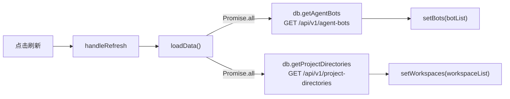
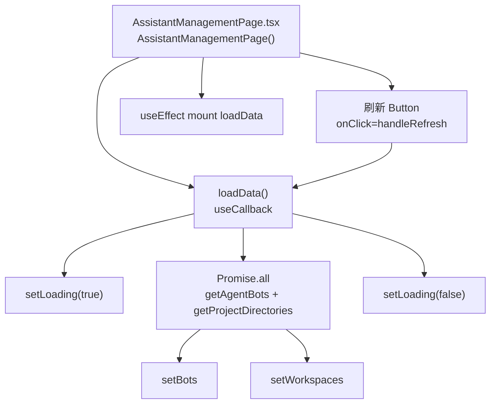
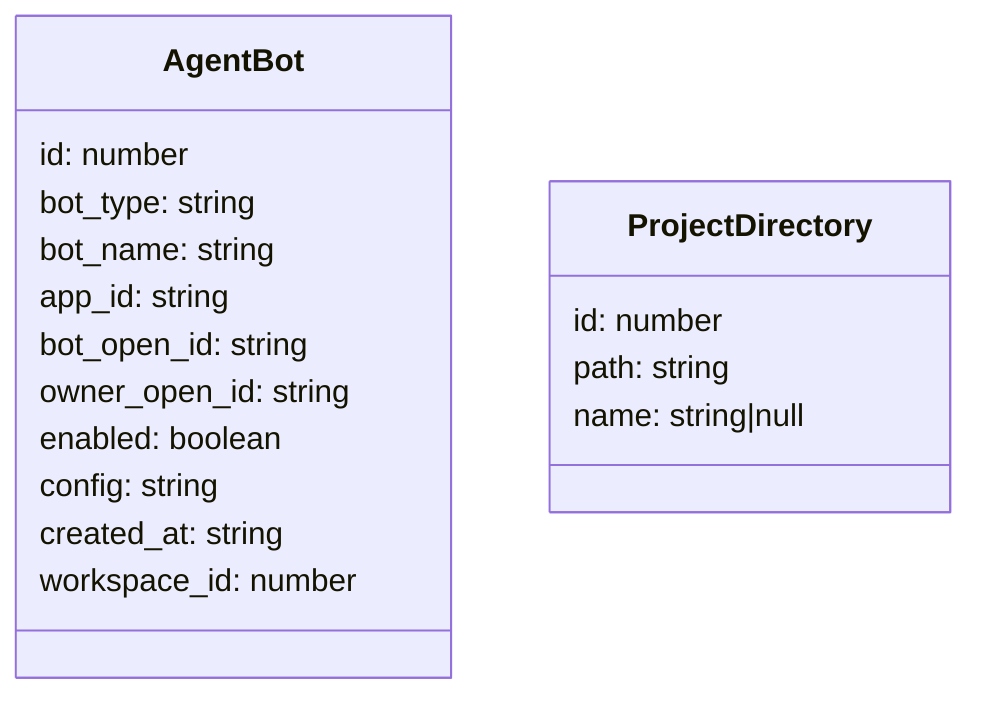
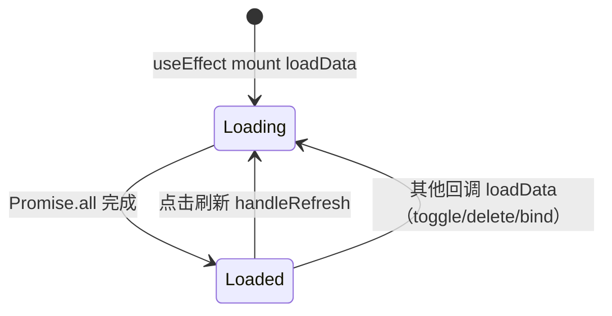

# 刷新智能助手列表

## 功能位置
智能助手页 → 页面右上角「刷新」按钮（`EyeOutlined`）

## 数据流图（前端 → 后端）

## 调用关系链路图

## 数据结构图

## 数据变更图

## 开发指导
- **前端入口**：`frontend/src/components/assistant-management/AssistantManagementPage.tsx` 的 `loadData` / `handleRefresh` 回调
- **后端入口**：`backend/src/handlers/agent_bot.rs` 处理 `GET /api/v1/agent-bots`；`backend/src/handlers/project_directory.rs` 处理 `GET /api/v1/project-directories`
- **注意**：`loadData` 用 `Promise.all` 并发拉取 bots 和 workspaces，任何回调（toggle/delete/bind/configChanged）都会触发整页 loadData 刷新
- **扩展**：新增智能助手平台类型时 `AgentBot.bot_type` 追加值，列表渲染的 `Tag color` 映射需同步更新
