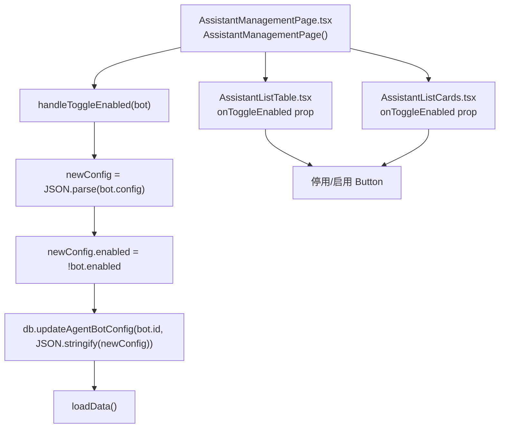
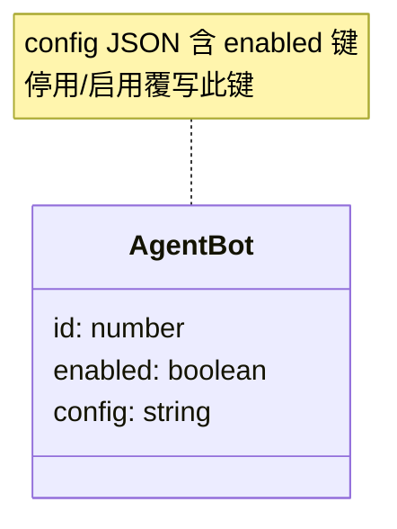
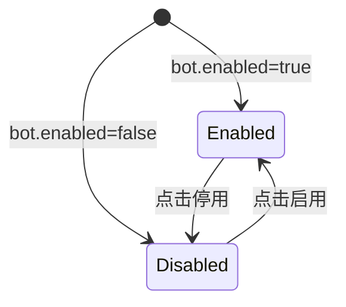

# 启用/停用智能助手

## 功能位置
智能助手页 → 列表/卡片「停用 / 启用」按钮（`PoweroffOutlined`，`danger` 随当前启用态切换）

## 数据流图（前端 → 后端）

## 谑用关系链路图

## 数据结构图

## 数据变更图

## 开发指导
- **前端入口**：`frontend/src/components/assistant-management/AssistantManagementPage.tsx` 的 `handleToggleEnabled` 回调；传递给 `AssistantListTable` / `AssistantListCards` 的 `onToggleEnabled` prop
- **后端入口**：`backend/src/handlers/agent_bot.rs` 处理 `PUT /api/v1/agent-bots/{id}/config`，接收 `{ config: string }` JSON
- **注意**：`enabled` 标志存在 `bot.config` JSON 内而非独立列，切换时需先 `JSON.parse` → 覆写 → `JSON.stringify` → PUT，不可直接 patch `enabled`
- **扩展**：如需将 `enabled` 提升为独立 DB 列，后端 schema migration + handler 改 PUT 接收 `{ enabled: boolean }`，前端改用对应 API
