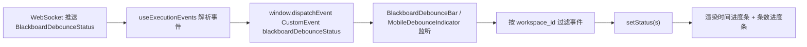
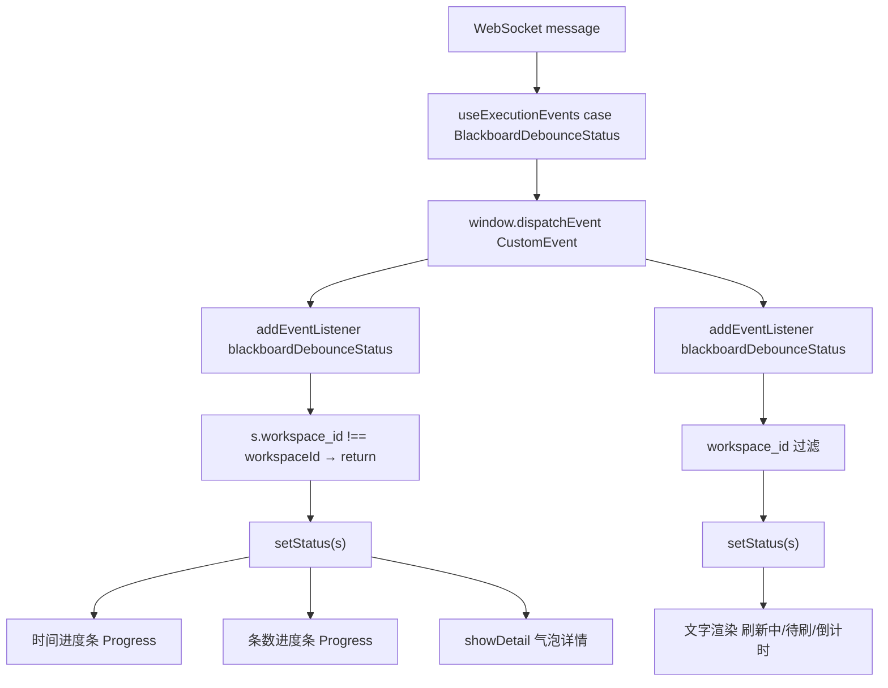
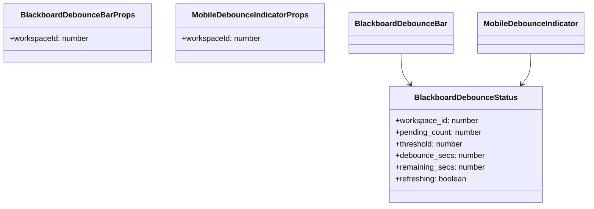
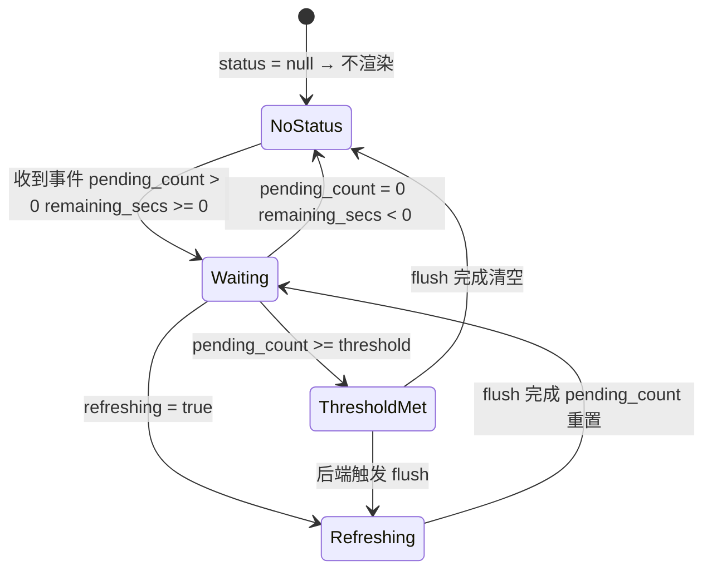

# 防抖双进度条

## 功能位置

黑板页 → 桌面端标题栏内 `BlackboardDebounceBar`（双 Progress 进度条）；移动端标题后缀 `MobileDebounceIndicator`（文字指示器）

## 数据流图（前端 → 后端）

## 调用关系链路图

## 数据结构图

## 数据变更图

## 开发指导

- **前端入口**：`frontend/src/components/BlackboardPage.tsx` 的 `BlackboardDebounceBar`（桌面端）和 `MobileDebounceIndicator`（移动端）组件；事件源自 `frontend/src/hooks/useExecutionEvents.ts` 的 `BlackboardDebounceStatus` case
- **后端入口**：后端 WebSocket 在防抖周期内推送 `BlackboardDebounceStatus` 事件，含 `pending_count` / `threshold` / `debounce_secs` / `remaining_secs` / `refreshing` 字段
- **注意**：事件用 `window.addEventListener('blackboardDebounceStatus', handler)` 监听，组件卸载时必须 `removeEventListener` 清理；`remaining_secs = -1` 表示无 active timer，此时时间进度条不展示数值；`refreshing = true` 时进度条变绿色并 `status='active'` 动画；移动端用文字替代进度条以节省空间
- **扩展**：若需在进度条旁展示「立即触发」按钮，在 `BlackboardDebounceBar` 中追加按钮调用后端 flush 接口；新增防抖状态字段时在 `BlackboardDebounceStatus` 接口和后端事件推送中同步添加
