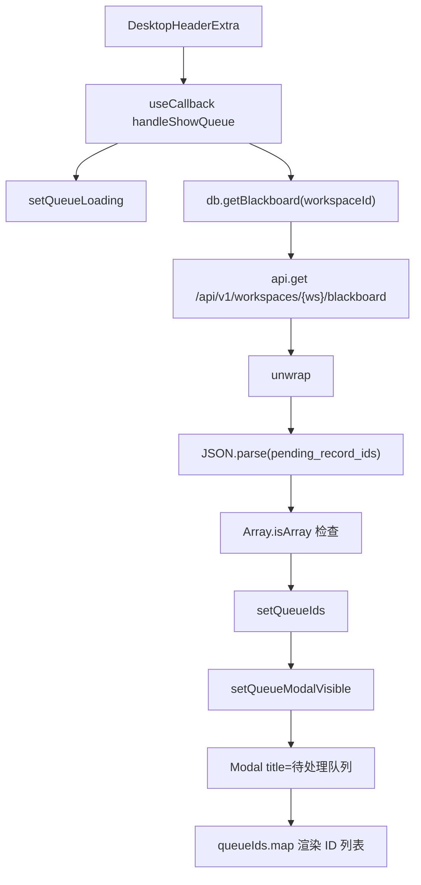
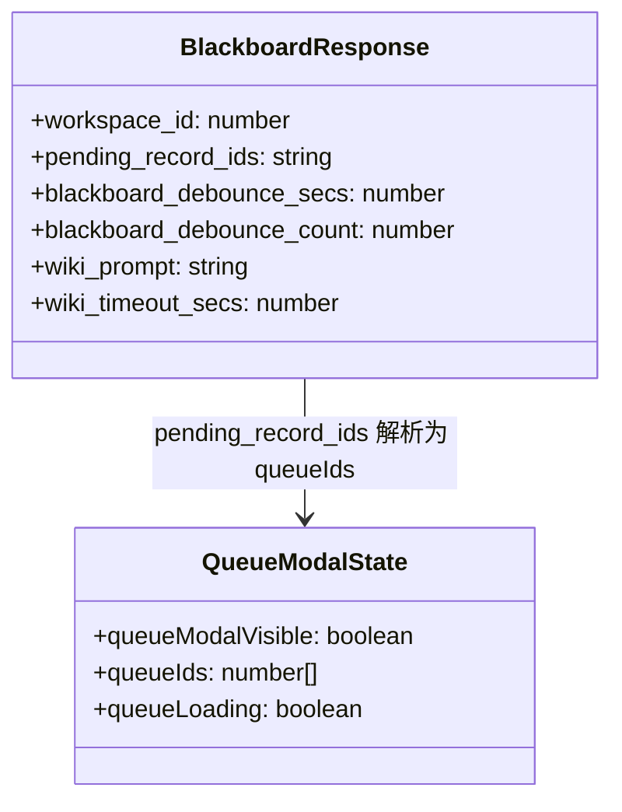
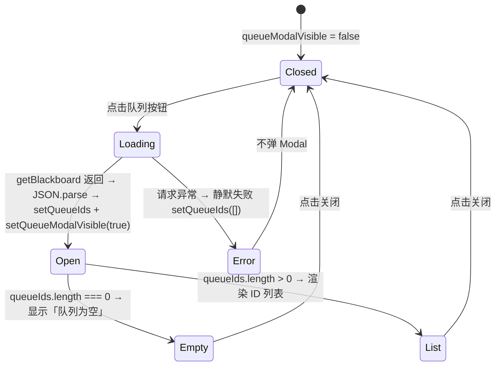

# 查看待处理队列

## 功能位置

黑板页 → 桌面端标题栏右侧的「查看队列 ID」按钮（`UnorderedListOutlined`），仅桌面端 `DesktopHeaderExtra` 有此入口

## 数据流图（前端 → 后端）

```mermaid
flowchart LR
  U[用户点击队列按钮] --> DHE["DesktopHeaderExtra handleShowQueue"]
  DHE --> QL["setQueueLoading(true)"]
  QL --> DB["getBlackboard(workspaceId)"]
  DB --> API["GET /api/v1/workspaces/{ws}/blackboard"]
  API --> H[get_blackboard handler]
  H --> DAO["db 查询 blackboards 表"]
  DAO --> BR["BlackboardResponse 含 pending_record_ids"]
  BR --> PARSE["JSON.parse(board.pending_record_ids)"]
  PARSE --> IDS["number[] 队列 ID 列表"]
  IDS --> SI["setQueueIds(ids)"]
  SI --> SV["setQueueModalVisible(true)"]
  SV --> MOD[队列 ID 弹窗 Modal 渲染列表]
```

## 调用关系链路图

## 数据结构图

## 数据变更图

## 开发指导

- **前端入口**：`frontend/src/components/BlackboardPage.tsx` 的 `DesktopHeaderExtra` 内 `handleShowQueue` 函数
- **后端入口**：`backend/src/handlers/blackboard.rs` 的 `get_blackboard` handler，返回 `BlackboardResponse` 含 `pending_record_ids` JSON 数组字符串
- **注意**：`pending_record_ids` 是 JSON 字符串（如 `"[12, 34, 56]"`），前端需 `JSON.parse` 后用 `Array.isArray` 校验；静默失败时不弹 Modal 只清空列表；移动端无此入口（`MobileHeaderExtra` 不含队列按钮）
- **扩展**：若需在队列中展示每个执行记录的标题或状态，改为批量调用 `db.getExecutionRecord` 或新增后端批量查询接口，在 Modal 中渲染更丰富的行信息
