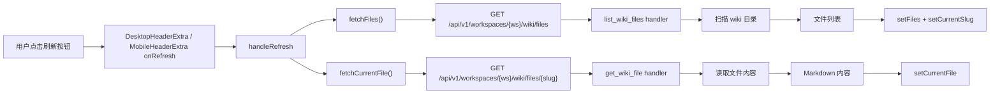
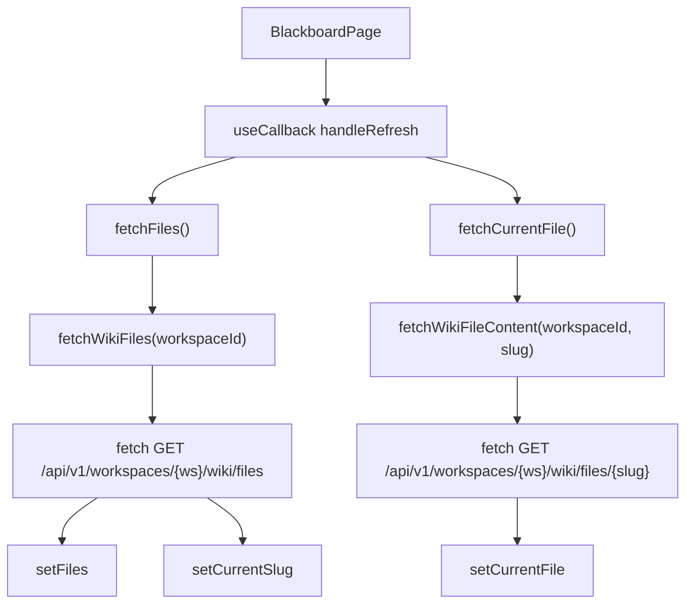
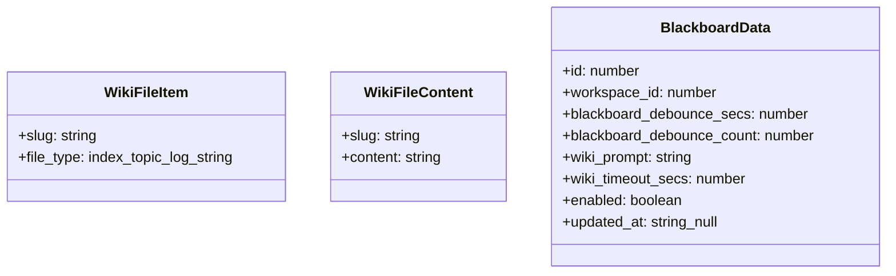
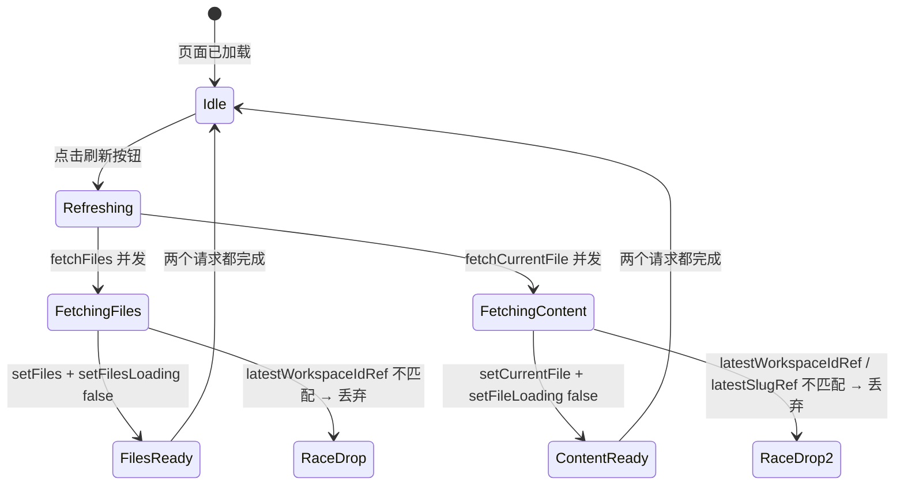

# 刷新黑板

## 功能位置

黑板页 → 顶部标题栏右侧的「刷新」按钮（`ReloadOutlined`），桌面端在 `DesktopHeaderExtra`、移动端在 `MobileHeaderExtra`

## 数据流图（前端 → 后端）

## 调用关系链路图

## 数据结构图

## 数据变更图

## 开发指导

- **前端入口**：`frontend/src/components/BlackboardPage.tsx` 的 `handleRefresh` 函数（`useCallback`），调用 `fetchFiles` 和 `fetchCurrentFile`
- **后端入口**：`backend/src/handlers/blackboard.rs` 的 `list_wiki_files` 和 `get_wiki_file` handler
- **注意**：`fetchFiles` 和 `fetchCurrentFile` 内部都有 `latestWorkspaceIdRef` / `latestSlugRef` 防切换竞态守卫——resolve 后与 ref 比对，不一致说明期间已切换工作空间或文件，晚到的响应直接丢弃；刷新不包含重拉配置（`fetchConfig`），配置只在挂载和保存设置时更新
- **扩展**：若刷新时需要同时重拉配置，在 `handleRefresh` 中追加 `fetchConfig()` 调用；新增刷新后的副作用（如 toast 提示）在 `handleRefresh` 的末尾追加
