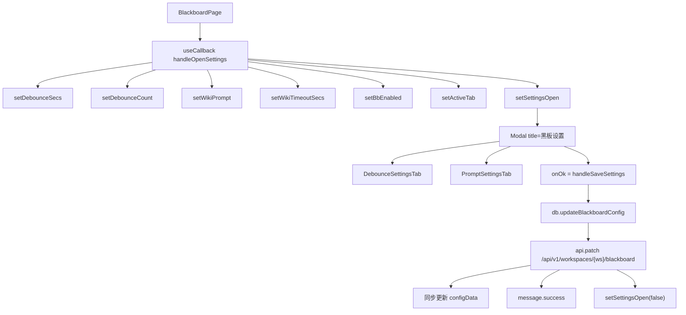
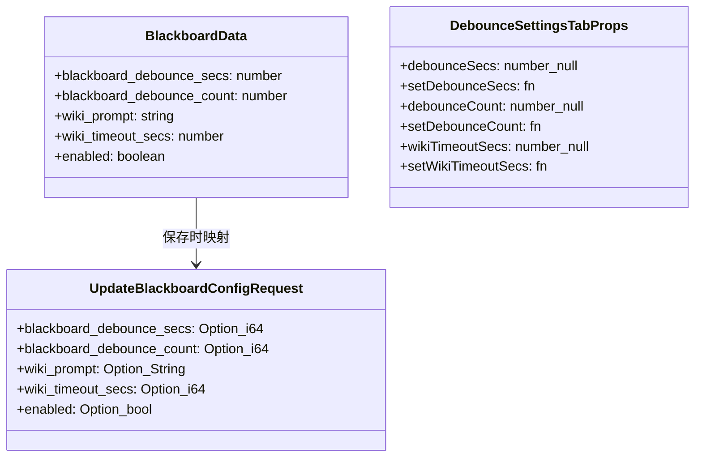
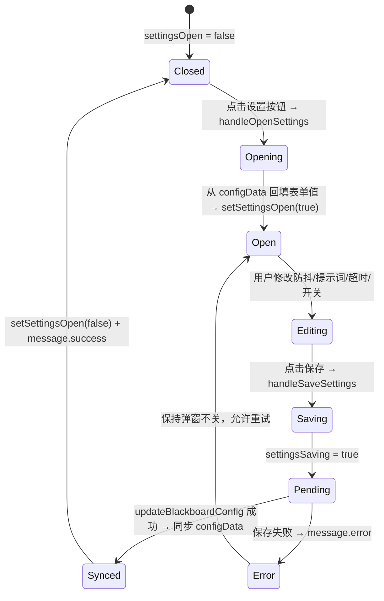

# 打开黑板设置

## 功能位置

黑板页 → 顶部标题栏右侧的「设置」按钮（`SettingOutlined`），桌面端在 `DesktopHeaderExtra`、移动端在 `MobileHeaderExtra`

## 数据流图（前端 → 后端）

```mermaid
flowchart LR
  U[用户点击设置按钮] --> HE["DesktopHeaderExtra / MobileHeaderExtra onOpenSettings"]
  HE --> HOS["handleOpenSettings"]
  HOS --> CD["从 configData 读取当前配置"]
  CD --> DS["setDebounceSecs / setDebounceCount / setWikiPrompt / setWikiTimeoutSecs / setBbEnabled"]
  DS --> SO["setSettingsOpen(true)"]
  SO --> MOD[设置弹窗 Modal 打开]
  MOD --> TAB[防抖设置 Tab + 提示词设置 Tab]
  TAB --> SAVE["用户修改后点击保存"]
  SAVE --> HSS["handleSaveSettings"]
  HSS --> DB["updateBlackboardConfig(workspaceId, config)"]
  DB --> API["PATCH /api/v1/workspaces/{ws}/blackboard"]
  API --> H[update_blackboard_config handler]
  H --> DAO["db 更新 blackboards 表"]
  DAO --> OK["保存成功"]
  OK --> SYNC["同步更新 configData state"]
```

## 调用关系链路图

## 数据结构图

## 数据变更图

## 开发指导

- **前端入口**：`frontend/src/components/BlackboardPage.tsx` 的 `handleOpenSettings` 和 `handleSaveSettings` 函数；设置弹窗含 `DebounceSettingsTab` 和 `PromptSettingsTab` 两个子组件
- **后端入口**：`backend/src/handlers/blackboard.rs` 的 `update_blackboard_config` handler，更新 `blackboards` 表
- **注意**：用户清空 `InputNumber` 时值为 `null`，保存时用 `?? 默认值` 兜底（如 `debounceSecs ?? 600`），避免删值瞬间被默认值覆盖；后端会把 `wiki_timeout_secs` 钳制到 `[60, 3600]`，前端 `InputNumber` 的 `min={60} max={3600}` 同步展示边界；`DEFAULT_WIKI_PROMPT` 是前端副本，与后端 `build_wiki_prompt()` 内置模板需同步修改
- **扩展**：若需新增设置项，在 `BlackboardData` 和 `UpdateBlackboardConfigRequest` 中同步追加字段，在 `DebounceSettingsTab` 或新 Tab 中渲染控件，`handleSaveSettings` 中透传给 `updateBlackboardConfig` 调用
