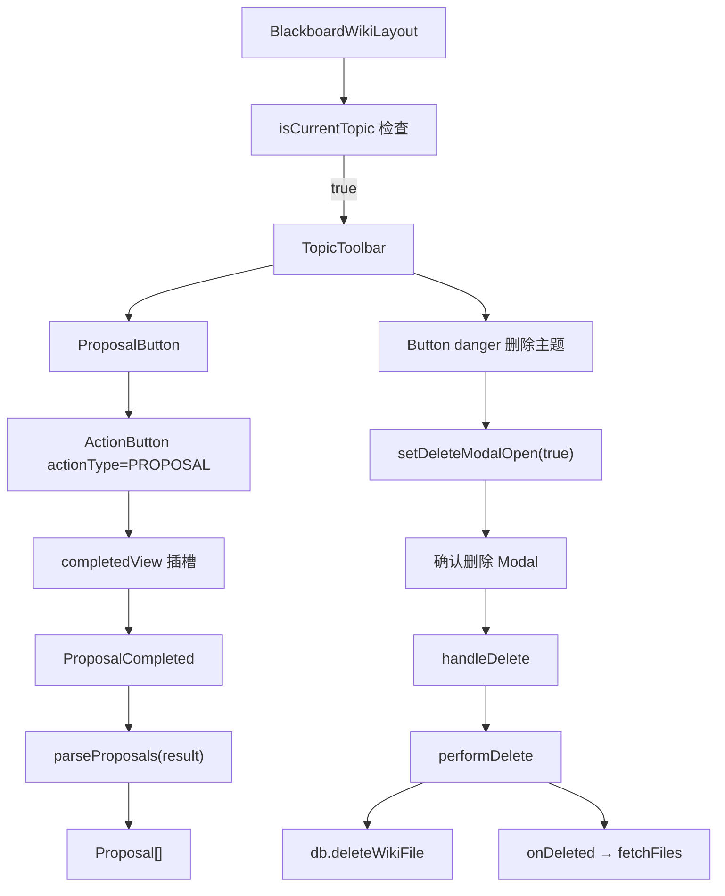
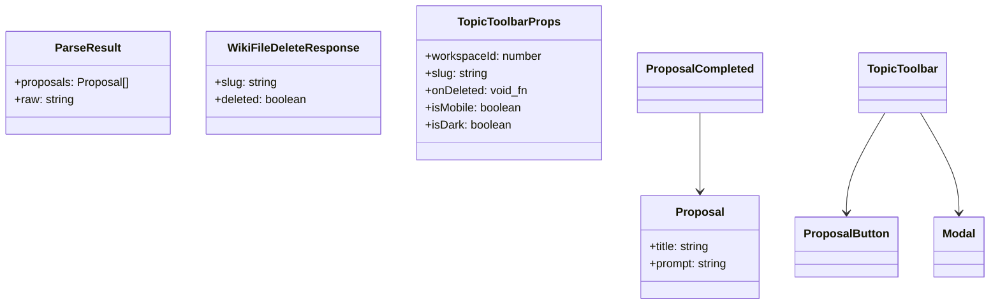
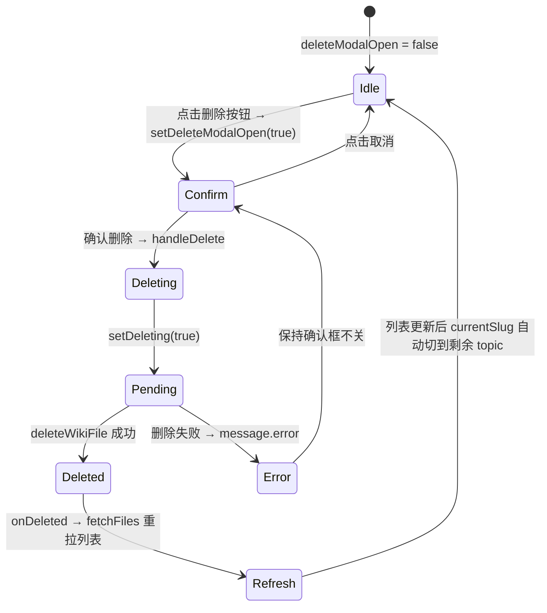

# 主题级操作（生成建议/删除）

## 功能位置

黑板页 → 内容区顶部 `TopicToolbar`（sticky 常驻），仅在当前选中页为 `topic` 类型时渲染

## 数据流图（前端 → 后端）

```mermaid
flowchart LR
  subgraph 生成建议
    U1[用户点击生成建议按钮] --> PB["ProposalButton"]
    PB --> AB["ActionButton 执行 LLM"]
    AB --> AI[AI 读取 topic 文件并生成 YAML 建议]
    AI --> PC["ProposalCompleted 解析建议列表"]
    PC --> PP["parseProposals(result)"]
    PP --> LIST[Proposal[] 建议列表]
    LIST --> CREATE[用户勾选后批量创建 Todo]
  end
  subgraph 删除主题
    U2[用户点击删除按钮] --> CONF[二次确认 Modal]
    CONF --> OK[确认删除]
    OK --> PD["performDelete(workspaceId, slug)"]
    PD --> DB["deleteWikiFile(workspaceId, slug)"]
    DB --> API["DELETE /api/v1/workspaces/{ws}/wiki/files/{slug}"]
    API --> H[delete_wiki_file handler]
    H --> FS["删除 wiki/topics/{slug}.md 文件"]
    FS --> DONE["message.success + onDeleted 回调"]
    DONE --> FF["fetchFiles 重拉文件列表"]
  end
```

## 调用关系链路图



## 数据结构图



## 数据变更图



## 开发指导

- **前端入口**：`frontend/src/components/BlackboardPage.tsx` 的 `TopicToolbar` 和 `performDelete` 函数；生成建议在 `frontend/src/components/blackboard-proposal/ProposalButton.tsx` 和 `parseProposals.ts`
- **后端入口**：`backend/src/handlers/blackboard.rs` 的 `delete_wiki_file` handler（删除 topic 文件）；生成建议复用通用 Action 执行链路
- **注意**：`ProposalButton` 的 `key={slug}` 确保切换主题时整体重建，避免 ActionButton 内部状态串台；删除仅限 topic 类型，后端会拒绝删除 log（系统维护）；文件本就不存在时返回 `deleted=false`（幂等），前端仍视为成功；`isCurrentTopic` 由 `files.some(f => f.slug === currentSlug && f.file_type === 'topic')` 计算，log 页不渲染工具条
- **扩展**：若需新增主题级操作（如重命名 topic），在 `TopicToolbar` 中追加按钮并实现对应 handler；新增建议解析的 YAML 字段时在 `Proposal` 接口和 `toProposal` 校验中同步添加
