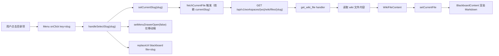
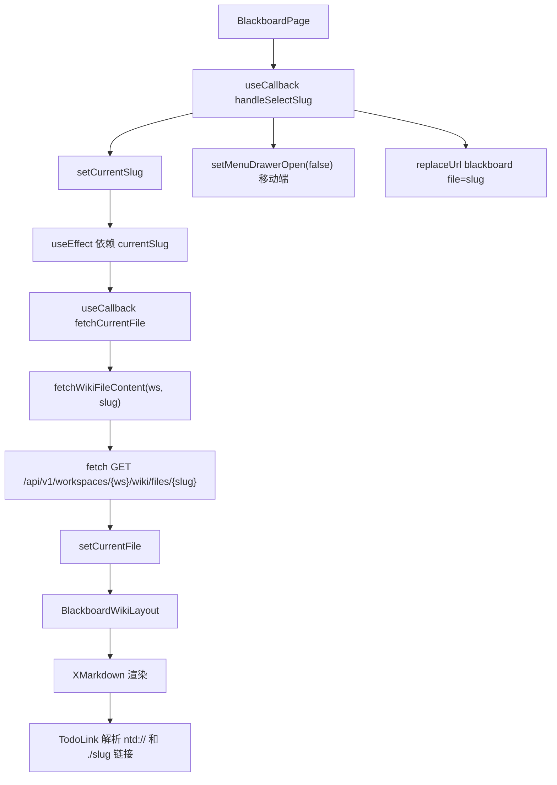
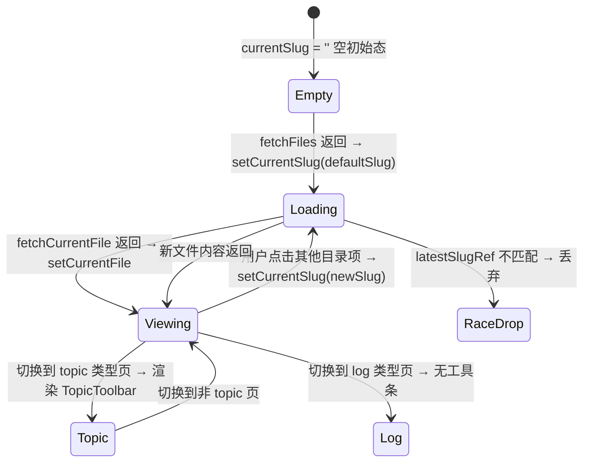

# Wiki 布区切换

## 功能位置

黑板页 → 左侧目录树 `Menu`（桌面端固定侧边栏 / 移动端 Drawer 内），点击目录项切换 Wiki 页面

## 数据流图（前端 → 后端）



## 调用关系链路图



## 数据结构图

```mermaid
classDiagram
  class WikiFileItem {
    +slug: string
    +file_type: index_topic_log_string
  }
  class WikiFileContent {
    +slug: string
    +content: string
  }
  class BlackboardWikiLayoutProps {
    +isDark: boolean
    +isMobile: boolean
    +files: WikiFileItem[]
    +currentFile: WikiFileContent_null
    +currentSlug: string
    +onSelectSlug: fn
    +filesLoading: boolean
    +fileLoading: boolean
    +menuDrawerOpen: boolean
    +onMenuDrawerClose: fn
    +workspaceId: number
    +isTopic: boolean
    +onTopicDeleted: fn
  }
  BlackboardWikiLayout --> WikiFileItem
  BlackboardWikiLayout --> WikiFileContent
  BlackboardWikiLayout --> Menu["Ant Design Menu inline"]
```

## 数据变更图



## 开发指导

- **前端入口**：`frontend/src/components/BlackboardPage.tsx` 的 `BlackboardWikiLayout` 组件和 `handleSelectSlug` 函数；Markdown 渲染在 `BlackboardContent` 组件
- **后端入口**：`backend/src/handlers/blackboard.rs` 的 `get_wiki_file` 和 `list_wiki_files` handler
- **注意**：`BlackboardWikiLayout` 用 `useMemo` 构造 `menuItems` 和 `sidebarContent`，避免每次父组件重渲染时重建数组触发 Ant Design Menu 内部 `prefixCls` null 崩溃；切换工作空间时不设 `currentSlug = ''`（会导致 Menu `selectedKeys={['']}` 崩溃），而是清空 `files` 让 Menu 不渲染，`fetchFiles` 完成后自动设回有效 slug；`TodoLink` 覆盖了 `a` 标签渲染，识别 `ntd://todo/{id}` 协议和 `./slug` Wiki 相对路径
- **扩展**：若需新增文件类型（如 `draft`），在 `WikiFileItem.file_type` 联合类型中追加，在 `menuItems` 构造逻辑中增加分组规则；若需支持文件重命名，在 `TopicToolbar` 追重命名操作并调用对应后端接口
