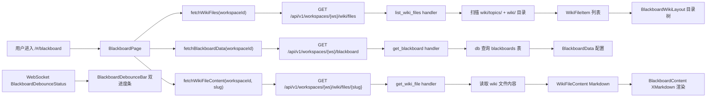

# 黑板

> 页面级总览。本页各功能点的 4 图 + 开发指导在子文档中维护。

## 页面简介

黑板页（`BlackboardPage`）是 `/#/blackboard` 路由对应的工作空间级知识维护容器，将后端自动维护的 Wiki 文件以可浏览的 Markdown 形态呈现给用户。页面左侧是 Wiki 目录树（主题页面分组 + 执行日志入口），右侧是 Markdown 内容渲染区；移动端目录收入 Drawer，内容区全宽。

数据按 `workspaceId` 隌离：挂载时并发调用 `fetchWikiFiles(workspaceId)`（`GET /api/v1/workspaces/{ws}/wiki/files`）拉取文件列表和 `fetchBlackboardData(workspaceId)`（`GET /api/v1/workspaces/{ws}/blackboard`）拉取黑板配置。切换文件时 `fetchWikiFileContent(workspaceId, slug)`（`GET /api/v1/workspaces/{ws}/wiki/files/{slug}`）拉取 Markdown 内容。全部使用原生 `fetch` 而非 axios 拦截器，手动写 v1 蛭径。

黑板的核心机制是「防抖入队」：后端在每次 todo 执行完成后将 `execution_record_id` 推入 `blackboards.pending_record_ids` 队列，达到条数阈值或周期到期后统一 spawn LLM 分析记录并编辑 Wiki 文件。前端通过 WebSocket 事件 `BlackboardDebounceStatus` 实时展示双进度条（时间维度 + 条数维度）。黑板设置弹窗支持配置防抖周期/触发条数/Wiki 执行超时/Wiki 提示词/总开关。主题页内容区提供「生成 Todo 建议」按钮（复用 `ActionButton` 执行 LLM 生成 YAML 建议列表）和删除主题操作。

## 页面级数据流总图

## 功能点索引

- [刷新黑板](blackboard-refresh)
- [打开黑板设置](blackboard-settings)
- [查看待处理队列](blackboard-queue)
- [主题级操作（生成建议/删除）](blackboard-topic-toolbar)
- [防抖双进度条](blackboard-debounce-bar)
- [Wiki 布区切换](blackboard-wiki-layout)
