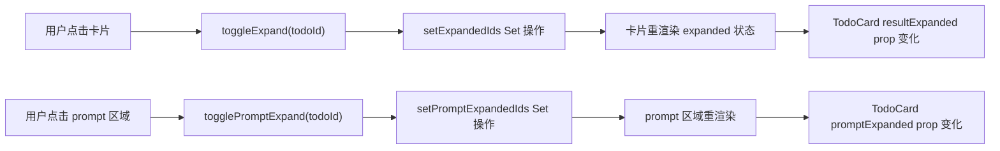
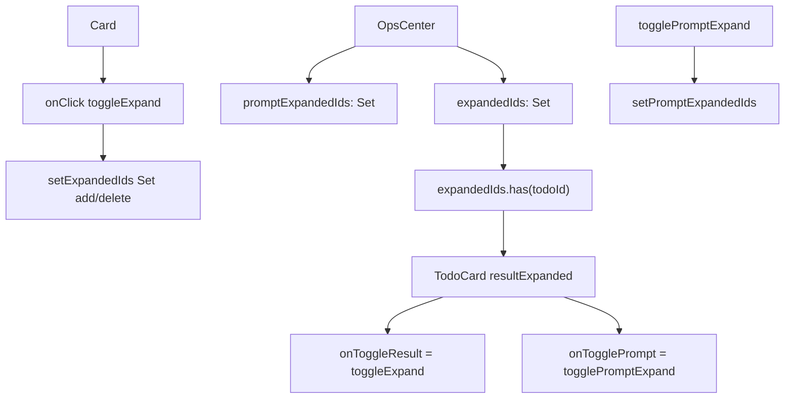
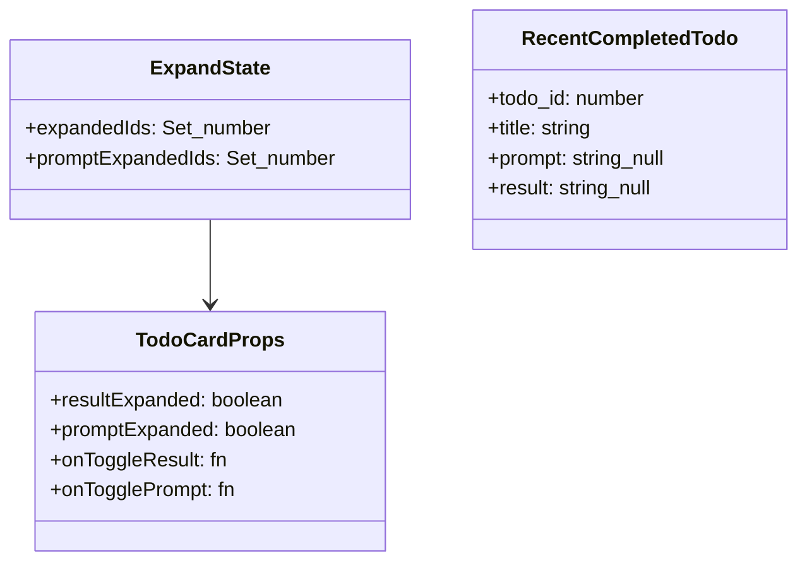
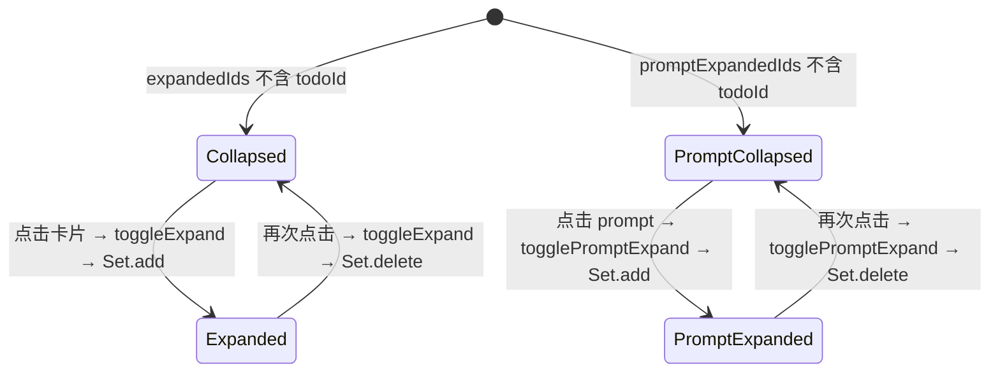

# 展开/收起卡片详情

## 功能位置

运行中心页 → 结论视图卡片内 `TodoCard` 的点击展开/收起（卡片整体 `onClick` + prompt 区域 `onTogglePrompt`）

## 数据流图（前端 → 后端）

## 调用关系链路图

## 数据结构图

## 数据变更图

## 开发指导

- **前端入口**：`frontend/src/components/OpsCenter.tsx` 的 `toggleExpand` 和 `togglePromptExpand` 函数，以及 `expandedIds` / `promptExpandedIds` state
- **后端入口**：无——展开/收起是纯前端 UI 状态，不打后端
- **注意**：`expandedIds` 和 `promptExpandedIds` 是两个独立的 `Set<number>`，分别控制 result 区域和 prompt 区域的展开；用 `Set` 而非 `boolean` 是因为多张卡片各自维护独立展开状态；卡片整体 `onClick={toggleExpand}` 控制 result 展开，prompt 区域有独立的 `onTogglePrompt` 按钮；`TodoCard` 的 `resultExpanded` / `promptExpanded` props 决定内容截断或全显
- **扩展**：若需默认展开所有卡片，初始化 `expandedIds` 为所有 `todo_id` 的 Set；若需持久化展开状态（如刷新后保持），将 `expandedIds` 存入 URL query 或 localStorage
