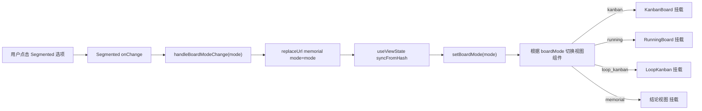
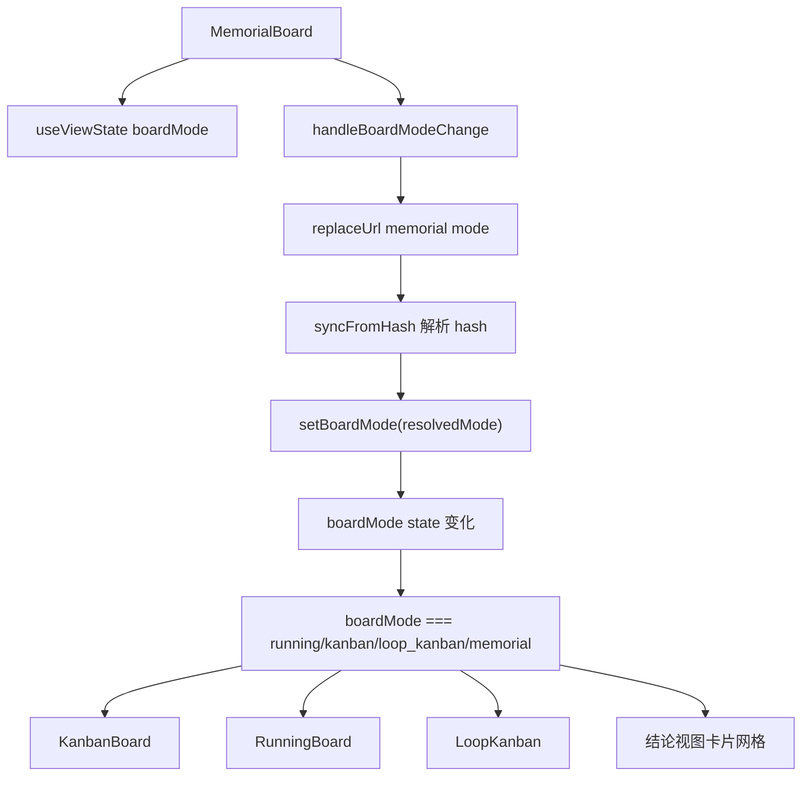
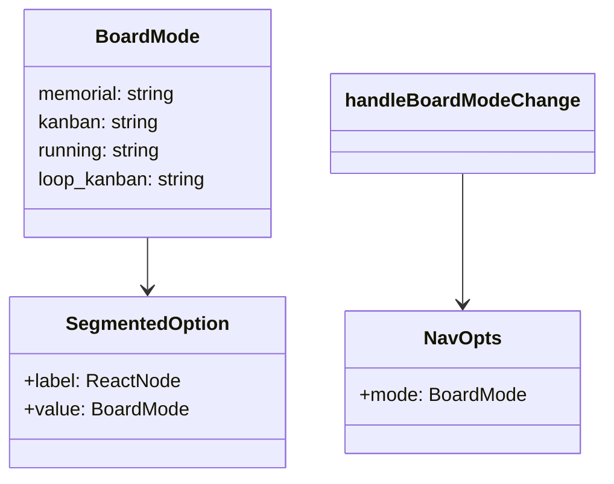

# 视图模式切换（四视图）

## 功能位置

看板页 → 顶部 `PageCard` 的 `extra` 区域 `Segmented` 组件（看板视图 / 运行视图 / 环路视图 / 结论视图）

## 数据流图（前端 → 后端）



## 调用关系链路图



## 数据结构图



## 数据变更图

```mermaid
stateDiagram-v2
  [*] --> Memorial: 默认 boardMode = memorial
  Memorial --> Kanban: 切换看板视图
  Kanban --> Running: 切换运行视图
  Running --> LoopKanban: 切换环路视图
  LoopKanban --> Memorial: 切换结论视图
  Memorial --> Running: 切换运行视图
  Kanban --> LoopKanban: 切换环路视图
  note right of Memorial: hours/searchText 保持不变
end note
```

## 开发指导

- **前端入口**：`frontend/src/components/MemorialBoard.tsx` 的 `handleBoardModeChange` 函数和 `useViewState` hook
- **后端入口**：无直接后端调用——视图切换仅改 URL hash 和 React state，各视图组件挂载后各自拉取数据
- **注意**：`boardMode` 通过 URL `?mode=` query 同步，支持浏览器前进后退；`ALL_BOARD_MODES` 白名单过滤非法值，`?mode=foo` 会 fallback 到 `'memorial'`；四个视图共享 `hours` 和 `searchText` state，切换时保持筛选条件；`LoopKanban` 是受控组件，接受外部 `searchText` / `hours` 并通过 `onSearchChange` / `onHoursChange` 回传同步
- **扩展**：若需新增第五种视图，在 `BoardMode` 联合类型追加字面量，在 `ALL_BOARD_MODES` 数组追加，在 `Segmented` options 加选项，在 `MemorialBoard` 的条件渲染分支加对应组件挂载
