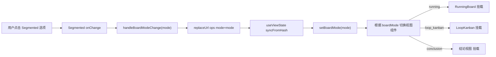
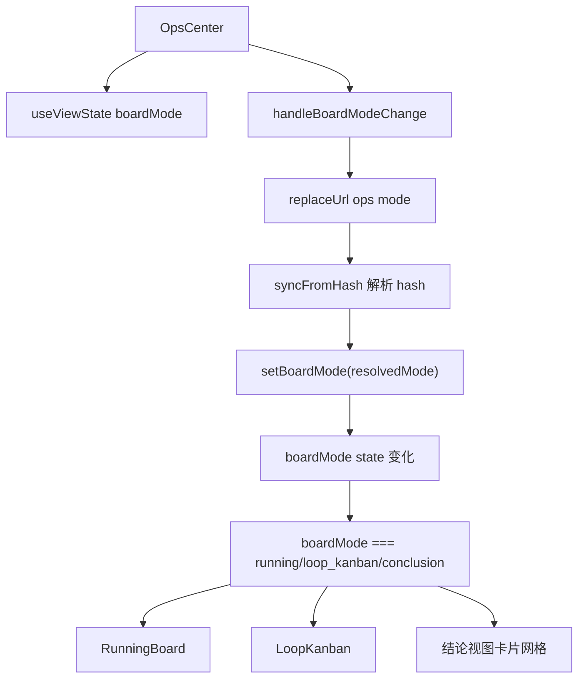
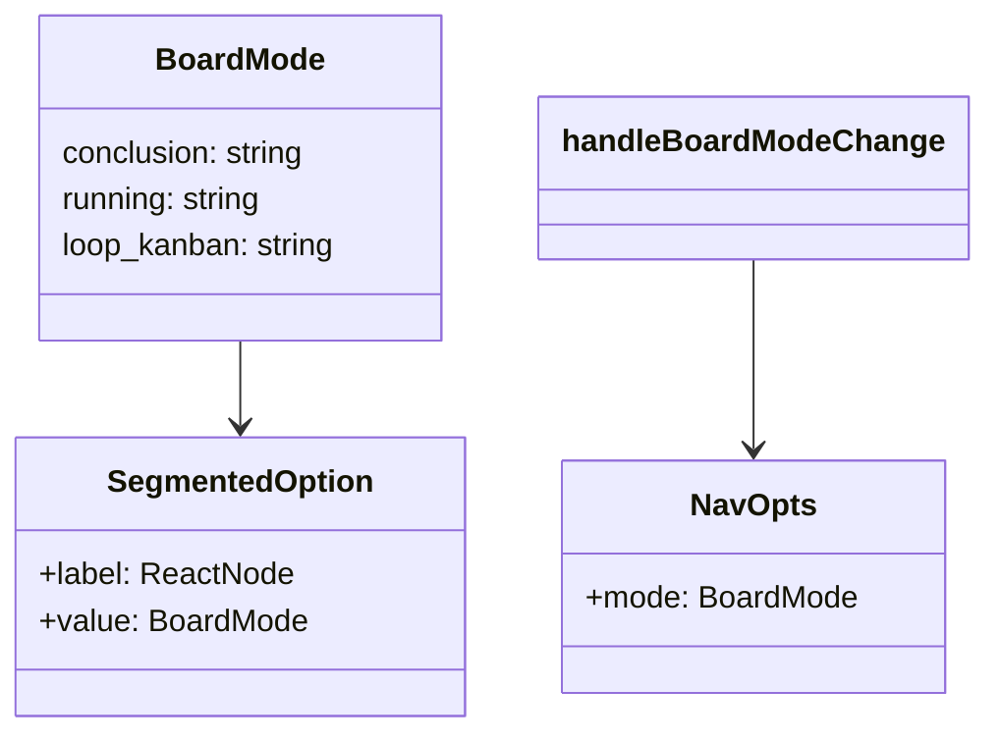
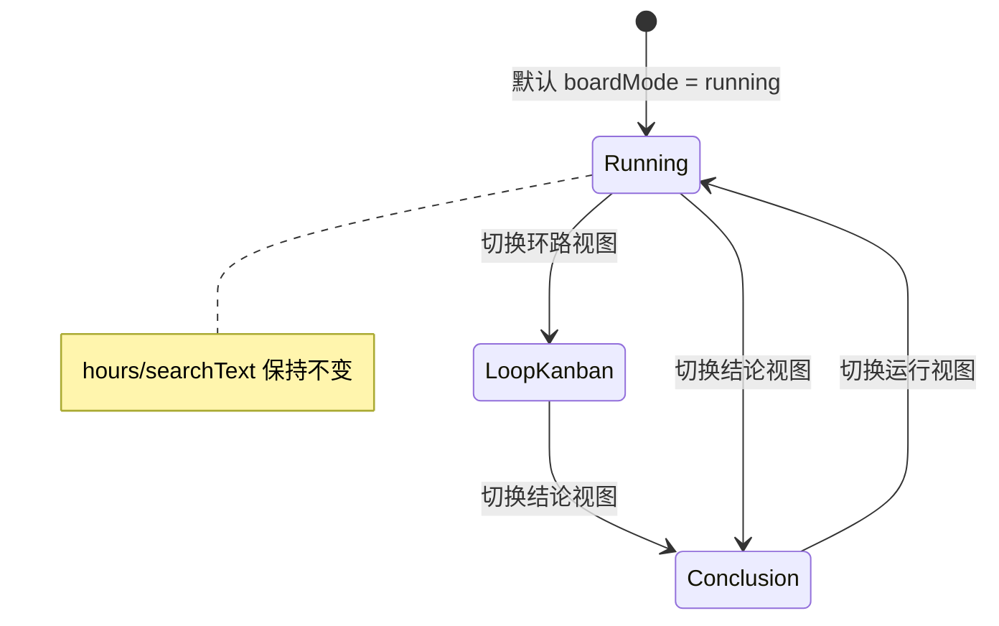

# 视图模式切换（三视图）

## 功能位置

运行中心页 → 顶部 `PageCard` 的 `extra` 区域 `Segmented` 组件（运行视图 / 环路视图 / 结论视图）

## 数据流图（前端 → 后端）

## 调用关系链路图

## 数据结构图

## 数据变更图

## 开发指导

- **前端入口**：`frontend/src/components/OpsCenter.tsx` 的 `handleBoardModeChange` 函数和 `useViewState` hook
- **后端入口**：无直接后端调用——视图切换仅改 URL hash 和 React state，各视图组件挂载后各自拉取数据
- **注意**：`boardMode` 通过 URL `?mode=` query 同步，支持浏览器前进后退；`ALL_BOARD_MODES` 白名单过滤非法值，`?mode=foo` 会 fallback 到 `'running'`；三个视图共享 `hours` 和 `searchText` state，切换时保持筛选条件；`LoopKanban` 是受控组件，接受外部 `searchText` / `hours` 并通过 `onSearchChange` / `onHoursChange` 回传同步
- **扩展**：若需新增第四种视图，在 `BoardMode` 联合类型追加字面量，在 `ALL_BOARD_MODES` 数组追加，在 `Segmented` options 加选项，在 `OpsCenter` 的条件渲染分支加对应组件挂载
- **历史**：原「看板视图」（todo 维度状态流转 + 拖拽改状态）已归位到「事项」菜单（`/#/todos` 的看板视图），运行中心不再保留该 mode
