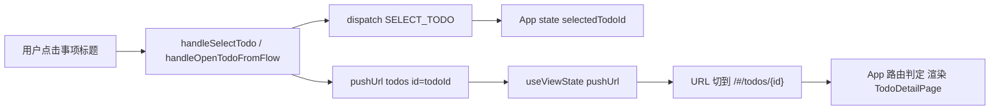
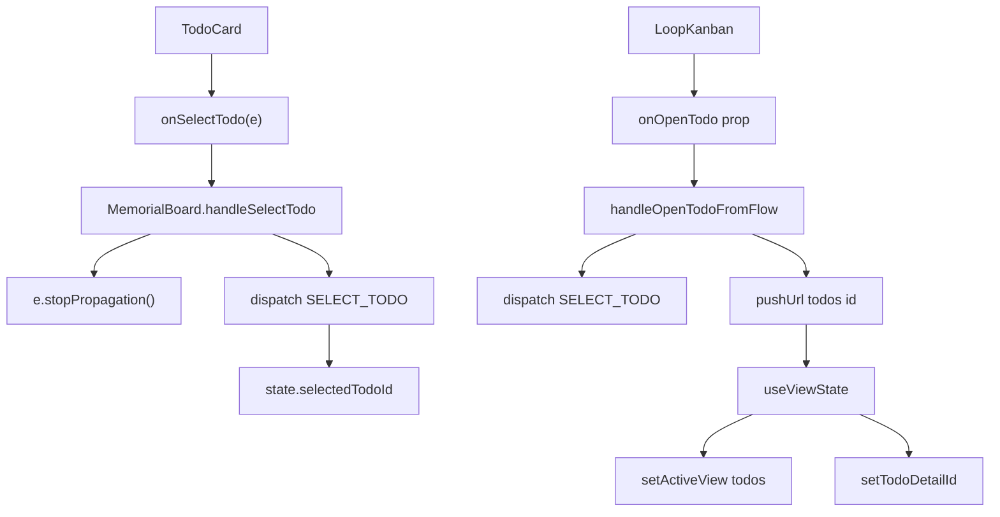
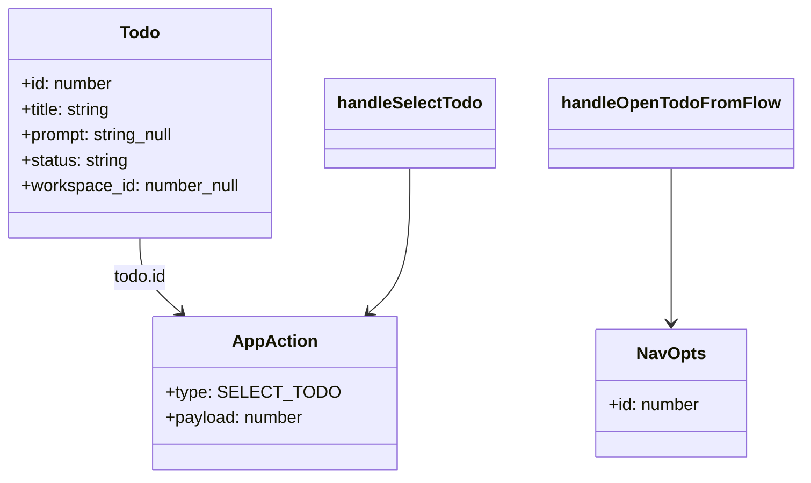

# 跳转事项详情

## 功能位置

看板页 → 结论视图卡片内 `TodoCard` 的 `onSelectTodo`（点击事项标题）；环路视图流程图中点击事项标题（`onOpenTodo`）

## 数据流图（前端 → 后端）



## 调用关系链路图



## 数据结构图



## 数据变更图

```mermaid
stateDiagram-v2
  [*] --> BoardView: 当前在看板页
  BoardView --> TodoSelected: 点击事项标题 → dispatch SELECT_TODO
  TodoSelected --> Navigating: pushUrl todos id=todoId
  Navigating --> TodoDetail: URL 切到 /#/todos/{id} → App 渲染详情页
  TodoDetail --> BoardView: history.back 回到看板
  note right of TodoDetail: 用 pushUrl 而非 replaceUrl，支持返回
end note
```

## 开发指导

- **前端入口**：`frontend/src/components/MemorialBoard.tsx` 的 `handleSelectTodo`（结论视图卡片点击）和 `handleOpenTodoFromFlow`（环路视图流程图点击）函数
- **后端入口**：无直接后端调用——跳转仅改 React state 和 URL hash，`TodoDetailPage` 挂载后自行拉取事项详情
- **注意**：`handleSelectTodo` 用 `e.stopPropagation()` 阻止冒泡，避免同时触发卡片展开 `toggleExpand`；`handleOpenTodoFromFlow` 用 `pushUrl`（而非 `replaceUrl`）让 `history.back` 能回到看板页；环路视图的 `onOpenTodo` prop 由 `MemorialBoard` 注入到 `LoopKanban`，再透传到 `LoopFlowGraph` 的步骤节点
- **扩展**：若需在跳转时携带额外上下文（如来源视图模式），在 `pushUrl` 的 `NavOpts` 中追加自定义 query 参数，在 `TodoDetailPage` 中解析并根据来源做差异化展示
