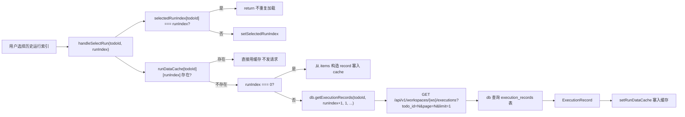
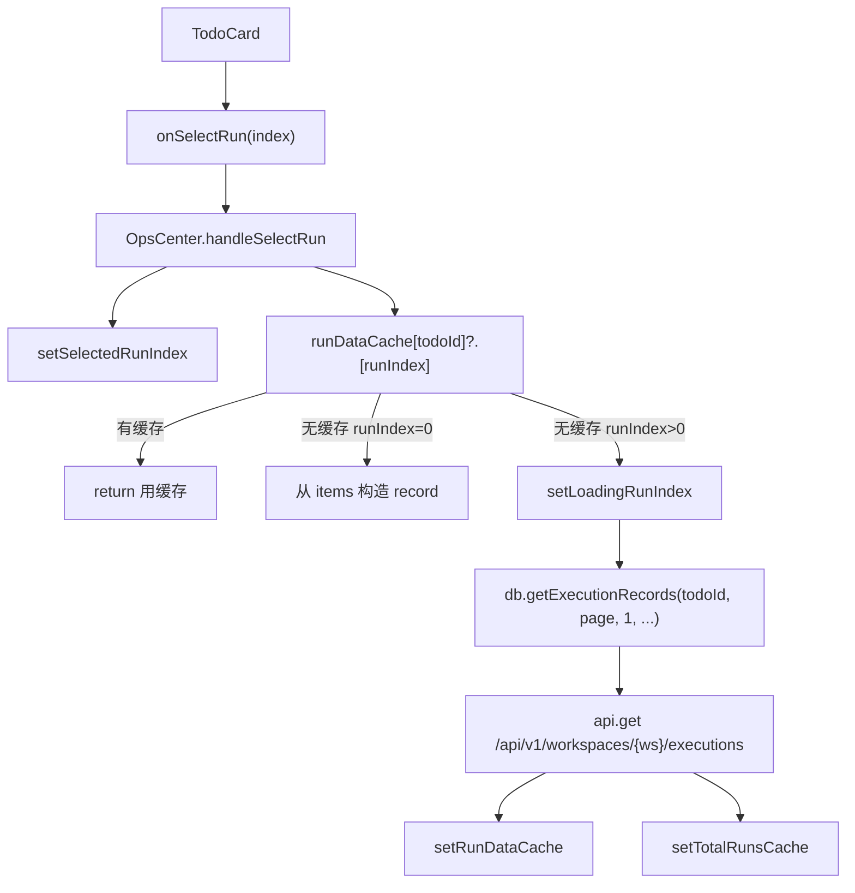
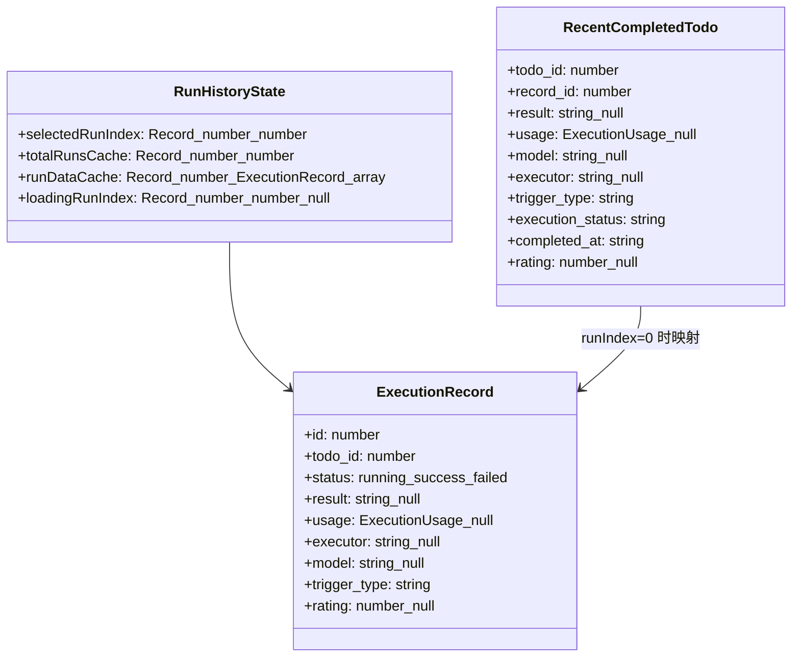
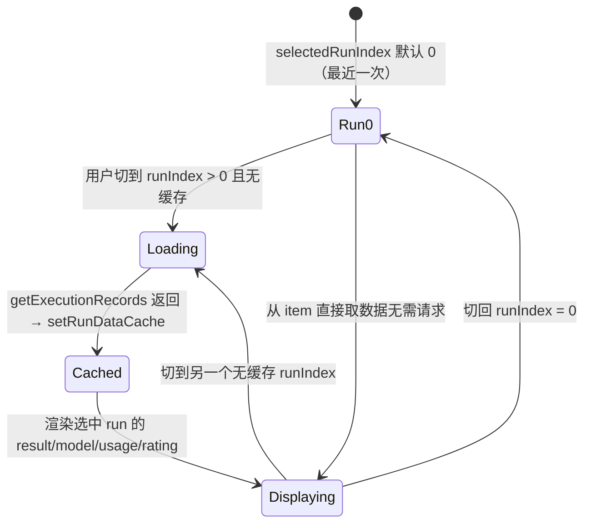

# 切换历史运行记录

## 功能位置

运行中心页 → 结论视图卡片内 `TodoCard` 的运行记录下拉选择器（`onSelectRun`），仅 `boardMode=conclusion` 时可用

## 数据流图（前端 → 后端）

## 调用关系链路图

## 数据结构图

## 数据变更图

## 开发指导

- **前端入口**：`frontend/src/components/OpsCenter.tsx` 的 `handleSelectRun` 函数和 `selectedRunIndex` / `runDataCache` / `totalRunsCache` / `loadingRunIndex` state
- **后端入口**：`backend/src/handlers/execution.rs` 的 `v1_get_execution_records` handler，查询 `execution_records` 表按 `todo_id` 过滤并分页
- **注意**：`runIndex = 0`（最近一次运行）直接从 `items` 中的 `RecentCompletedTodo` 字段构造 `ExecutionRecord` 塞入缓存，不发后端请求；`runIndex > 0` 时用 `page = runIndex + 1` + `limit = 1` 拉取指定页的单条记录；`totalRunsCache` 在首次加载时通过 `db.getExecutionRecords(todoId, 1, 1)` 获取 `page.total`，后续切 run 不重复拉取；缓存命中时直接用 `runDataCache[todoId][runIndex]` 不发请求
- **扩展**：若需展示运行记录的执行日志，在 `TodoCard` 中追加「查看日志」入口调用 `db.getExecutionLogs`；若需支持批量删除历史运行，在 `TodoCard` 下拉旁追加操作按钮调用后端批量删除接口
