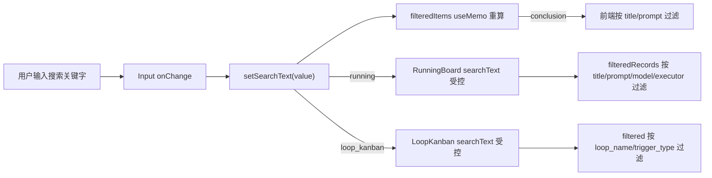
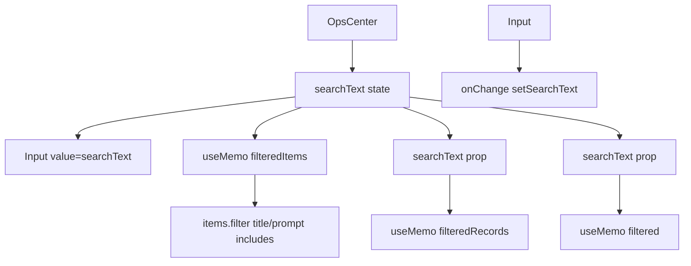
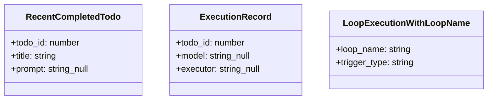

# 搜索任务

## 功能位置

运行中心页 → 工具栏搜索框（`Input` + `SearchOutlined`），三种视图共享

## 数据流图（前端 → 后端）



## 调用关系链路图



## 数据结构图



## 数据变更图

```mermaid
stateDiagram-v2
  [*] --> Empty: searchText = ''
  Empty --> Typing: 用户输入关键字
  Typing --> Filtering: searchText 变化触发 useMemo 重算
  Filtering --> Empty: 清空搜索框（allowClear）
  Filtering --> Typing: 继续输入
  note right of Filtering: 纯前端过滤，不发后端请求
end note
```

## 开发指导

- **前端入口**：`frontend/src/components/OpsCenter.tsx` 的 `searchText` state 和 `filteredItems` useMemo；各子视图组件内部各自实现过滤逻辑
- **后端入口**：无——搜索为纯前端 `filter` 过滤，不打后端
- **注意**：三种视图共享同一个 `searchText` state，切换视图时保持关键字；结论视图按 `title` 和 `prompt` 双字段过滤；运行视图额外匹配 `model` 和 `executor`；环路视图匹配 `loop_name` 和 `trigger_type`；搜索全部用 `toLowerCase().includes()` 做大小写不敏感匹配
- **扩展**：若需将搜索下沉到后端（如分页场景），改为在 `Input` onChange 中调用带 `keyword` 参数的后端接口并防抖；新增搜索字段时在各视图的 `useMemo` 过滤逻辑中追加字段匹配条件
