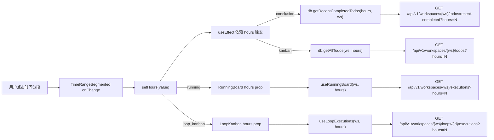
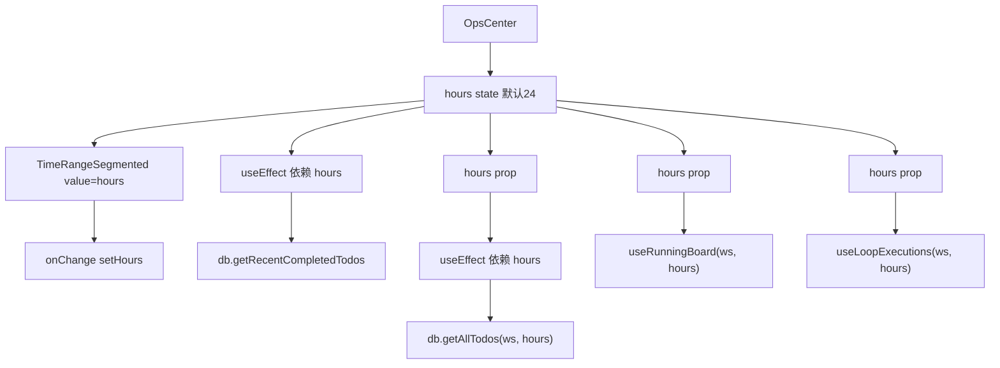
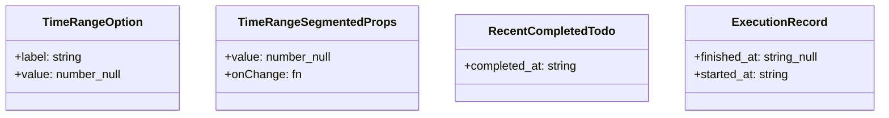

# 时间窗过滤

## 功能位置

运行中心页 → 工具栏 `TimeRangeSegmented` 组件（6h / 24h / 72h / all 分段按钮）

## 数据流图（前端 → 后端）



## 调用关系链路图



## 数据结构图



## 数据变更图

```mermaid
stateDiagram-v2
  [*] --> Default24: hours = 24（默认）
  Default24 --> SixHours: 点击 6h
  SixHours --> Default24: 点击 24h
  Default24 --> SeventyTwo: 点击 72h
  SeventyTwo --> All: 点击 all（hours=null）
  All --> Default24: 点击 24h
  note right of All: hours=null 表示不按时间过滤
end note
```

## 开发指导

- **前端入口**：`frontend/src/components/OpsCenter.tsx` 的 `hours` state 和 `TimeRangeSegmented` 共享组件（`frontend/src/components/common/TimeRangeSegmented.tsx`）
- **后端入口**：各视图对应 handler 的 `hours` query 参数（`GET /api/v1/workspaces/{ws}/todos` / `/executions` / `/todos/recent-completed` / `/loops/{id}/executions`）
- **注意**：`TIME_RANGE_OPTIONS` 是全站唯一事实源（需求 031），从 `TimeRangeSegmented` 组件导出，本页不再自持一份；`hours = null`（all）表示不按时间过滤，各视图的 cutoff 逻辑用 `if (hours && hours > 0)` 守卫；看板视图切 `hours` 后用 `db.getAllTodos(ws, hours)` 拉取覆盖到 `kanbanTodos` 本地 state，不影响全局 store
- **扩展**：若需新增时间分段选项（如 12h），在 `TimeRangeSegmented` 的 `TIME_RANGE_OPTIONS` 数组中追加，全站所有使用处自动生效；新增视图时确保支持 `hours` prop 并在数据拉取中透传
