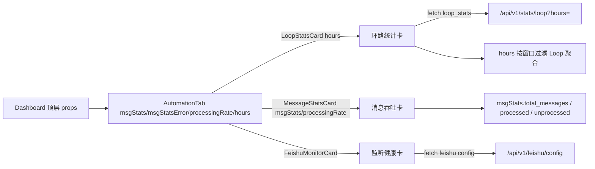
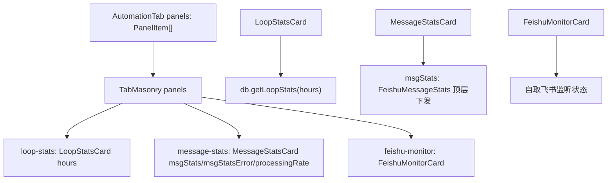
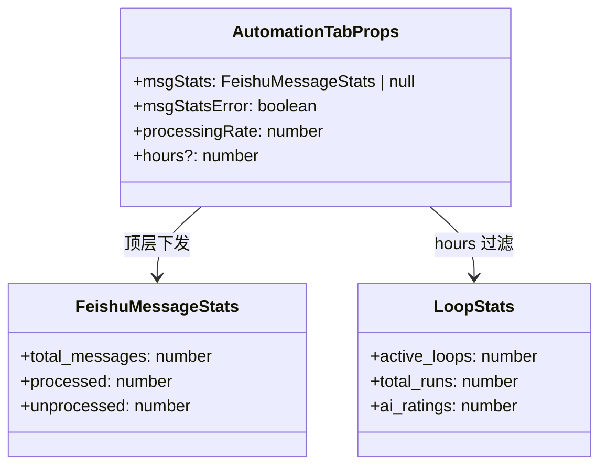
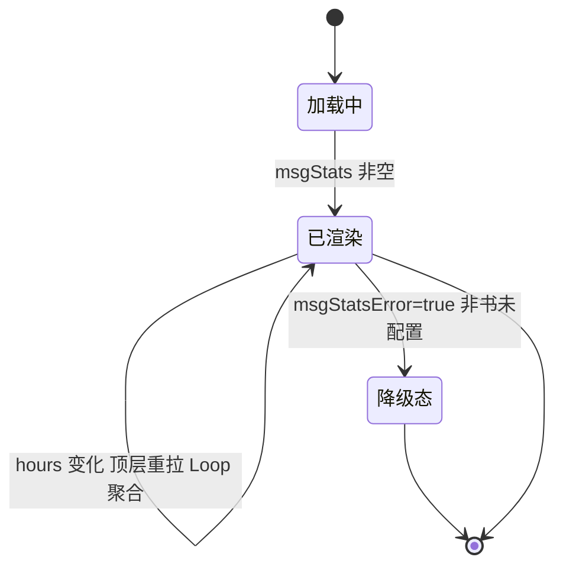

# 自动化 Tab

## 功能位置

仪表盘 → 「自动化」Tab → `AutomationTab` 组件（Loop 环路统计卡 / 飞书消息吞吐卡 / 飞书监听健康卡）

## 数据流图（前端 → 后端）

## 调用关系链路图

## 数据结构图

## 数据变更图

## 开发指导

- **前端入口**：`frontend/src/components/dashboard/tabs/AutomationTab.tsx` 的 `AutomationTab` 组件；`MessageStatsCard` 在 `frontend/src/components/dashboard/StatsGridCards.tsx`；`LoopStatsCard` 在 `frontend/src/components/dashboard/cards/LoopStatsCard.tsx`；`FeishuMonitorCard` 在同 cards 子目录
- **后端入口**：飞书消息 stats 来自顶层 `db.getFeishuMessageStats`（handler `get_message_stats`，路由 `/api/v1/feishu/message-stats`）；Loop 聚合由 `LoopStatsCard` 自取 `/api/v1/stats/loop`（`hours` 过滤）
- **注意**：`msgStatsError=true` 时（飞书未配置）用布尔标记降级展示，不弹错误打扰用户；`hours` 在 custom 模式用区间跨度小时数，undefined=全时段；飞书消息吞吐与监听健康互补，同 Tab 展示
- **扩展**：增自动化维度卡时，在 `panels` 加项；新增 Loop 聚合字段时改后端 `get_loop_stats` handler + SQL
