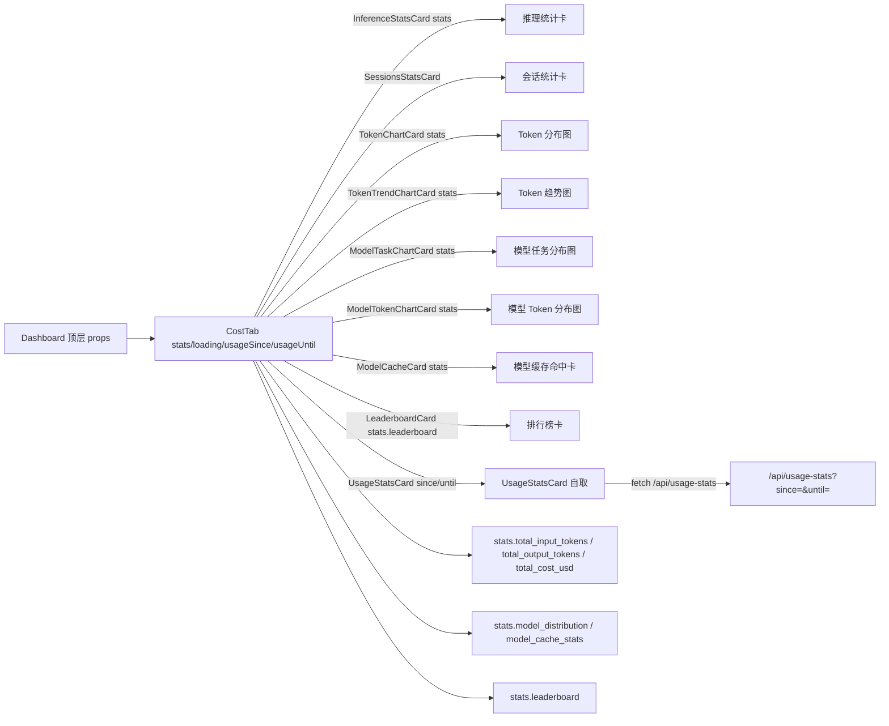
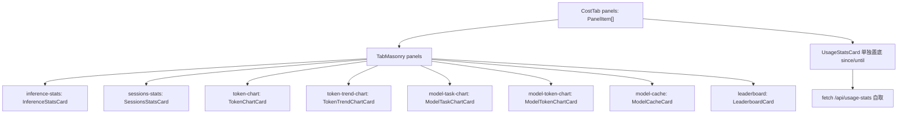
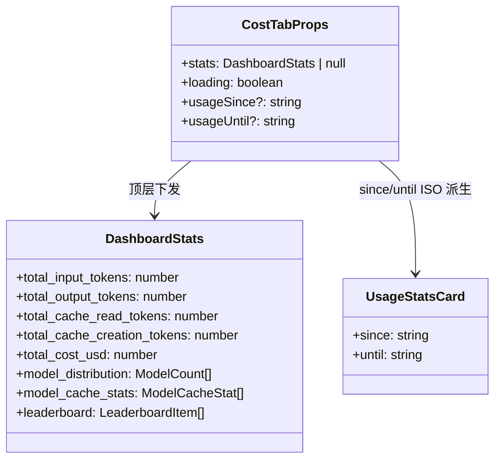
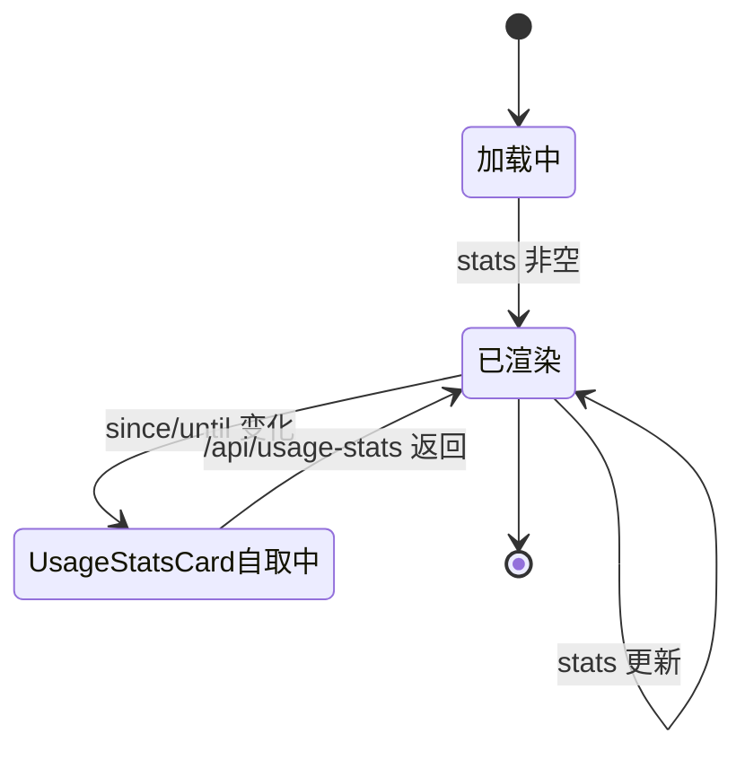

# 成本与模型 Tab

## 功能位置

仪表盘 → 「成本与模型」Tab（移动端短文案「成本」） → `CostTab` 组件（推理统计 / 会话统计 / Token 图表 / 模型分布 / 缓存命中 / 排行榜 / UsageStatsCard）

## 数据流图（前端 → 后端）

## 调用关系链路图

## 数据结构图

## 数据变更图

## 开发指导

- **前端入口**：`frontend/src/components/dashboard/tabs/CostTab.tsx` 的 `CostTab` 组件；`InferenceStatsCard` 在 `StatsGridCards.tsx`；`SessionsStatsCard` 在 `frontend/src/components/dashboard/cards/SessionsStatsCard.tsx`；`ModelTaskChartCard` / `ModelTokenChartCard` / `ModelCacheCard` 在 `DistributionCards.tsx`；`UsageStatsCard` 在 `frontend/src/components/dashboard/UsageStatsCard.tsx`
- **后端入口**：stats 字段来自 `get_dashboard_stats` handler 聚合；`UsageStatsCard` 自取 `/api/usage-stats`（ccusage 通道，与主 stats 解耦）
- **注意**：`UsageStatsCard` 数据较多（含 daily/weekly/monthly + 模型 breakdown），固定置底与瀑布流不拆散；`usageSince`/`usageUntil` 由顶层 `TimeRangeSelector` 派生 ISO 串，全局共享
- **扩展**：增成本维度卡时，在 `panels` 加项；新增 stats 字段时改后端 `DashboardStats` struct + `db.get_dashboard_stats` SQL 聚合
