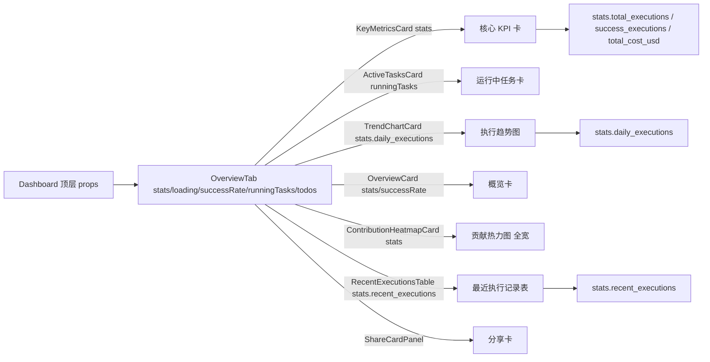
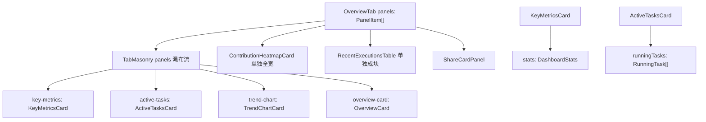
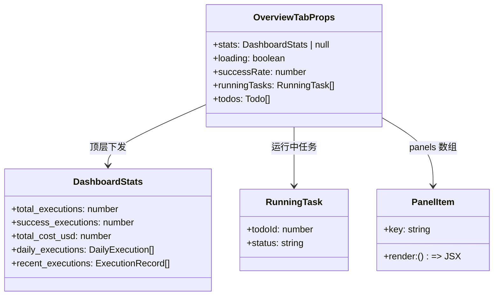
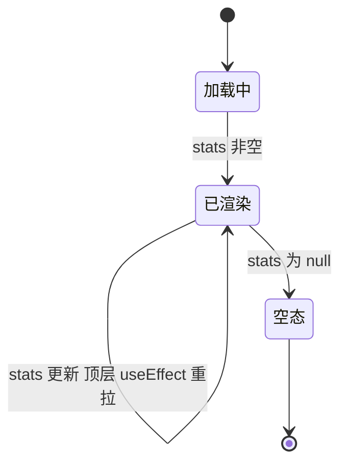

# 总览 Tab

## 功能位置

仪表盘 → 「总览」Tab → `OverviewTab` 组件（核心 KPI / 运行中任务 / 执行趋势 / 贡献热力图 / 最近执行记录表 / 分享卡）

## 数据流图（前端 → 后端）

## 调用关系链路图

## 数据结构图

## 数据变更图

## 开发指导

- **前端入口**：`frontend/src/components/dashboard/tabs/OverviewTab.tsx` 的 `OverviewTab` 组件；`KeyMetricsCard` / `OverviewCard` 在 `frontend/src/components/dashboard/StatsGridCards.tsx`；`ActiveTasksCard` / `ShareCardPanel` 在 `frontend/src/components/dashboard/SpecialCards.tsx`；`TrendChartCard` / `ContributionHeatmapCard` 在 `frontend/src/components/dashboard/ChartCards.tsx`；`RecentExecutionsTable` 在同目录
- **后端入口**：数据来自顶层 `Dashboard` 拉的 `/api/v1/stats/dashboard`（`get_dashboard_stats` handler）；后端 `db.get_dashboard_stats` 聚合全库
- **注意**：贡献热力图因一年 53 周横向跨度大，从 Masonry 移出独占一行全宽渲染，格子随宽度放大可读性提升；最近执行记录表与瀑布流视觉节奏不同单独成块置于下方；分享卡置于总览底部作为推广位
- **扩展**：总览 Tab 增新卡时，在 `panels` 数组加 `{ key, render }` 项，或单独全宽渲染时直接追加在 `TabMasonry` 之后
