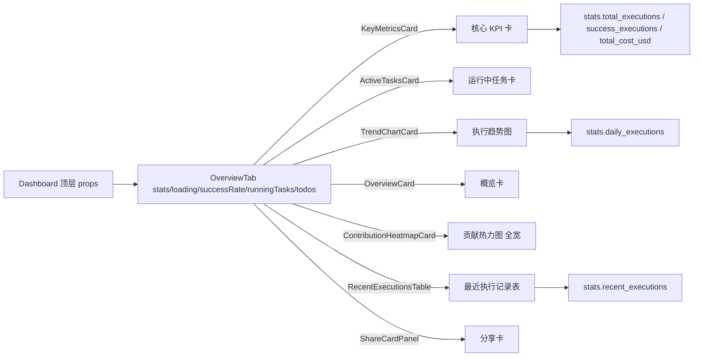

# 总览 Tab

总览 Tab 是仪表盘的默认落地页，用核心 KPI、运行中任务、执行趋势、贡献热力图、最近执行记录、分享卡让你一眼掌握全局态势。

## 在这里做什么

- 看核心 KPI（总执行数、成功执行数、总成本）
- 看运行中任务、执行趋势图
- 看贡献热力图（一年 53 周横向跨度）
- 看最近执行记录表
- 生成分享卡（推广位）

## 怎么操作

1. 进入仪表盘，默认落在总览 Tab。
2. 卡片以瀑布流（Masonry）布局自适应排列。
3. 贡献热力图因横向跨度大，独占一行全宽渲染，格子随宽度放大可读性提升。
4. 最近执行记录表与瀑布流视觉节奏不同，单独成块置于下方。
5. 分享卡置于总览底部作为推广位。

## 操作后会发生什么

- 顶层 `Dashboard` 拉数据，`stats` 非空即渲染卡片。
- `stats` 更新时顶层 `useEffect` 重拉，卡片自动刷新。
- `stats` 为 null 时走空态，不崩溃。

## 数据来源

## 常见问题

**Q：贡献热力图为什么独占一行？**
A：一年 53 周横向跨度太大，塞进 Masonry 会挤成一团；移出独占全宽后格子放大，可读性提升。

**Q：最近执行记录表为什么不跟瀑布流？**
A：表格与瀑布流视觉节奏不同，放一起会割裂；单独成块置于下方更自然。
