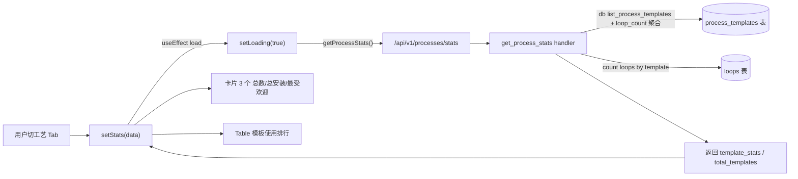
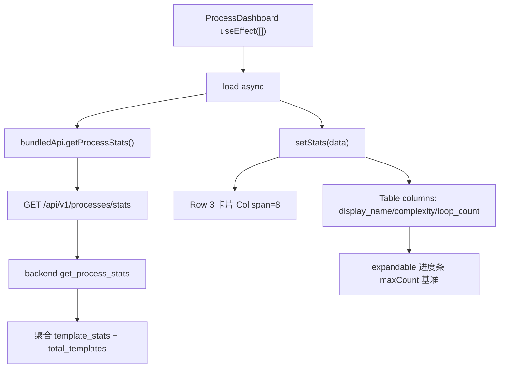
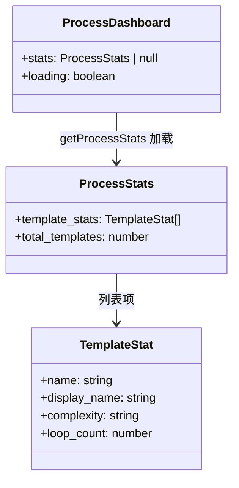
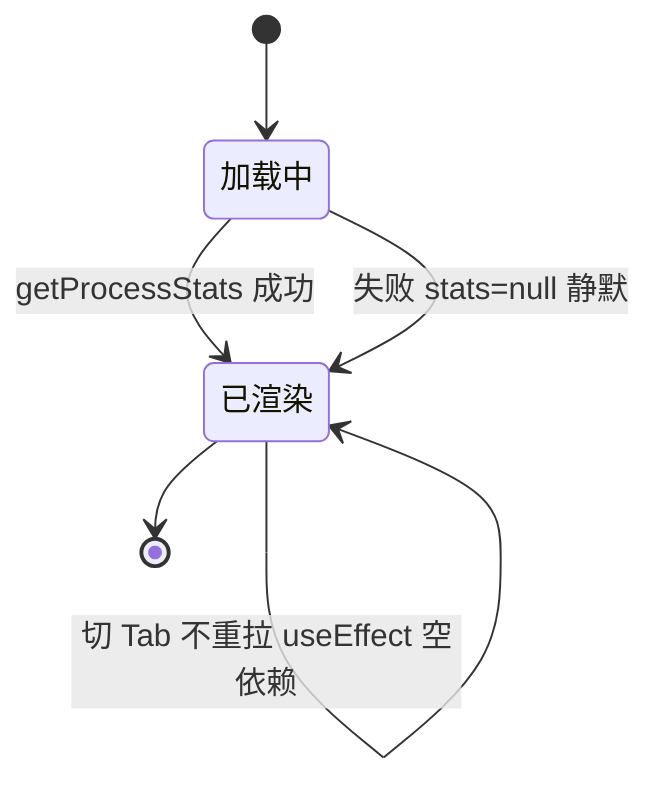

# 工艺 Tab

## 功能位置

仪表盘 → 「工艺」Tab → `ProcessDashboard` 组件（模板总数 / 总安装次数 / 最受欢迎 / 模板使用排行表）

## 数据流图（前端 → 后端）

## 调用关系链路图

## 数据结构图

## 数据变更图

## 开发指导

- **前端入口**：`frontend/src/components/process/ProcessDashboard.tsx` 的 `ProcessDashboard` 组件；`bundledApi.getProcessStats` 在 `frontend/src/api/bundled.ts`
- **后端入口**：`backend/src/handlers/process.rs` 的 `get_process_stats` handler，路由 `GET /api/v1/processes/stats`
- **注意**：统计接口可选，失败静默（`catch` 空体）不弹错；进度条用 `maxCount` 基准防空数据除零；`useEffect` 空依赖数组只在挂载拉一次，切 Tab 不重拉
- **扩展**：增统计维度时，改后端 `get_process_stats` handler 聚合新字段、`ProcessStats` / `TemplateStat` 加列、前端 Table columns 加项
