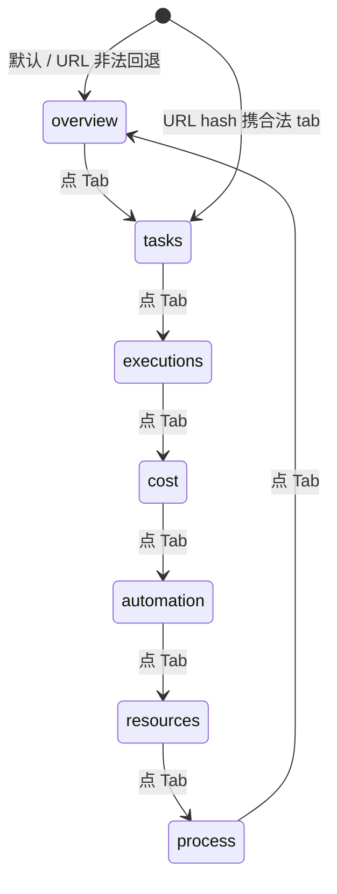

# Tab 切换

仪表盘顶部有 7 个 Tab：总览 / 任务 / 执行 / 成本与模型 / 自动化 / 资源与运维 / 工艺。点任一 Tab 即可切换。

## 在这里做什么

- 在 7 个语义域间快速切换，分别看不同维度的运营数据
- 切换时不丢失顶部全局时间范围

## 怎么操作

1. 点顶部 Tab 卡片。
2. Tab 高亮，下方内容区切换为该 Tab 的卡片列表。

## 操作后会发生什么

- 当前 Tab 写入 URL hash（`#/dashboard?tab=xxx`），刷新 / 前进 / 后退保持当前 Tab。
- 非法或缺失的 tab 参数会回退到「总览」，保证不渲染空白。
- 移动端 Tab 标签自动用短文案，避免窄屏溢出。

## Tab 选中流转

## 常见问题

**Q：为什么切 Tab 后数据没变？**
A：所有 Tab 共享顶部全局时间范围，切 Tab 只换展示维度，不换时间窗。若想换时间窗，用顶部 Segmented。

**Q：新增 Tab 怎么扩展？**
A：扩 `DASHBOARD_TABS` as const 数组、`tabItems` 加项、对应 Tab 组件文件、本帮助目录加子文档 md。
