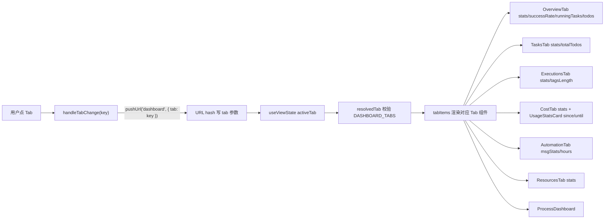
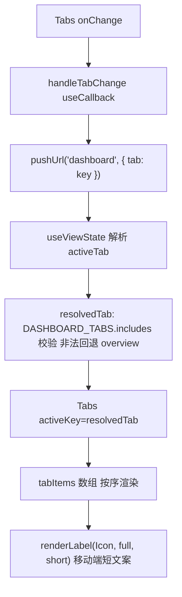
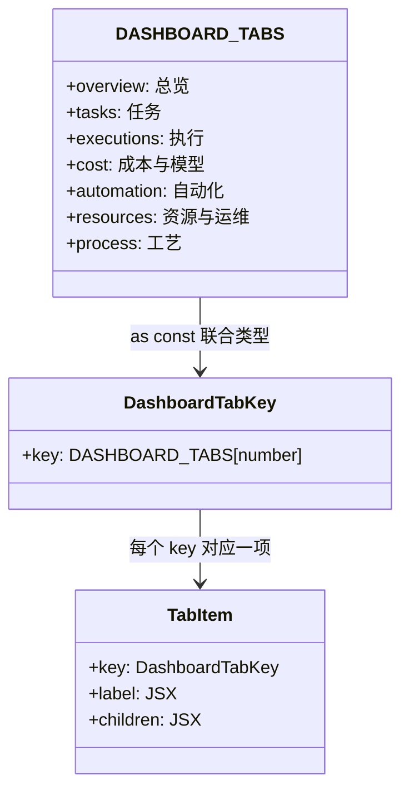
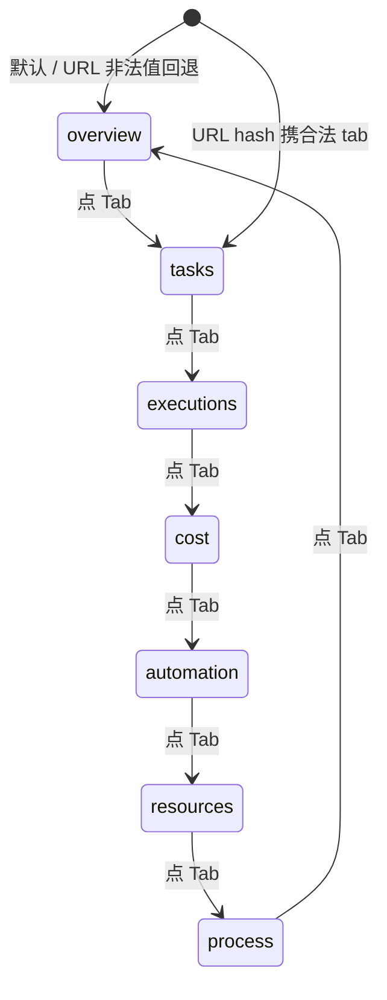

# Tab 切换（7 个语义域）

## 功能位置

仪表盘 → `Tabs` 控件（card 型，7 个 Tab：总览 / 任务 / 执行 / 成本与模型 / 自动化 / 资源与运维 / 工艺）

## 数据流图（前端 → 后端）

## 调用关系链路图

## 数据结构图

## 数据变更图

## 开发指导

- **前端入口**：`frontend/src/components/Dashboard.tsx` 的 `Dashboard` 组件；`DASHBOARD_TABS` 常量、`tabItems` 数组、`handleTabChange` / `resolvedTab` 校验
- **后端入口**：Tab 切换纯前端，不直接调后端；各 Tab 内部数据拉取见对应 Tab 子文档
- **注意**：Tab 切换写入 URL hash（`pushUrl`），浏览器前进/后退/刷新保持当前 Tab；`resolvedTab` 校验非法/缺失值回退 `overview`，保证不渲染空白；移动端用短文案（如「成本与模型」→「成本」）避免 6 个 Tab 在窄屏溢出
- **扩展**：新增 Tab 时，扩 `DASHBOARD_TABS` as const 数组、`tabItems` 加项、对应 Tab 组件文件、子文档 md
