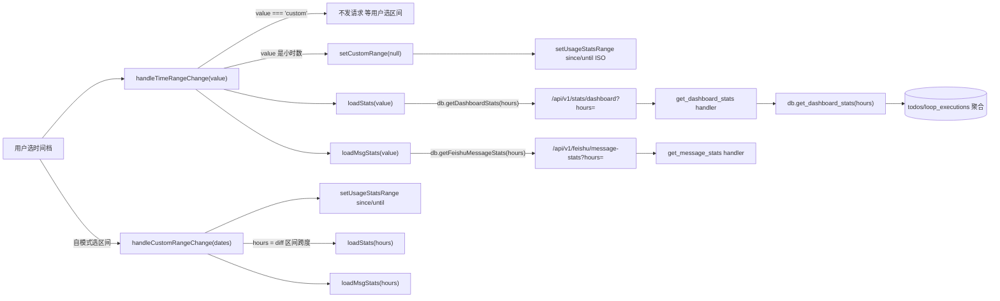
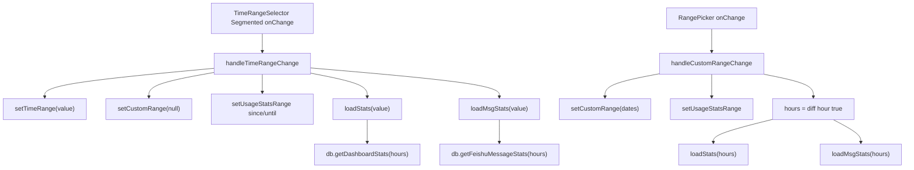
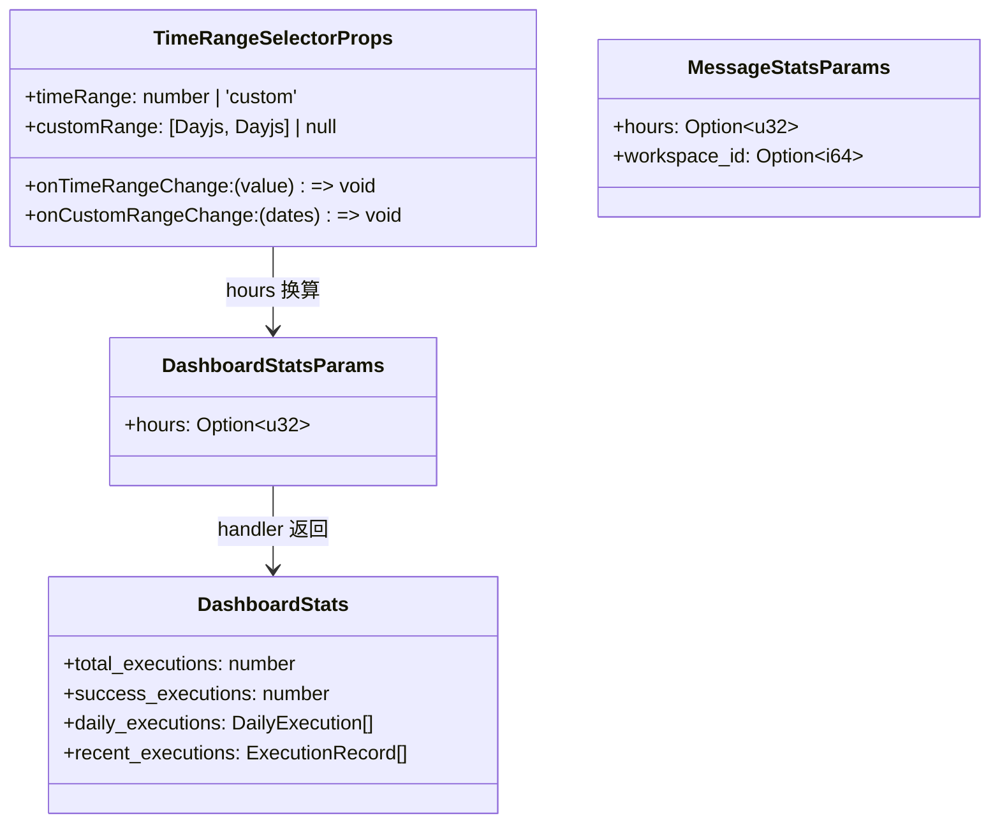
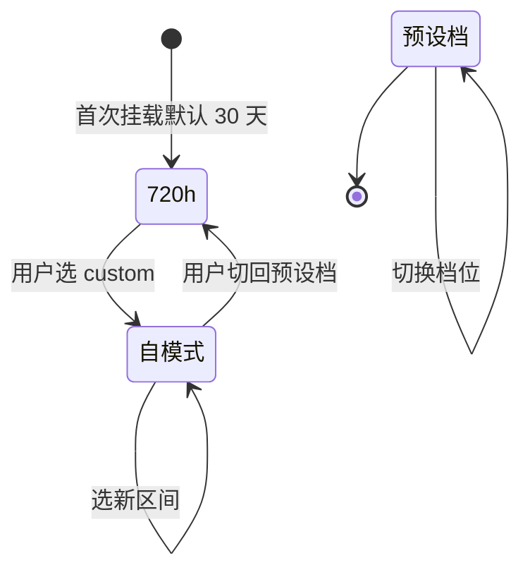

# 全局时间范围选择

## 功能位置

仪表盘 → 顶部 `TimeRangeSelector` 控件（Segmented 多档预设 + 自模式 DatePicker.RangePicker）

## 数据流图（前端 → 后端）

## 调用关系链路图

## 数据结构图

## 数据变更图

## 开发指导

- **前端入口**：`frontend/src/components/Dashboard.tsx` 的 `handleTimeRangeChange` / `handleCustomRangeChange` / `loadStats` / `loadMsgStats`；控件在 `frontend/src/components/dashboard/SpecialCards.tsx` 的 `TimeRangeSelector`；`db.getDashboardStats` / `db.getFeishuMessageStats` 在 `frontend/src/utils/database.ts`
- **后端入口**：`backend/src/handlers/execution.rs` 的 `get_dashboard_stats` handler（路由 `/api/v1/stats/dashboard`，`DashboardStatsParams.hours`）；飞书在 `backend/src/handlers/feishu_history.rs` 的 `get_message_stats` handler（路由 `/api/v1/feishu/message-stats`）
- **注意**：自模式不发中间态请求，等用户选完区间才触发；`currentHours` 在 custom 模式用区间跨度小时数，派生给自动化 Tab 的 Loop 聚合按窗口过滤；后端 `get_dashboard_stats` / `get_loop_stats` 目前只接受 hours（往前 N 小时），历史区间精确 since/until 需后端改造
- **扩展**：新增预设档时，改 `TimeRangeSelector` 的 `TIME_RANGE_OPTIONS` 常量；后端支持精确 since/until 时，`DashboardStatsParams` 增字段、`db.get_dashboard_stats` SQL WHERE 改区间
