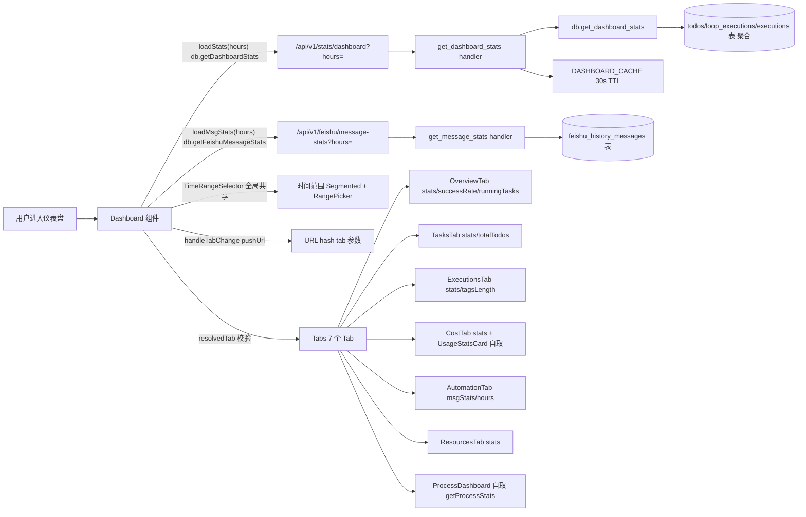

# 仪表盘

> 页面级总览。本页各功能点的 4 图 + 开发指导在子文档中维护。

## 页面简介

仪表盘是全局运营视图，不依赖当前选中的工作空间。它把此前塞进单个 Masonry 的 24 张卡片按语义拆成 7 个 Tab：总览、任务、执行、成本与模型、自动化、资源与运维、工艺。顶部全局时间范围（Segmented + 自定义 RangePicker）对所有 Tab 共享，切换 Tab 不丢失筛选上下文。

数据由 `/api/v1/stats/dashboard` 全库聚合返回 `DashboardStats`（含 todo 分布、执行统计、token/费用、模型分布、近期执行、排行榜等），并有 30 秒 TTL 缓存。飞书消息吞吐由 `/api/v1/feishu/message-stats` 单独拉取，失败时降级空态不弹错。工艺 Tab 由 `ProcessDashboard` 自取 `/api/v1/processes/stats`。

## 页面级数据流总图

## 功能点索引

- [Tab 切换（7 个语义域）](dashboard-tab-switch)
- [全局时间范围选择](dashboard-time-range)
- [总览 Tab](dashboard-overview)
- [成本与模型 Tab](dashboard-cost)
- [自动化 Tab](dashboard-automation)
- [工艺 Tab](dashboard-process)
