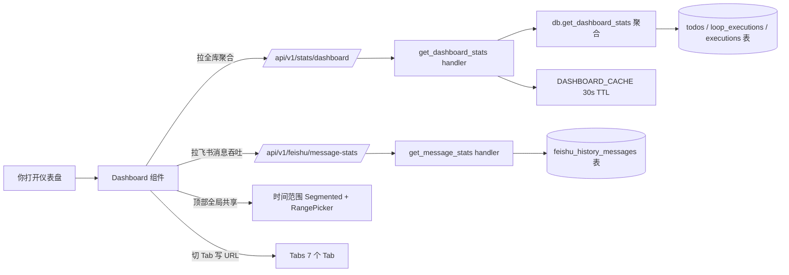

# 仪表盘

仪表盘是全局运营视图，不依赖当前选中的工作空间。它把运营数据按语义拆成 7 个 Tab，让你从不同维度观察系统运转情况。

## 在这里做什么

- 看全局执行量、成功率、成本趋势
- 按时间范围（今天 / 7 天 / 30 天 / 自定义）筛选所有 Tab 的数据
- 在 7 个 Tab 间切换，分别看总览、任务、执行、成本与模型、自动化、资源与运维、工艺

## 怎么操作

1. **选时间范围**：顶部 Segmented 控件选「今天 / 7 天 / 30 天 / 自定义」，所有 Tab 共享这个筛选。
2. **切 Tab**：点顶部 7 个 Tab 卡片切换，切换不丢失时间范围上下文。
3. **看具体指标**：每个 Tab 内部是若干卡片（KPI、趋势图、排行榜、图表等），按需下钻。

## 操作后会发生什么

- 切 Tab 会把当前 Tab 写入 URL hash（`#/dashboard?tab=xxx`），刷新/前进/后退保持当前 Tab。
- 切时间范围会立即重拉所有 Tab 的数据，30 秒内的重复请求走缓存。
- 移动端 Tab 标签自动用短文案（如「成本与模型」→「成本」），避免 6 个 Tab 在窄屏溢出。

## 全局数据流

## 7 个 Tab 一览

| Tab | 看什么 |
|-----|--------|
| 总览 | 核心 KPI、运行中任务、执行趋势、贡献热力图、最近执行记录、分享卡 |
| 任务 | 任务总数、状态分布、近期任务列表 |
| 执行 | 执行成功率、标签维度统计、近期执行记录 |
| 成本与模型 | Token / 费用趋势、模型分布、用量统计 |
| 自动化 | 飞书消息吞吐、自动化触发频次、消息配置入口 |
| 资源与运维 | 执行器资源占用、运维告警、系统健康度 |
| 工艺 | 工艺统计数据，由 ProcessDashboard 自取 `/api/v1/processes/stats` |
