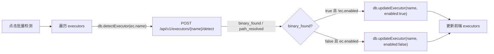
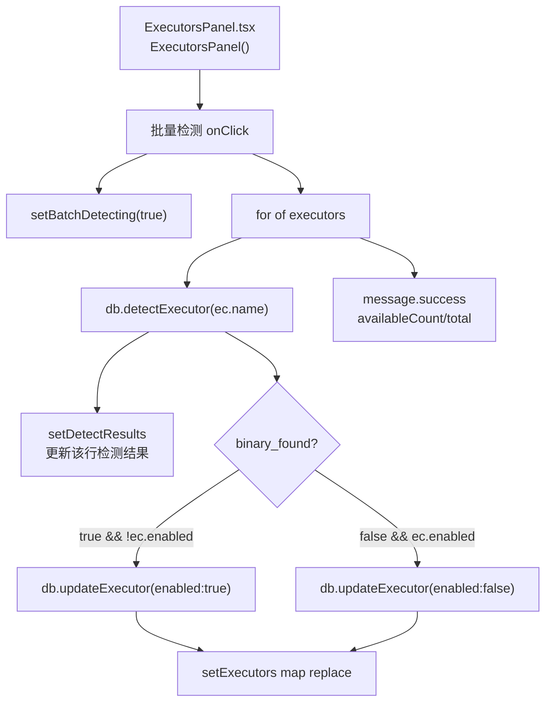
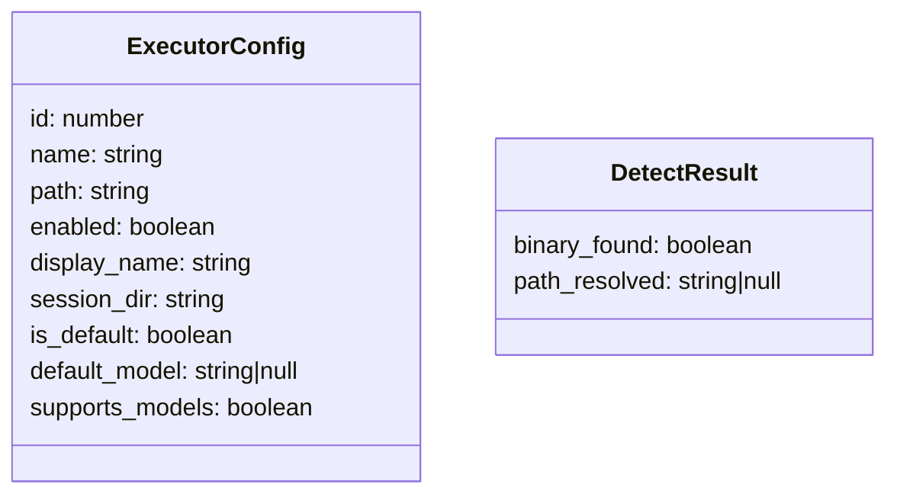
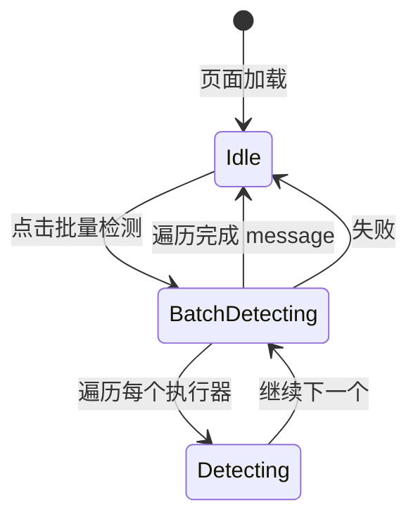

# 批量检测执行器

## 功能位置
执行器页 →「执行器」Tab → 配置表上方「批量检测」按钮（`SearchOutlined`）

## 数据流图（前端 → 后端）

## 调用关系链路图

## 数据结构图

## 数据变更图

## 开发指导
- **前端入口**：`frontend/src/components/settings/ExecutorsPanel.tsx` 的「批量检测」按钮 `onClick` 回调（内联在 JSX）
- **后端入口**：`backend/src/handlers/executor_config.rs` 处理 `POST /api/v1/executors/{name}/detect`（调 `which` 解析二进制路径）
- **注意**：批量检测会根据 `binary_found` 联动更新 `enabled` 开关——找到但未启用则自动启用，未找到但已启用则自动停用
- **扩展**：如需检测时执行额外操作（如写入检测时间戳），后端 detect handler 需追加逻辑并让前端在 `setDetectResults` 同步更新
