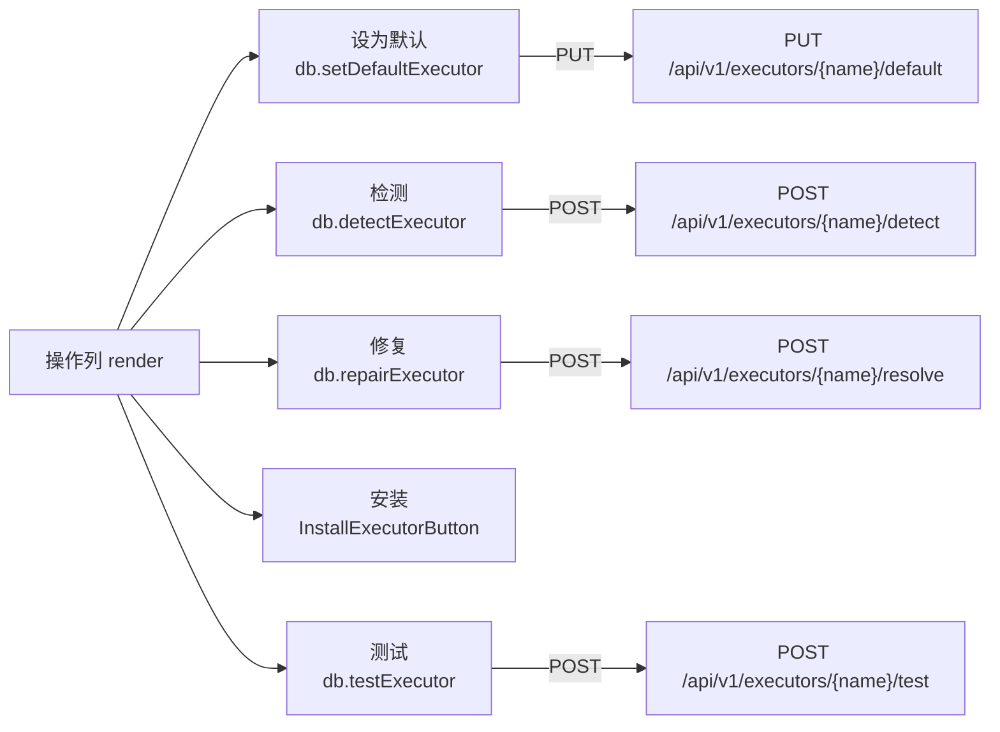
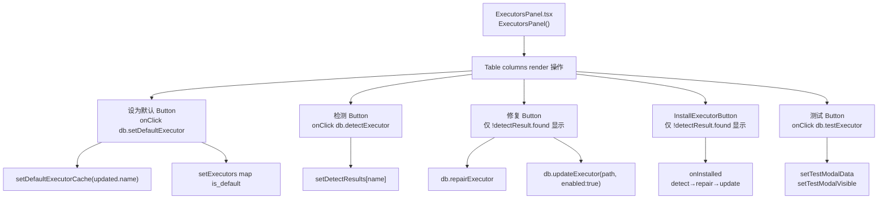
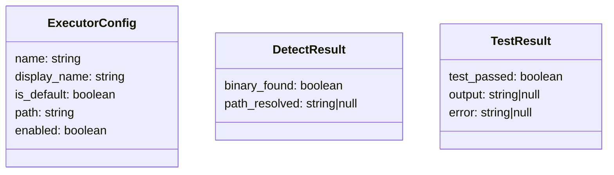
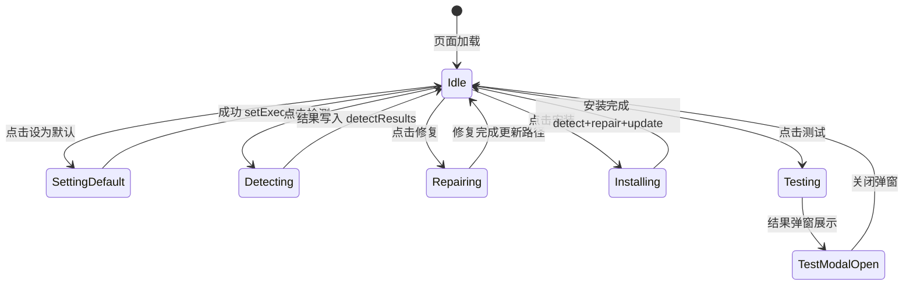

# 执行器行操作

## 功能位置
执行器页 →「执行器」Tab → 配置表「操作」列（设为默认 / 检测 / 修复 / 安装 / 测试）

## 数据流图（前端 → 后端）

## 谑用关系链路图

## 数据结构图

## 数据变更图

## 开发指导
- **前端入口**：`frontend/src/components/settings/ExecutorsPanel.tsx` 的配置表 `columns` 中 `key: 'action'` 的 `render` 回调；`InstallExecutorButton` 来自 `settings/InstallExecutorButton.tsx`
- **后端入口**：`backend/src/handlers/executor_config.rs` 处理 `default`、`detect`、`resolve`、`test` 子路由
- **注意**：修复按钮仅在 `!detectResult?.found` 时显示；安装按钮仅在检测结果存在且未找到时显示；安装回调 `onInstalled` 用 `repair.path_resolved || detect.path_resolved || record.path` 三选一兜底路径
- **扩展**：新增行操作按钮在 `columns` 的操作列 `Space` 中追加 `Button`，并添加对应 loading state
