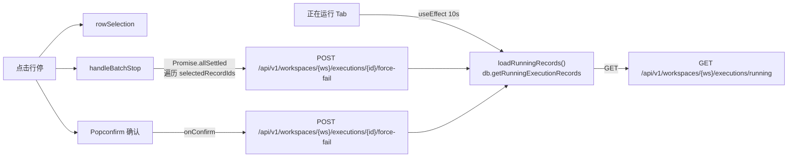
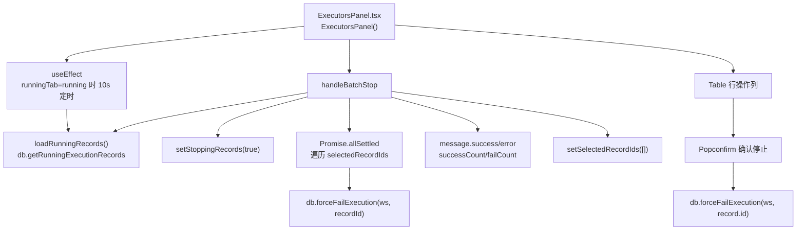
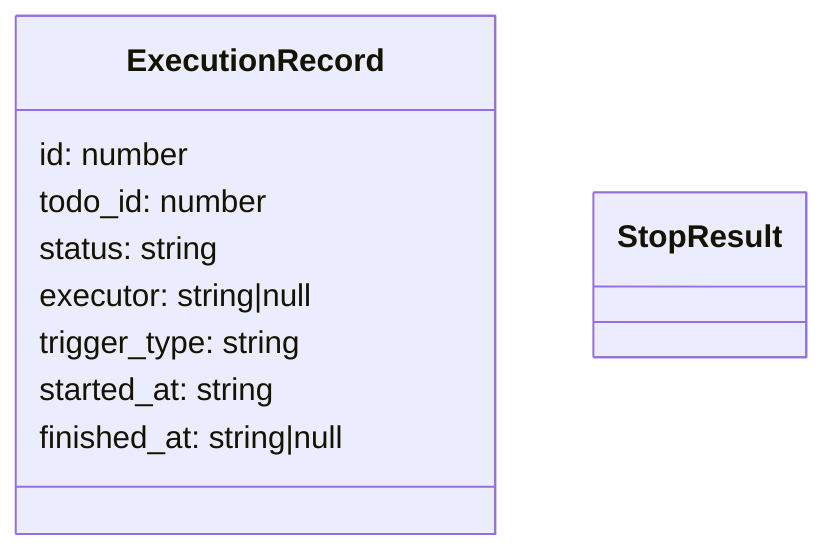
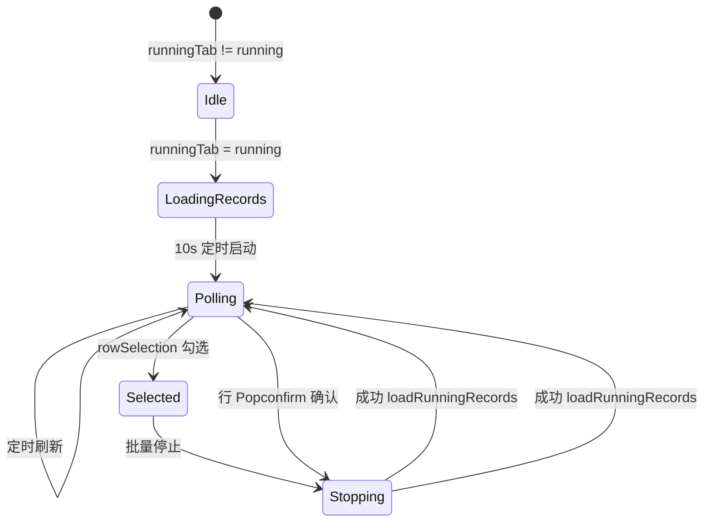

# 正在运行 Tab 停停任务

## 功能位置
执行器页 →「正在运行」Tab →「批量停止 (N)」按钮 / 行内「停止」`Popconfirm`

## 数据流图（前端 → 后端）

## 谑用关系链路图

## 数据结构图

## 数据变更图

## 开发指导
- **前端入口**：`frontend/src/components/settings/ExecutorsPanel.tsx` 的 `loadRunningRecords`、`handleBatchStop` 回调；行操作列的 `Popconfirm onConfirm`
- **后端入口**：`backend/src/handlers/execution.rs` 处理 `GET /api/v1/workspaces/{ws}/executions/running`、`POST /api/v1/workspaces/{ws}/executions/{id}/force-fail`
- **注意**：工作空间 ID 取 `state.selectedWorkspace ?? 0`；批停用 `Promise.allSettled` 统计成功/失败数，不因部分失败而中断
- **扩展**：如需停停时附带原因（如「用户手动停」），后端 force-fail handler 需接收 `reason` 字段并写入 execution record
