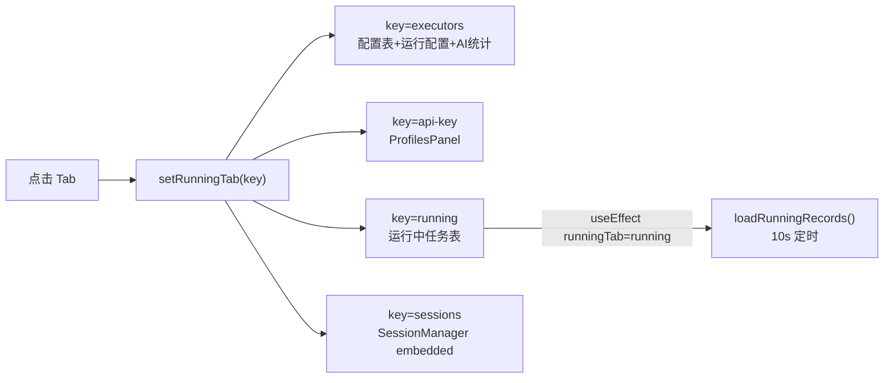
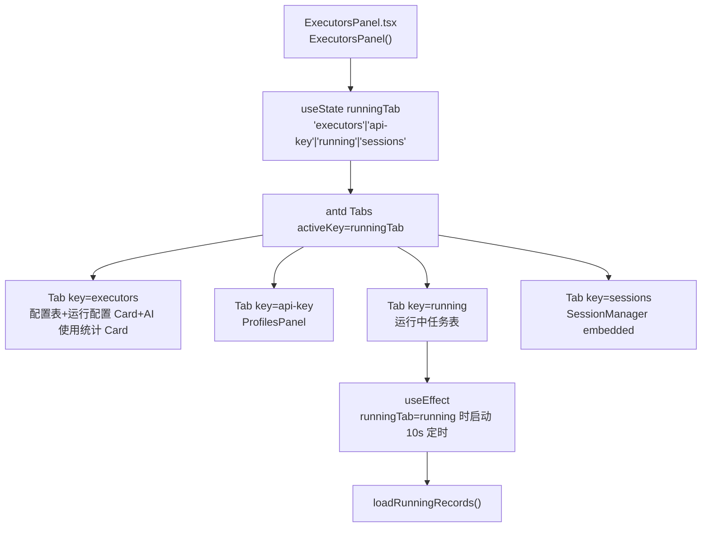
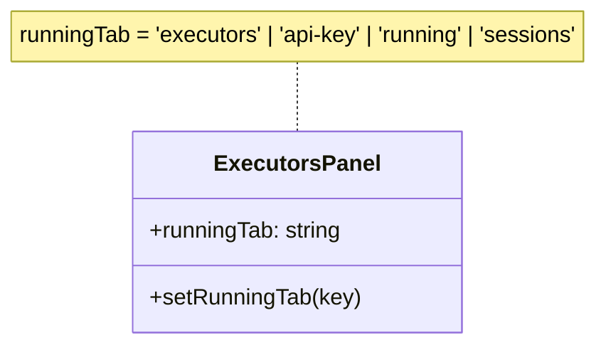

# 执行器页子页签切换

## 功能位置
执行器页 → 顶部 `Tabs`（执行器 / API Key / 正在运行 / 会话）

## 数据流图（前端 → 后端）



## 调用关系链路图



## 数据结构图



## 数据变更图

```mermaid
stateDiagram-v2
  [*] --> executors: 默认 useState
  executors --> api-key: 点击 API Key
  api-key --> executors: 点击执行器
  executors --> running: 点击正在运行
  running --> executors: 点击执行器
  executors --> sessions: 点击会话
  sessions --> executors: 点击执行器
```

## 开发指导
- **前端入口**：`frontend/src/components/settings/ExecutorsPanel.tsx` 的 `ExecutorsPanel` 组件，`Tabs onChange` 回调 `setRunningTab`
- **后端入口**：各 Tab 按需调用不同后端接口；Tab 切换本身无后端调用
- **注意**：`running` Tab 的 `useEffect` 仅在 `runningTab === 'running'` 时启动 10 秒定时器加载运行记录，切走时 clearInterval
- **扩展**：新增 Tab 时在 `Tabs items` 数组追加条目并扩展 `runningTab` 的 union 类型
