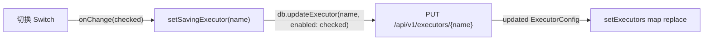
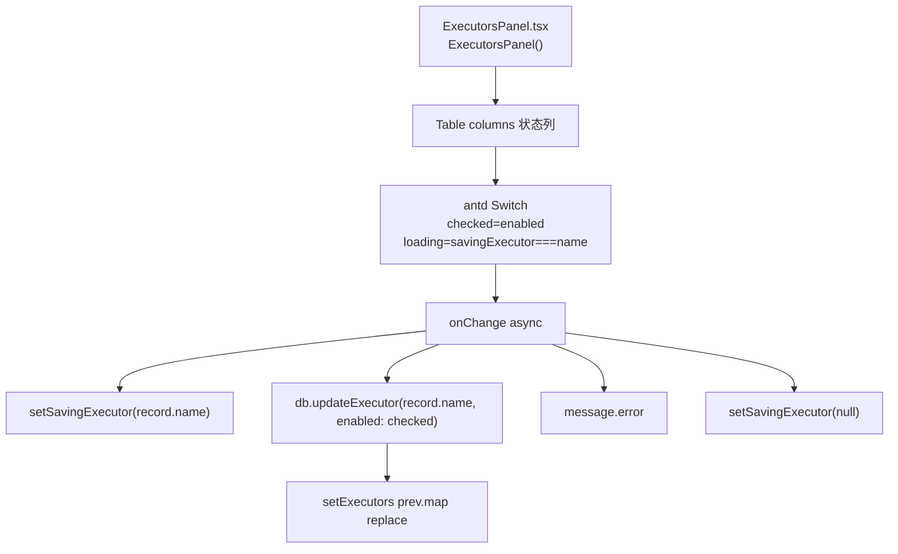
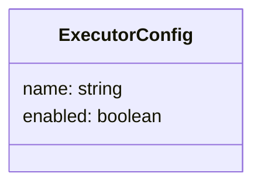
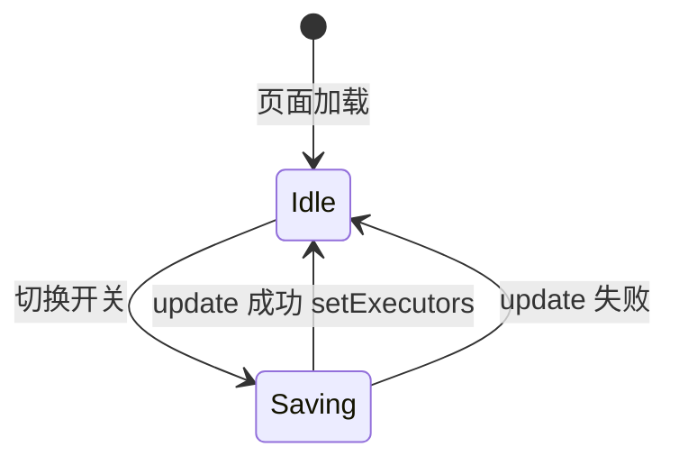

# 启用/停用执行器

## 功能位置
执行器页 →「执行器」Tab → 配置表「状态」列的 `Switch` 开关

## 数据流图（前端 → 后端）

## 谑用关系链路图

## 数据结构图

## 数据变更图

## 开发指导
- **前端入口**：`frontend/src/components/settings/ExecutorsPanel.tsx` 的配置表 `columns` 中 `key: 'enabled'` 的 `Switch onChange` 回调（内联在 JSX render）
- **后端入口**：`backend/src/handlers/executor_config.rs` 处理 `PUT /api/v1/executors/{name}`，接收 `{ enabled: boolean }` partial update
- **注意**：关闭开关的执行器不会出现在 Todo 的执行器选择列表中；批量检测也会根据二进制可用性联动此开关
- **扩展**：如需在启用/停用时触发额外操作（如清理会话），后端 update handler 的 `enabled` 分支需追加逻辑
