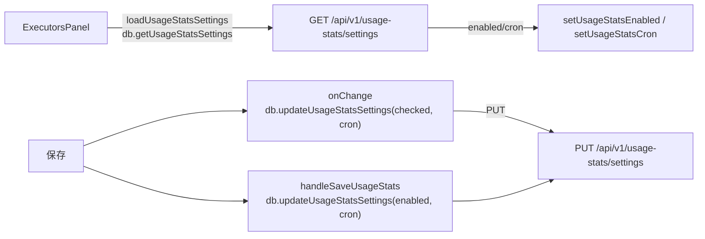
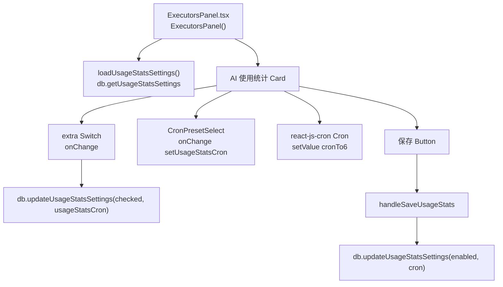
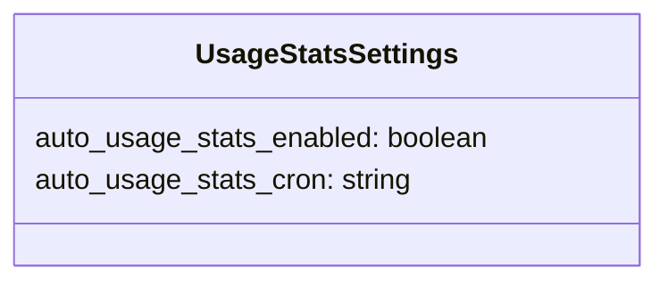
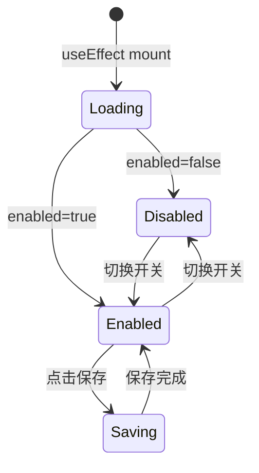

# AI 使用统计

## 功能位置
执行器页 →「执行器」Tab →「AI 使用统计」Card（右上角 `Switch` + cron 表达式配置）

## 数据流图（前端 → 后端）

## 谑用关系链路图

## 数据结构图

## 数据变更图

## 开发指导
- **前端入口**：`frontend/src/components/settings/ExecutorsPanel.tsx` 的 `loadUsageStatsSettings`、`handleSaveUsageStats` 回调；cron 用 `react-js-cron` + `cronTo5`/`cronTo6` 转换 5/6 段格式
- **后端入口**：`backend/src/handlers/usage_stats.rs` 处理 `GET /api/v1/usage-stats/settings`、`PUT /api/v1/usage-stats/settings`
- **注意**：cron 在前端用 5 段格式展示（`cronTo5`），存储用 6 段（`cronTo6`），因为后端 scheduler 依赖 6 段含秒的 cron
- **扩展**：新增统计维度（如按模型分组）需后端归档逻辑追加字段，前端 `UsageStatsSettings` 类型扩展对应键
