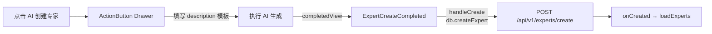
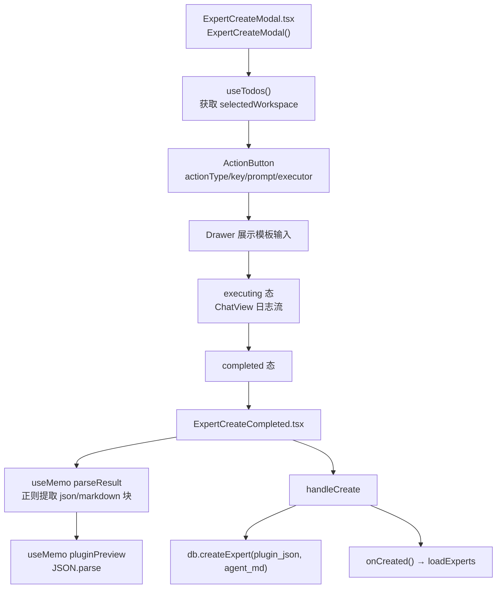
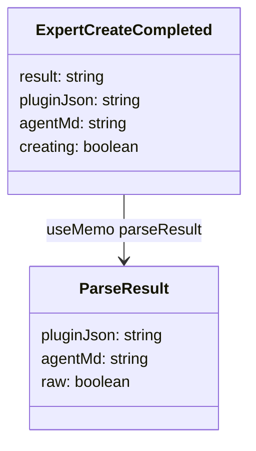
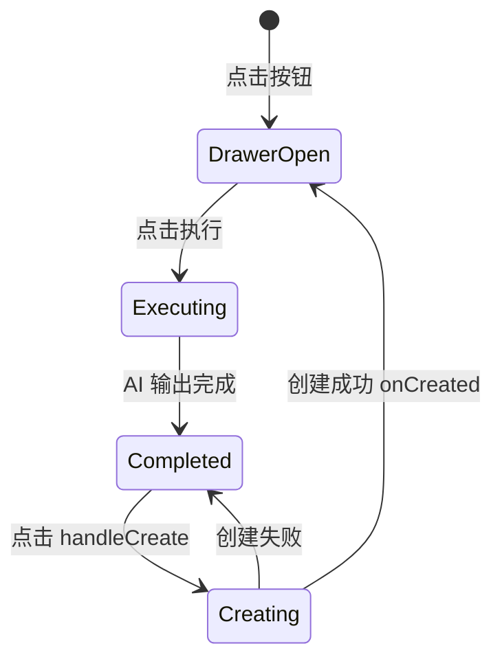

# AI 创建专家

## 功能位置
专家页 → 搜索栏右侧「AI 创建专家」按钮（`ExpertCreateModal`）

## 数据流图（前端 → 后端）



## 谑用关系链路图



## 数据结构图



## 数据变更图



## 开发指导
- **前端入口**：`frontend/src/components/settings/ExpertCreateModal.tsx` 的 `ExpertCreateModal` 组件，复用 `ActionButton` 交互流程；完成态由 `ExpertCreateCompleted.tsx` 渲染
- **后端入口**：`backend/src/handlers/experts.rs` 处理 `POST /api/v1/experts/create`，写入 `plugin.json` 和 `agent.md`
- **注意**：`parseResult` 用正则 `` ```json `` 和 `` ```markdown `` 提取 AI 输出块，若任一缺失则 `raw=true` 展示原始文本供用户手动修正
- **扩展**：新增 AI 模板字段时改 `EXPERT_CREATE_PROMPT` 和 `ExpertCreateCompleted` 的解析逻辑
