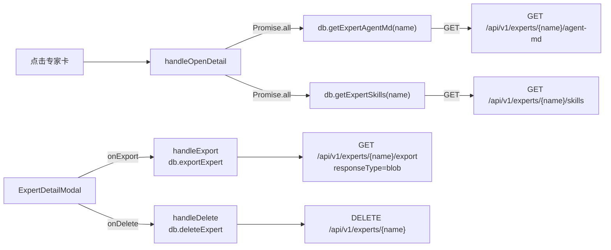
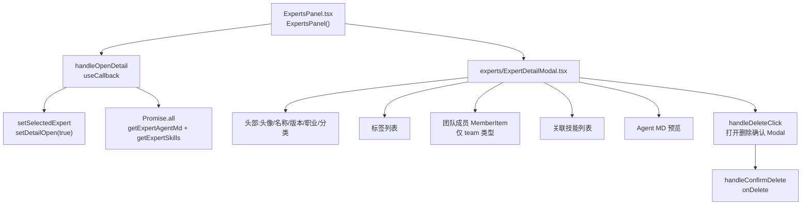
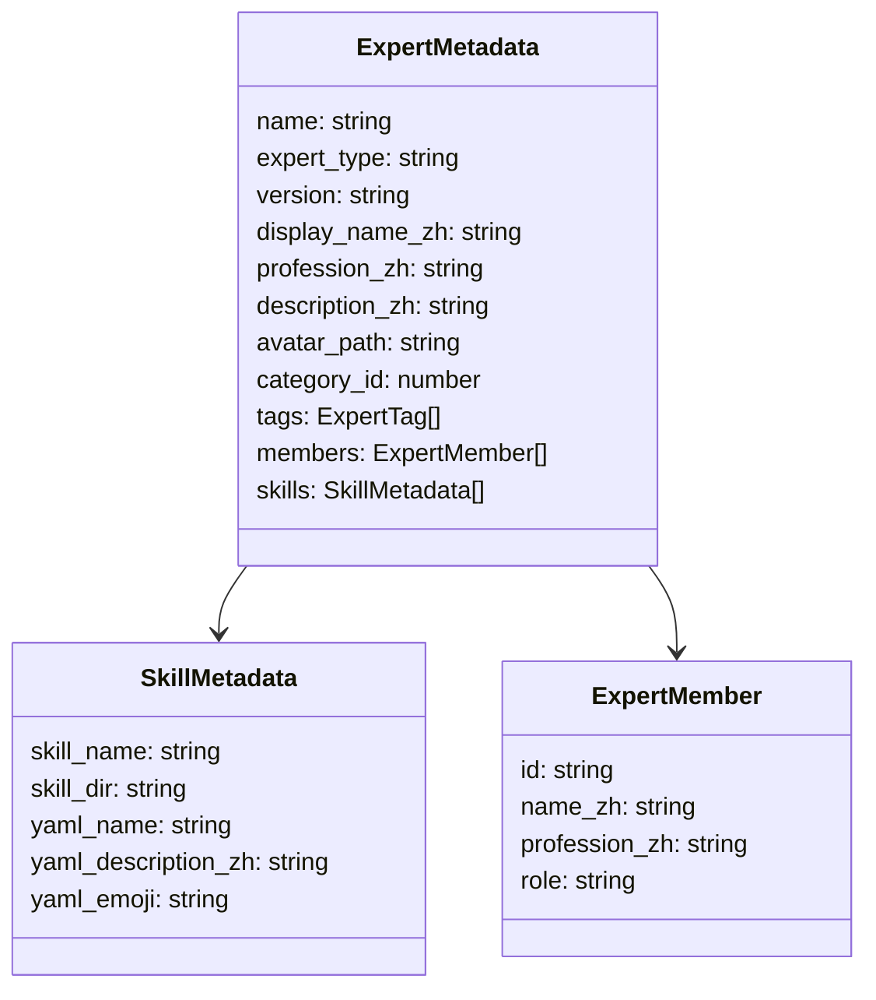
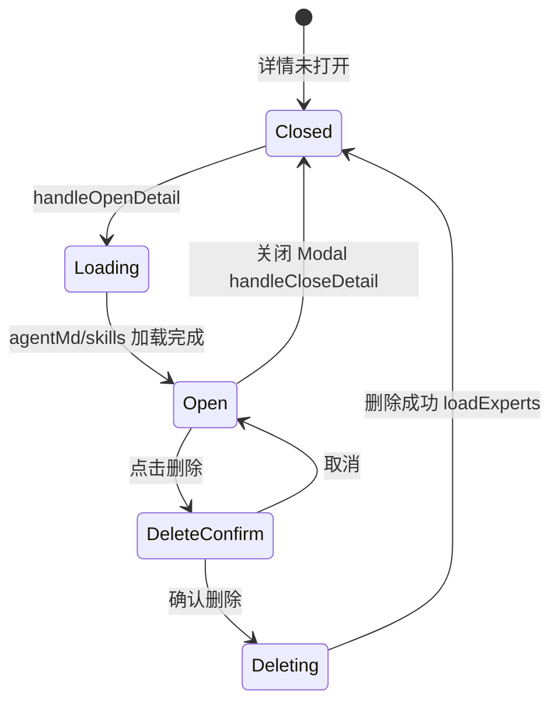

# 专家详情 Modal

## 功能位置
专家页 → 点击专家卡 / 团队卡 → `ExpertDetailModal` 弹窗

## 数据流图（前端 → 后端）

## 谑用关系链路图

## 数据结构图

## 数据变更图

## 开开发指导
- **前端入口**：`frontend/src/components/settings/experts/ExpertDetailModal.tsx` 的 `ExpertDetailModal` 组件；由 `ExpertsPanel` 的 `handleOpenDetail` / `handleExport` / `handleDelete` 驱动
- **后端入口**：`backend/src/handlers/experts.rs` 处理 `GET /api/v1/experts/{name}/agent-md`、`GET /api/v1/experts/{name}/skills`、`GET /api/v1/experts/{name}/export`、`DELETE /api/v1/experts/{name}`
- **注意**：`ExpertDetailModal` 内的 `useState` / `useIsMobile` Hooks 必须在 `if (!expert) return null` 之前调用，否则 expert 从 null→对象时 Hook 数量变化导致崩溃
- **扩展**：新增详情区块（如「配置预览」）在 Modal 内容区追加 JSX 并在 `handleOpenDetail` 预加载对应数据
