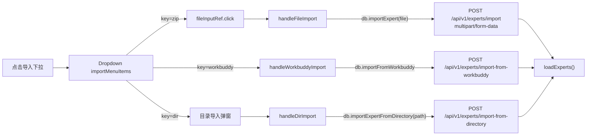
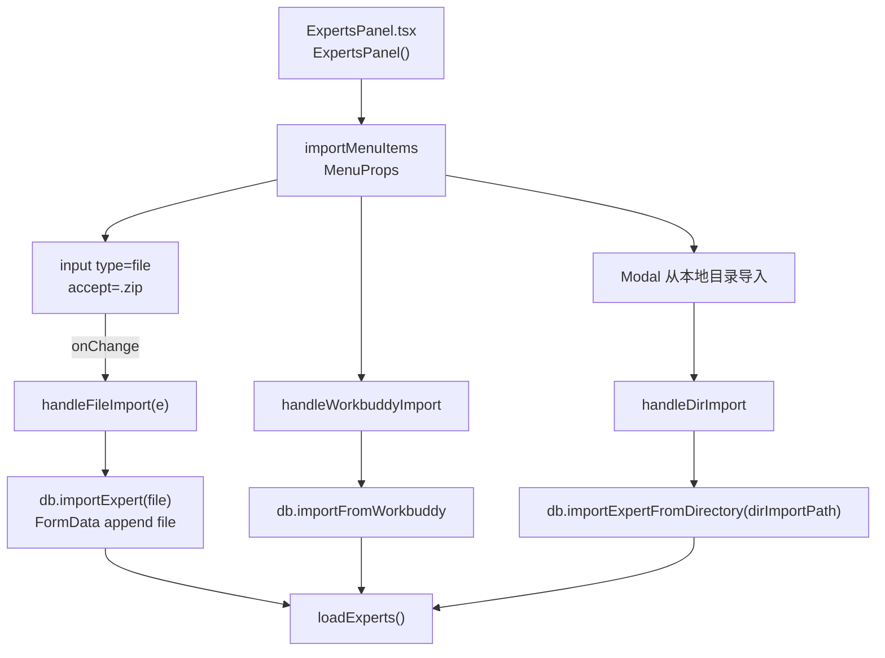
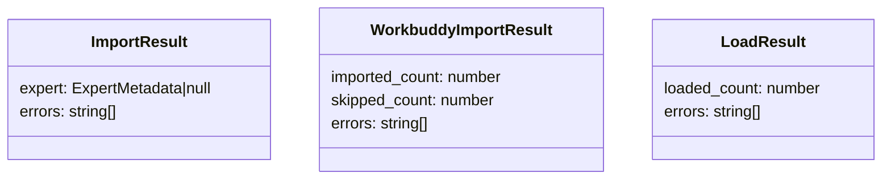
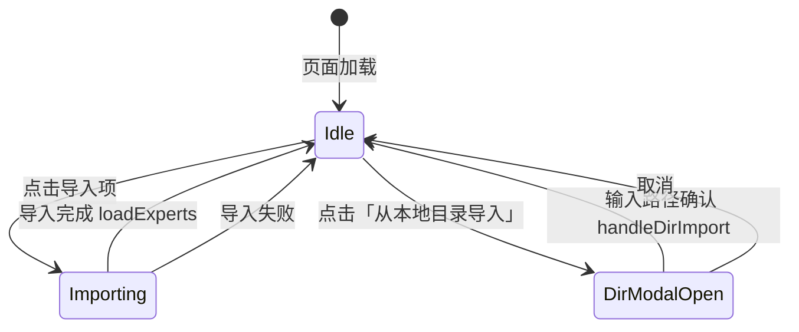

# 导入专家

## 功能位置
专家页 → 页面卡片右上角「导入」下拉按钮（上传 zip 包 / 从 WorkBuddy 导入 / 从本地目录导入）

## 数据流图（前端 → 后端）

## 谑用关系链路图

## 数据结构图

## 数据变更图

## 开发指导
- **前端入口**：`frontend/src/components/settings/ExpertsPanel.tsx` 的 `handleFileImport`、`handleWorkbuddyImport`、`handleDirImport` 回调
- **后端入口**：`backend/src/handlers/experts.rs` 处理 `POST /api/v1/experts/import`、`import-from-directory`、`import-from-workbuddy`
- **注意**：zip 导入不手动设 `Content-Type`，交给浏览器自动生成带 boundary 的 multipart 头；WorkBuddy 导入返回 `imported_count` / `skipped_count` / `errors` 三段统计需分别拼装提示
- **扩展**：新增导入来源时在 `importMenuItems` 数组追加菜单项并在 `ExpertsPanel` 添加对应 handler
