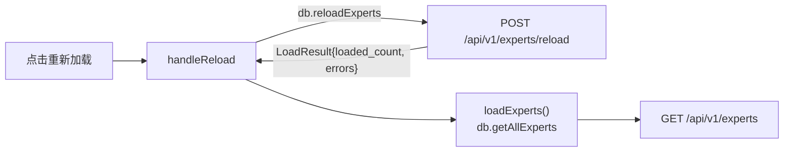
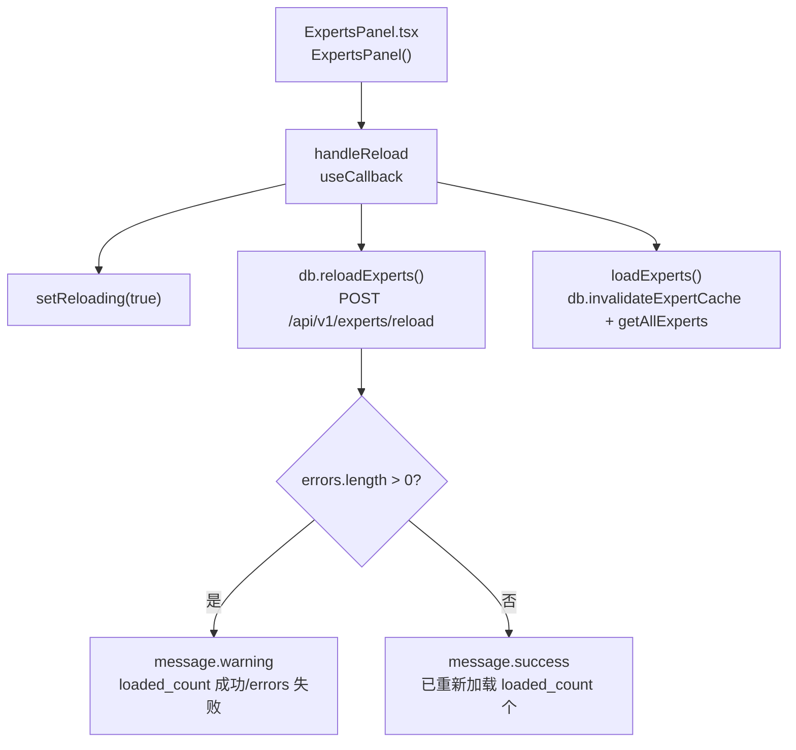
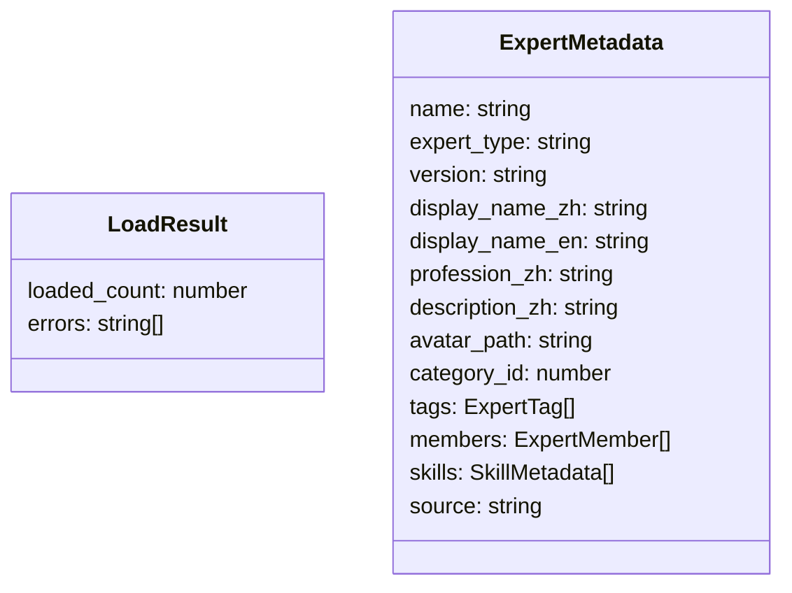
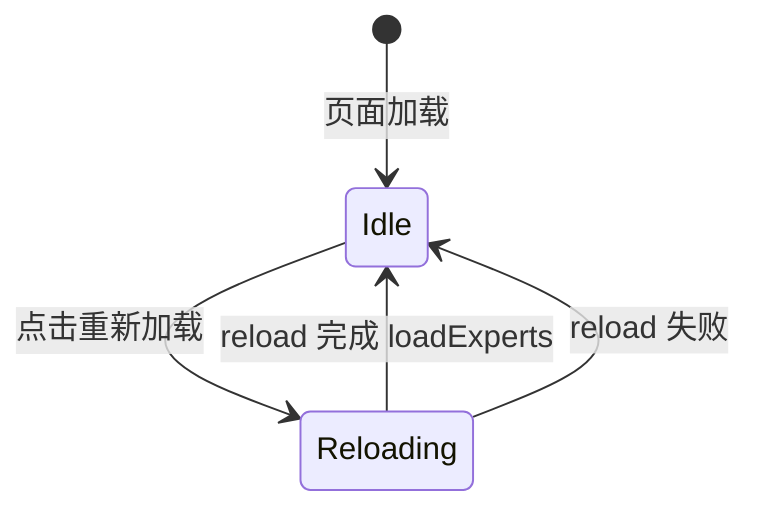

# 重新加载专家

## 功能位置
专家页 → 页面卡片右上角「重新加载」按钮（Tooltip 提示「重新扫描 ~/.ntd/experts/ 目录」）

## 数据流图（前端 → 后端）

## 谑用关系链路图

## 数据结构图

## 数据变更图

## 开发指导
- **前端入口**：`frontend/src/components/settings/ExpertsPanel.tsx` 的 `handleReload` 回调（`useCallback`）
- **后端入口**：`backend/src/handlers/experts.rs` 处理 `POST /api/v1/experts/reload`，清空内存索引并重新扫描 `~/.ntd/experts/`
- **注意**：`loadExperts` 开头调用 `db.invalidateExpertCache()` 失效单专家缓存，避免刷新后展示过期数据
- **扩展**：如需扫描额外目录，后端 reload handler 的扫描路径需对应修改
