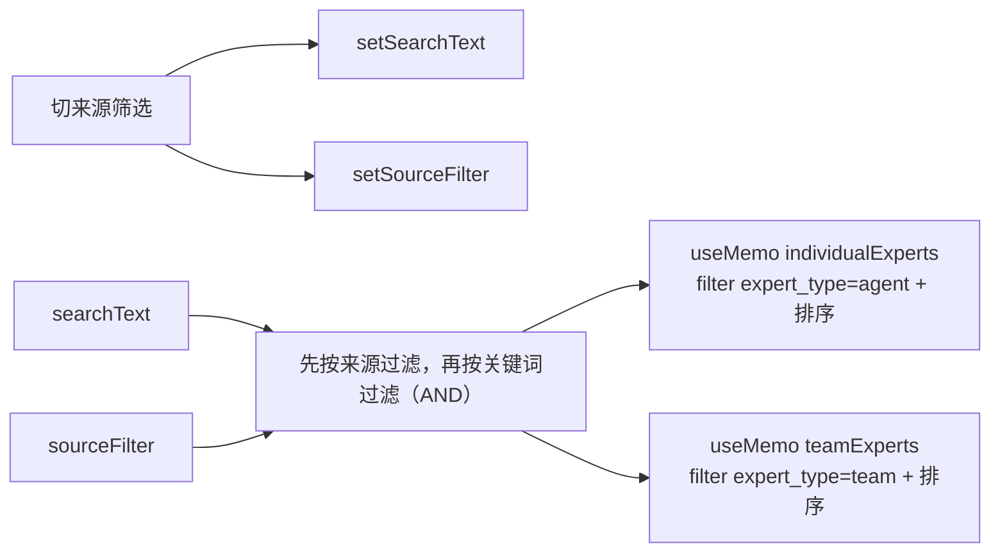
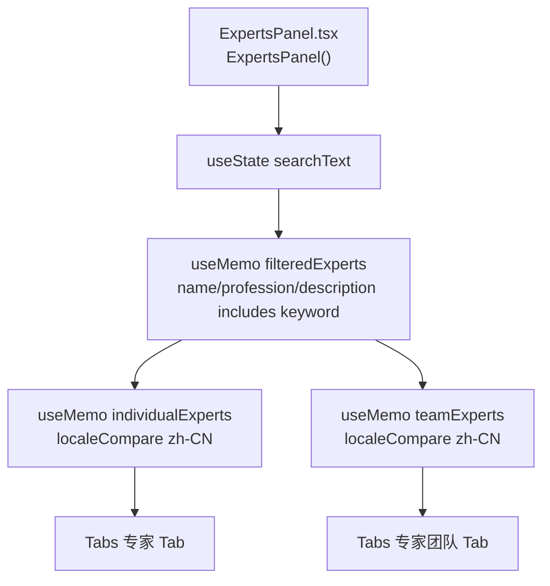
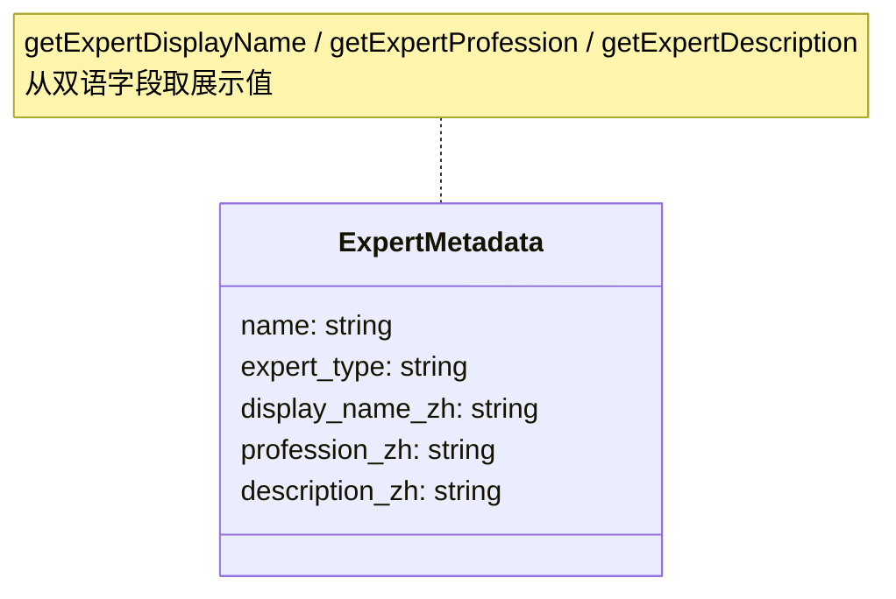
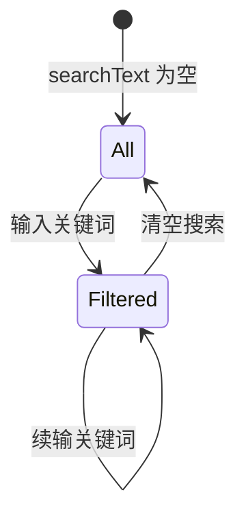

# 搜索专家

## 功能位置
专家页 → 搜索栏（`Input` 前缀 `SearchOutlined`，placeholder「搜索专家名称、职业或描述」），搜索框左侧为来源筛选 Segmented（全部/我的/内置）

## 数据流图（前端 → 后端）

## 谑用关系链路图

## 数据结构图

## 数据变更图

## 开发指导
- **前端入口**：`frontend/src/components/settings/ExpertsPanel.tsx` 的 `filteredExperts` useMemo（`useMemo` 依赖 `experts`、`searchText` 与 `sourceFilter`）
- **后端入口**：无后端调用，纯前端从已加载列表过滤
- **注意**：搜索关键词统一 `toLowerCase()` 后做 `includes`；排序用 `localeCompare(nameB, 'zh-CN')` 稳定排序避免刷新时顺序跳动
- **扩展**：新增搜索维度时在 `filteredExperts` 的 `filter` 回调追加字段判断
