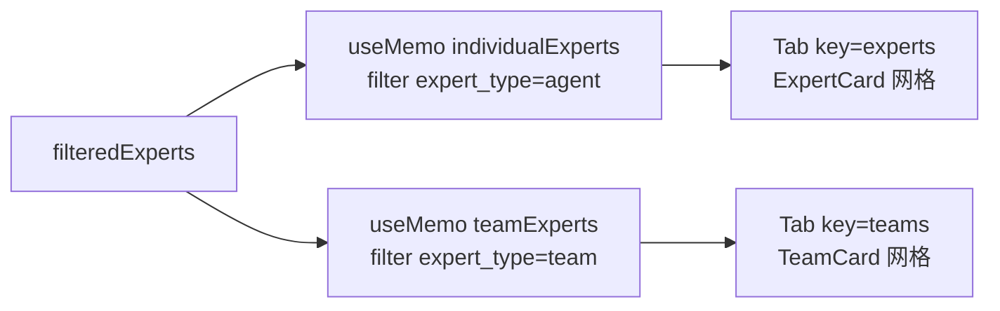
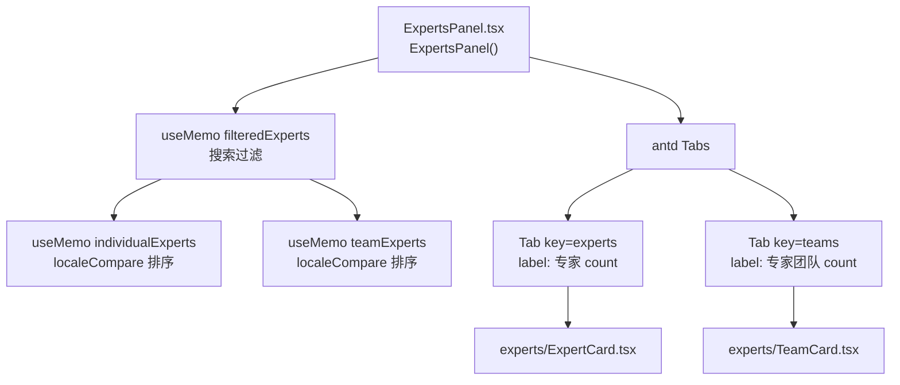
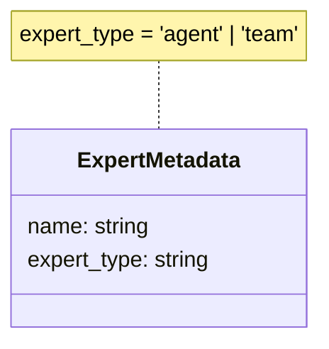
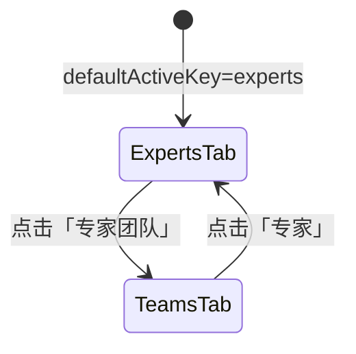

# 专家 / 专家团队分区切换

## 功能位置
专家页 → `Tabs`（defaultActiveKey="experts"，两个 Tab：专家 / 专家团队）

## 数据流图（前端 → 后端）

## 谑用关系链路图

## 数据结构图

## 数据变更图

## 开发指导
- **前端入口**：`frontend/src/components/settings/ExpertsPanel.tsx` 的 `Tabs items` 数组，`individualExperts` / `teamExperts` useMemo 分区
- **后端入口**：无后端调用，纯前端分区
- **注意**：Tab label 附实时计数（`individualExperts.length`），搜索过滤后计数同步刷新；空列表时展示 `Empty` 占位
- **扩展**：新增专家类型分区时追加 `useMemo` 过滤并增加对应 Tab item
