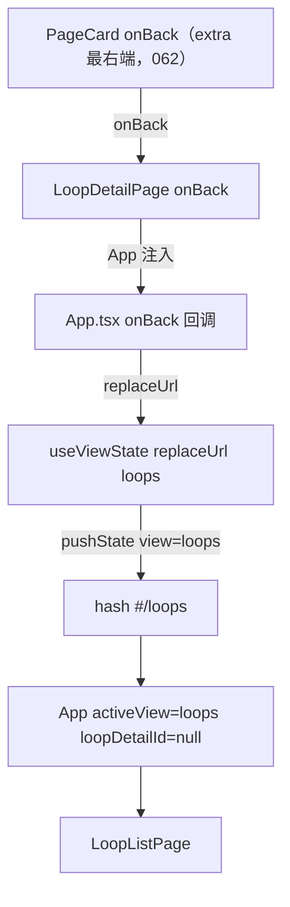
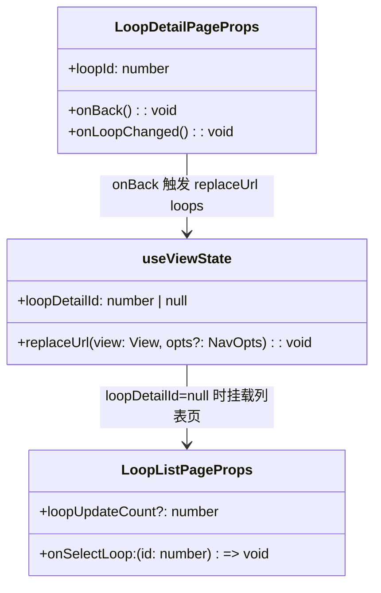
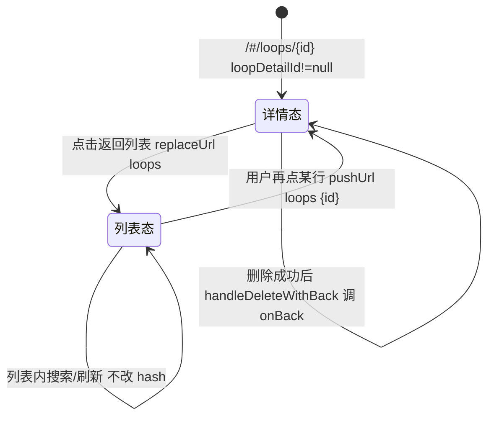

# 返回列表

## 功能位置

环路（详情） → `LoopDetailPage` 的 `PageCard` 页头 extra 区最右端 → 「返回列表」按钮（`ArrowLeftOutlined`）。062 起统一走 `PageCard` 的 `onBack` prop（固定右上角锡点），各详情页不再手写 `titleSuffix` 按钮。

## 数据流图（前端 → 后端）

## 调用关系链路图

## 数据结构图

## 数据变更图

## 开发指导

- **前端入口**：`frontend/src/components/LoopDetailPage.tsx` 的 `LoopDetailPage`（062 起将 `onBack` 传给 `PageCard` 的 `onBack` prop，按钮由 PageCard 统一渲染在 extra 区最右端），`onBack` 由 `frontend/src/App.tsx` 注入（`replaceUrl('loops')` 让 `loopDetailId` 解析为 `null`）。删除流程里 `handleDeleteWithBack` 也会在删除成功后调 `onBack` 自动回到列表。
- **后端入口**：无。纯前端路由切换，不落环路后端接口。
- **注意**：`handleDeleteWithBack` 用 `useCallback([handleDelete, onBack])` 稳定引用，避免每次重渲染创建新函数传给 `LoopDetailPanel`/`onActionsReady` effect 触发死循环（NTD-007 引用链稳定性设计）；返回列表后 `LoopListPage` 通过监听 `loopUpdateCount` 自动重拉，能反映详情页的删除/启停结果。
- **扩展**：要支持「返回到列表并保持滚动位置/选中态」，需在 `replaceUrl('loops')` 前把列表 `scrollTop`/`selectedIds` 存到 `App` 的 ref/state，并在 `LoopListPage` 挂载时恢复；当前实现是纯重挂载，列表分页/滚动会复位。
