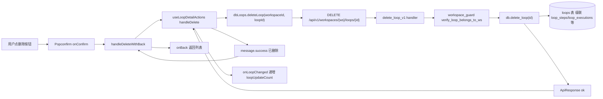
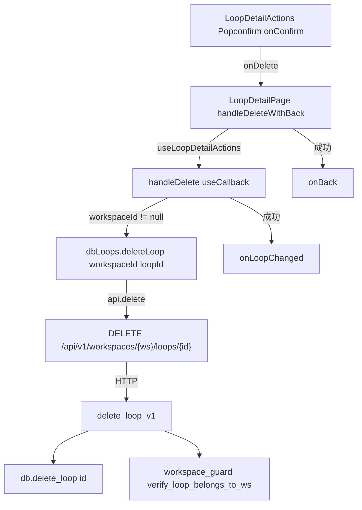
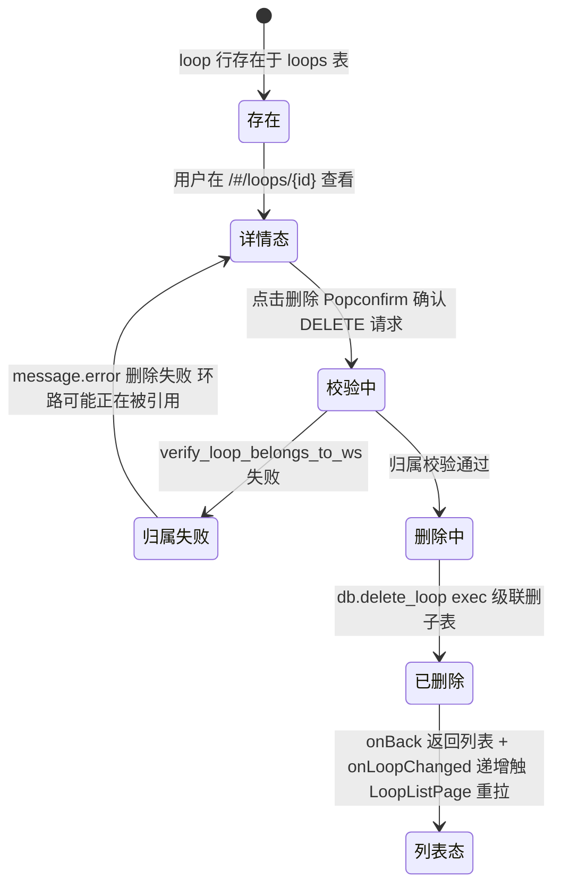

# 删除环路

## 功能位置

环路（详情） → `LoopDetailPage` 的 `PageCard` `extra` 区 → `LoopDetailActions` 删除按钮（`DeleteOutlined`，外包 `Popconfirm` 硚示「将级联删除环节与执行记录，无法恢复」，`okType="danger"`）。

## 数据流图（前端 → 后端）



## 调用关系链路图



## 数据结构图

```mermaid
classDiagram
  class LoopDetailActionsProps {
    +onDelete(): void
  }
  class UseLoopDetailActionsArgs {
    +loopId: number
    +workspaceId: number | null
    +onLoopChanged(): void
  }
  class loops::Model {
    +id: i64
    +name: String
    +workspace_id: Option i64
  }
  class loop_steps::Model {
    +id: i64
    +loop_id: i64
  }
  class loop_executions::Model {
    +id: i64
    +loop_id: i64
  }
  loops::Model --> loop_steps::Model : Relation LoopSteps has_many
  loops::Model --> loop_executions::Model : Relation LoopExecutions has_many
  LoopDetailActionsProps --> UseLoopDetailActionsArgs : onDelete 落 handleDelete
```

## 数据变更图



## 开发指导

- **前端入口**：`frontend/src/components/LoopDetailActions.tsx` 的 `LoopDetailActions`（`Popconfirm` + `Button`），回调 `frontend/src/components/LoopDetailPage.tsx` 的 `handleDeleteWithBack`（`useCallback` 包 `useLoopDetailActions.handleDelete` + `onBack`），`useLoopDetailActions` 在 `frontend/src/components/LoopDetailPageParts.tsx`。
- **后端入口**：`backend/src/handlers/loop_.rs` 的 `delete_loop_v1`（路由 `DELETE /api/v1/workspaces/{ws}/loops/{id}`），DAO `backend/src/db/loop_.rs` 的 `Database::delete_loop`（`loops::Entity::delete_by_id`），级联清子表靠 sea_orm Relation `has_many` + DB 外键。
- **注意**：删除按钮只在 `LoopDetailPanel` 上报 `onActionsReady(true)`（即 detail 加载完成）后才渲染到 `PageCard extra`，避免详情未加载误删；`handleDeleteWithBack` 删除成功后会先 `message.success` + `onLoopChanged` 再 `onBack`，回到列表态让 `LoopListPage` 按 `loopUpdateCount` 重拉反映删除结果。
- **扩展**：044 后环路删除是清理运行时实例的唯一入口；要加「删除前校验环路是否正被 todo 引用」，需在后端 `delete_loop_v1` 增 `db.find_loop_step_by_todo_id`/`get_referencing_loops_for_todos` 反查，有引用时返回 BadRequest 让前端 `Popconfirm` 提示阻断。
