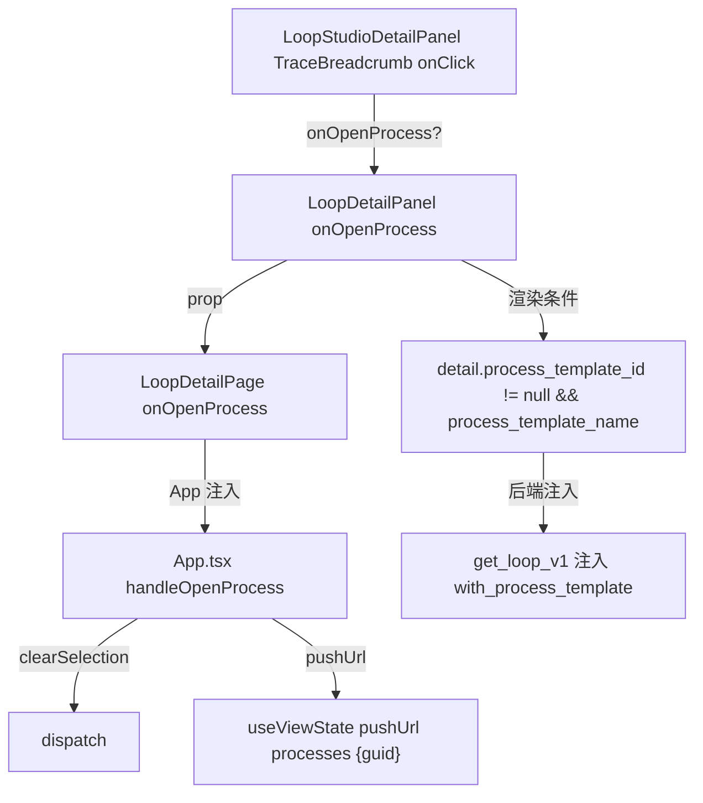
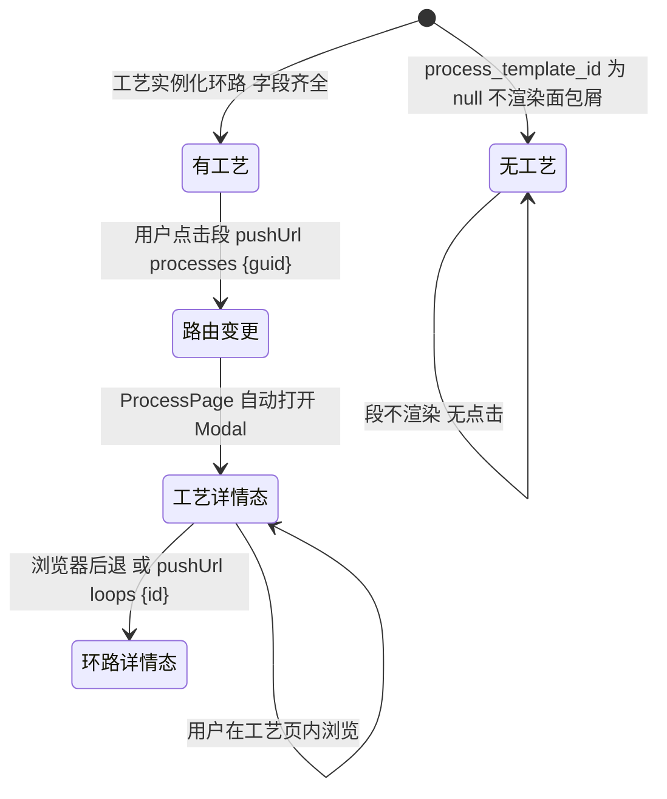

# 跳转来源工艺

## 功能位置

环路（详情） → `LoopDetailPanel` 详情头下方「来源工艺」面包屑 → `TraceBreadcrumb` 单段（label=工艺显示名，techName=标识名，version=实例化快照），仅当 `detail.process_template_id != null && process_template_name` 存在时渲染。

## 数据流图（前端 → 后端）

```mermaid
flowchart LR
  U[用户点击来源工艺段] --> OC["TraceBreadcrumb onClick"]
  OC --> OP["onOpenProcess guid 或 name"]
  OP --> APP["App handleOpenProcess"]
  APP --> CS["clearSelection"]
  CS --> PU["pushUrl processes {guid}"]
  PU --> URL["hash 路由 #/processes?guid=xxx"]
  URL --> PP["渲染 ProcessPage 并自动打开工艺详情 Modal"]
  PP --> PT["工艺详情展示"]
  PT --> DB[(process_templates 表)]
```



## 调用关系链路图



## 数据结构图

```mermaid
classDiagram
  class LoopDetail {
    +process_template_id?: number | null
    +process_template_name?: string | null
    +process_template_guid?: string | null
    +process_template_display_name?: string | null
    +process_template_version?: string | null
  }
  class LoopDto {
    +with_process_template(tpl): LoopDto
  }
  class process_templates::Model {
    +id: i64
    +name: String
    +guid: String
    +display_name: Option String
  }
  class TraceBreadcrumb {
    +label: string
    +techName: string
    +version?: string
    +onClick?: () => void
  }
  LoopDetail --> TraceBreadcrumb : 字段映射为段
  LoopDto --> process_templates::Model : get_process_template_by_id 注入
```

## 数据变更图



## 开发指导

- **前端入口**：`frontend/src/components/LoopStudioDetailPanel.tsx` 的 `LoopDetailPanel`（`detail.process_template_id != null && process_template_name` 时渲染 `TraceBreadcrumb`），`onClick` 调 `onOpenProcess(detail.process_template_guid ?? process_template_name!)`，`onOpenProcess` 由 `frontend/src/App.tsx` 的 `handleOpenProcess`（`clearSelection` + `pushUrl('processes', { guid: templateGuid })`）注入，未注入时段不可点击。
- **后端入口**：工艺名/guid/version 由 `backend/src/handlers/loop_.rs` 的 `get_loop_v1` 在组装 `LoopDetail` 时经 `detail.loop_.with_process_template(process_meta)` 注入（`db.get_process_template_by_id(template_id)` 查 `process_templates` 表）；普通环路（无 `process_template_id`）不查模板表零额外查询。
- **注意**：040 起回跳按 `guid` 寻址（`name` 可重复），旧环路无 `guid` 时回退 `name` 让链接不失效；`display_name` 缺失时 `label` 回退 `name`（`process_template_display_name || process_template_name`）；`onOpenProcess` 未注入时段渲染但不带 `onClick`，保持只读展示。
- **扩展**：要在工艺详情页加「回到本环路」的返回链接，需在 `pushUrl('processes', { guid })` 带上 `from_loop_id` 查询参数，`ProcessPage` 解析后渲染返回按钮调 `pushUrl('loops', { id: from_loop_id })`；当前实现是单向跳转，后退靠浏览器 `history`。
