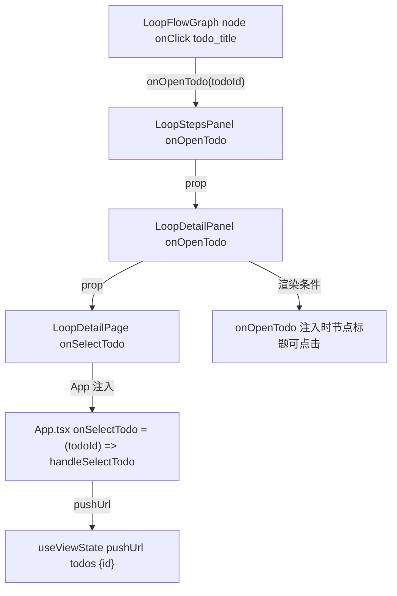
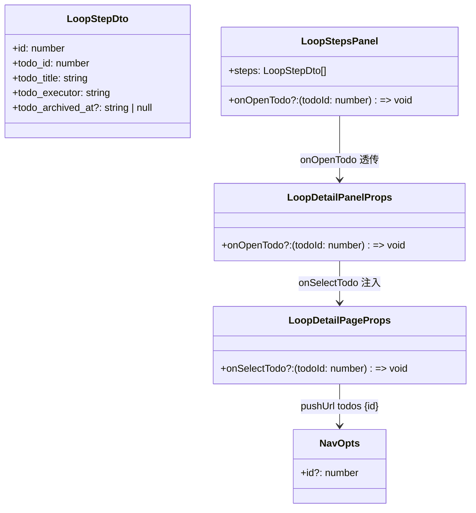
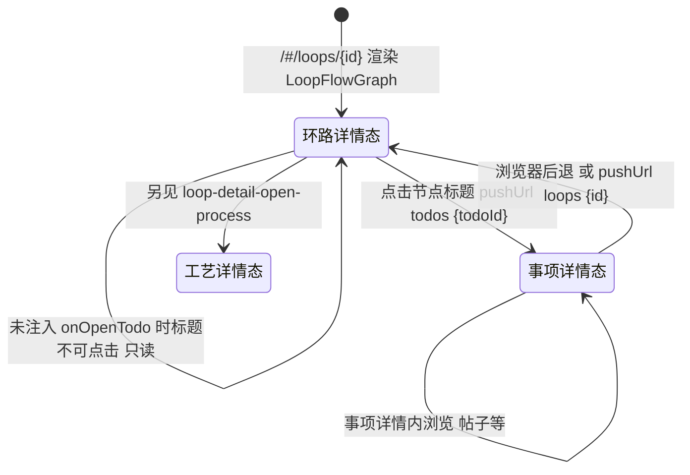

# 流程图节点跳转事项

## 功能位置

环路（详情） → `LoopDetailPanel`「执行环节」Section → `LoopStepsPanel` → `LoopFlowGraph` DAG 流程图节点上的事项标题（可点击，仅当 `onOpenTodo` 注入时）。

## 数据流图（前端 → 后端）

```mermaid
flowchart LR
  U[用户点击节点事项标题] --> FG["LoopFlowGraph onOpenTodo todo_id"]
  FG --> SE["LoopStepsPanel onOpenTodo"]
  SE --> PAN["LoopDetailPanel onOpenTodo"]
  PAN --> LDP["LoopDetailPage onSelectTodo"]
  LDP --> APP["App handleSelectTodo"]
  APP --> PU["pushUrl todos {id: todoId}"]
  PU --> URL["hash 路由 #/todos/{todoId}"]
  URL --> TP["渲染 TodoDetailPage 事项详情"]
  TP --> DB[(todos 表)]
```

## 调用关系链路图

## 数据结构图

## 数据变更图

## 开发指导

- **前端入口**：`frontend/src/components/loop-flow/LoopFlowGraph`（节点事项标题 `onClick` 调 `onOpenTodo(step.todo_id)`），经 `frontend/src/components/LoopStudioStepsPanel.tsx` 的 `LoopStepsPanel` → `frontend/src/components/LoopStudioDetailPanel.tsx` 的 `LoopDetailPanel`（`onOpenTodo` prop）→ `frontend/src/components/LoopDetailPage.tsx` 的 `LoopDetailPage`（`onSelectTodo` prop）透传，最终落到 `frontend/src/App.tsx` 的 `handleSelectTodo`（`pushUrl('todos', { id: todoId })`）。
- **后端入口**：本功能点不发请求，仅前端路由切换。事项详情态挂载后由 `TodoDetailPage` 拉事项数据。环路详情数据里 `todo_id`/`todo_title` 由 `backend/src/db/loop_.rs` 的 `Database::load_loop_full` JOIN `todos` 注入。
- **注意**：`onOpenTodo` 未注入时（如某些内嵌场景）节点事项标题渲染但不带 `onClick`，保持只读展示不可误跳；`todo_archived_at` 非空时流程图节点标记「已归档」，提醒环节指向已隐藏事项，但仍可点击跳转事项详情查看归档事项。
- **扩展**：要在事项详情页加「回到本环路本环节」的返回链接，需在 `pushUrl('todos', { id })` 带上 `from_loop_id`/`from_step_id` 查询参数，`TodoDetailPage` 解析后渲染返回按钮调 `pushUrl('loops', { id: from_loop_id })`；当前实现是单向跳转，后退靠浏览器 `history`。
