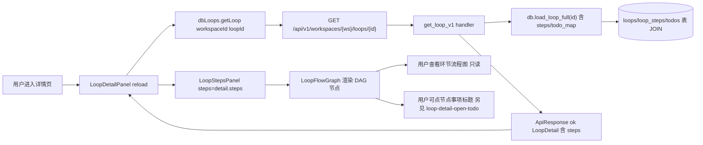
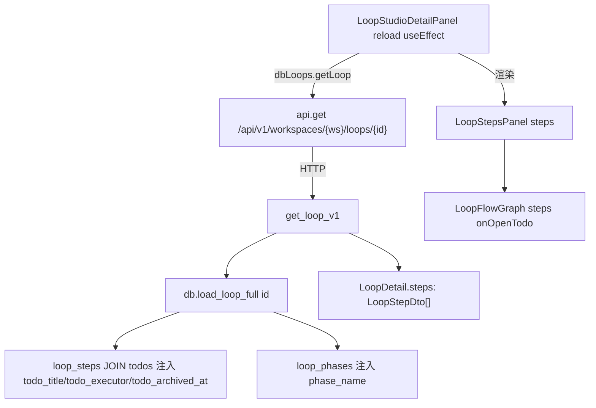
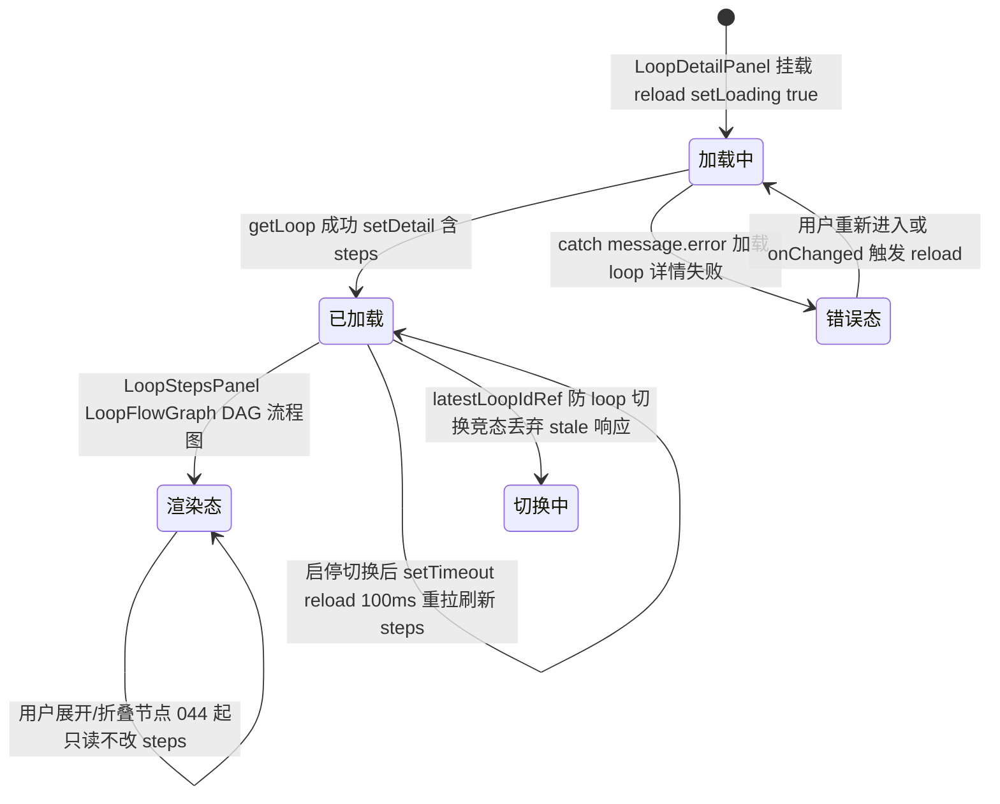

# 步骤展开/执行环节查看

## 功能位置

环路（详情） → `LoopDetailPanel`「执行环节」Section → `LoopStepsPanel`（044 起只读 DAG 流程图，由 `LoopFlowGraph` 渲染），Section 右上 `extra` 显示「{steps.length} 个环节按顺序执行」计数。

## 数据流图（前端 → 后端）



## 调用关系链路图



## 数据结构图

```mermaid
classDiagram
  class LoopDetail {
    +steps: LoopStepDto[]
    +pending_approval_count: number
  }
  class LoopStepDto {
    +id: number
    +loop_id: number
    +name: string
    +order_index: number
    +todo_id: number
    +todo_title: string
    +todo_executor: string
    +todo_archived_at?: string | null
    +phase_id?: number | null
    +phase_name?: string | null
    +enabled: boolean
    +on_success: string
    +success_goto_step_id: number | null
    +on_rating_fail: string
    +fail_goto_step_id: number | null
  }
  class loop_steps::Model {
    +id: i64
    +loop_id: i64
    +name: String
    +order_index: i32
    +todo_id: i64
    +phase_id: Option i64
    +enabled: bool
  }
  class LoopStepsPanel {
    +steps: LoopStepDto[]
    +onOpenTodo?: (todoId: number) => void
  }
  LoopDetail --> LoopStepDto : steps 数组
  LoopStepDto --> loop_steps::Model : DAO 映射
  LoopStepsPanel --> LoopStepDto : props
```

## 数据变更图



## 开发指导

- **前端入口**：`frontend/src/components/LoopStudioDetailPanel.tsx` 的 `LoopDetailPanel`（「执行环节」`DetailSection` 内挂 `LoopStepsPanel`），`LoopStepsPanel` 在 `frontend/src/components/LoopStudioStepsPanel.tsx`（直接转发给 `frontend/src/components/loop-flow/LoopFlowGraph`），数据来自 `LoopDetail.steps: LoopStepDto[]`。
- **后端入口**：`backend/src/handlers/loop_.rs` 的 `get_loop_v1`（路由 `GET /api/v1/workspaces/{ws}/loops/{id}`），DAO `backend/src/db/loop_.rs` 的 `Database::load_loop_full(id)`（JOIN `loop_steps` + `todos` 注入 `todo_title`/`todo_executor`/`todo_archived_at`，并 `loop_phases` 注入 `phase_name`）。
- **注意**：044 起环节定义只由工艺 install/upgrade 写入，`LoopStepsPanel`/`LoopFlowGraph` 不再提供新增/编辑/删除/排序交互——要改环节请编辑工艺 YAML 后升级实例；`todo_archived_at` 非空时流程图节点标记「指向已隐藏事项」提醒用户；`reload` 用 `latestLoopIdRef` 防切换竞态，resolve 后与最新 `loopId` 比较丢弃 stale 响应避免覆盖新 loop 数据。
- **扩展**：要加环节折叠/展开分组（按 `phase_id`），在 `LoopFlowGraph` 内按 `phase_name` 分组渲染 `Collapse`，需 `LoopStepDto` 已带 `phase_id`/`phase_name`（DAO `load_loop_full` 已注入）；要加环节级操作（如单步重跑），需后端新增 `POST .../loops/{id}/steps/{step_id}/rerun` 并在 `LoopFlowGraph` 节点挂按钮。
