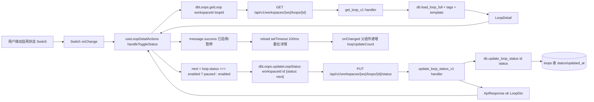
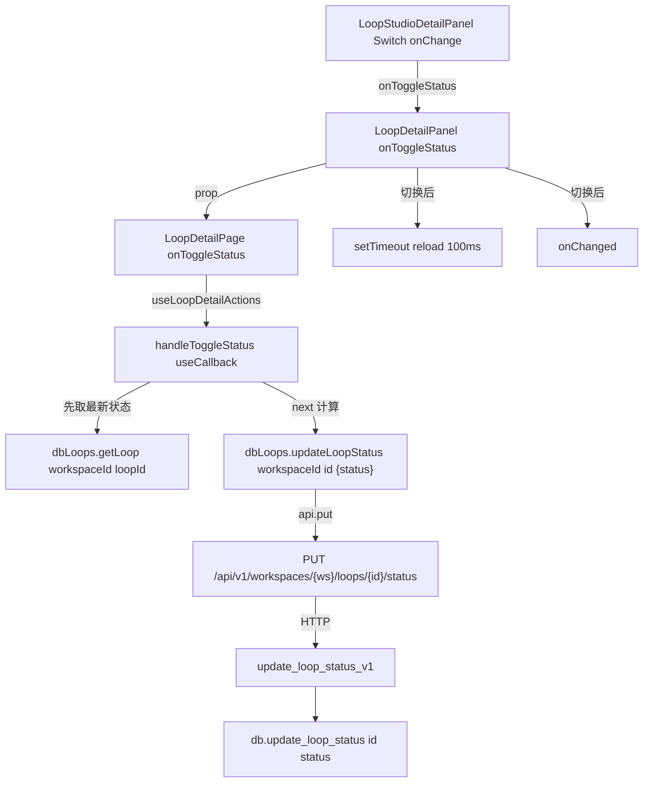
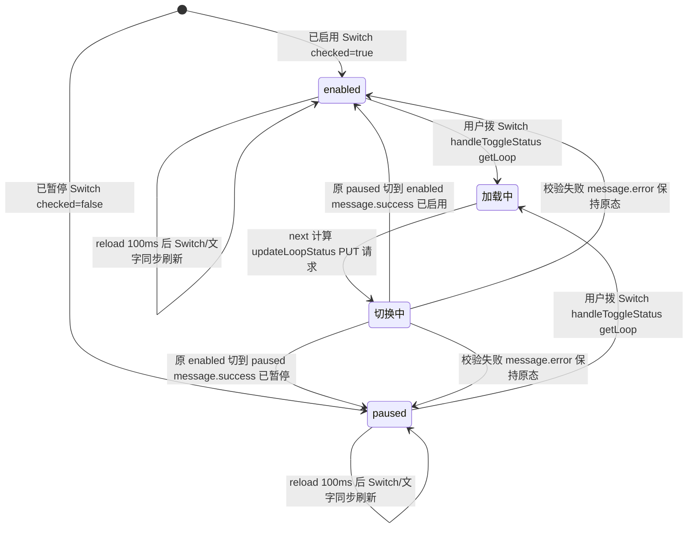

# 启停切换

## 功能位置

环路（详情） → `LoopDetailPanel` 基本信息 Section「启用状态」字段 → `Switch`（`checked` 绑定 `detail.status === 'enabled'`，`onChange` 触发切换）+ 状态文字（已启用/已暂停/草稿）。

## 数据流图（前端 → 后端）



## 调用关系链路图



## 数据结构图

```mermaid
classDiagram
  class LoopDetail {
    +id: number
    +status: string
  }
  class UseLoopDetailActionsArgs {
    +loopId: number
    +workspaceId: number | null
    +onLoopChanged(): void
  }
  class UpdateLoopStatusRequest {
    +status: LoopStatus | string
  }
  class LoopStatus {
    enabled: string
    paused: string
  }
  class loops::Model {
    +id: i64
    +status: String
    +updated_at: Option String
  }
  LoopDetail --> UpdateLoopStatusRequest : loop.status 决定 next
  UseLoopDetailActionsArgs --> UpdateLoopStatusRequest : 请求体
```

## 数据变更图



## 开发指导

- **前端入口**：`frontend/src/components/LoopStudioDetailPanel.tsx` 的 `LoopDetailPanel` 基本信息 Section「启用状态」`Switch`（`onChange` 内调 `onToggleStatus` + `setTimeout(reload, 100)` + `onChanged`），回调 `frontend/src/components/LoopDetailPage.tsx` 的 `useLoopDetailActions.handleToggleStatus`（在 `frontend/src/components/LoopDetailPageParts.tsx`）。
- **后端入口**：`backend/src/handlers/loop_.rs` 的 `update_loop_status_v1`（路由 `PUT /api/v1/workspaces/{ws}/loops/{id}/status`），先 `models::validate_loop_status` 校验枚举再 `workspace_guard::verify_loop_belongs_to_ws`，DAO `backend/src/db/loop_.rs` 的 `Database::update_loop_status`。
- **注意**：详情页切换前要先 `dbLoops.getLoop` 重取最新 `status` 再算 `next`（列表页是直接用行内 `loop.status`），避免详情页长时间停留后状态已过期导致翻转方向错；`setTimeout(reload, 100)` 让后端写入完成后再重拉详情，让 `Switch` 与状态文字同步刷新；`onChanged` 递增 `loopUpdateCount` 让列表页联动。
- **扩展**：要加新状态，需同步改 `backend/src/models/loop_.rs` 的 `validate_loop_status`、`frontend/src/types/loop.ts` 的 `LoopStatus`、`LoopStudioDetailPanel.tsx` 的状态文字判定（`enabled`/`paused`/草稿 三分支），以及 `LoopListViewParts.LOOP_STATUS_META` 的中文/颜色映射。
