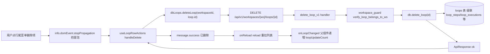
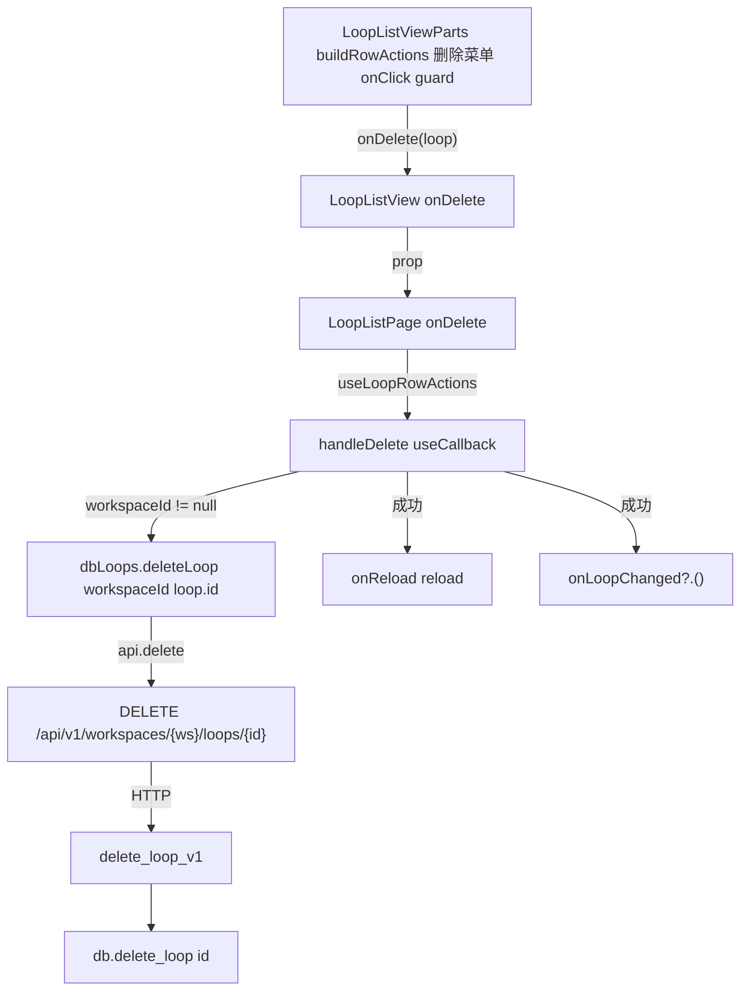
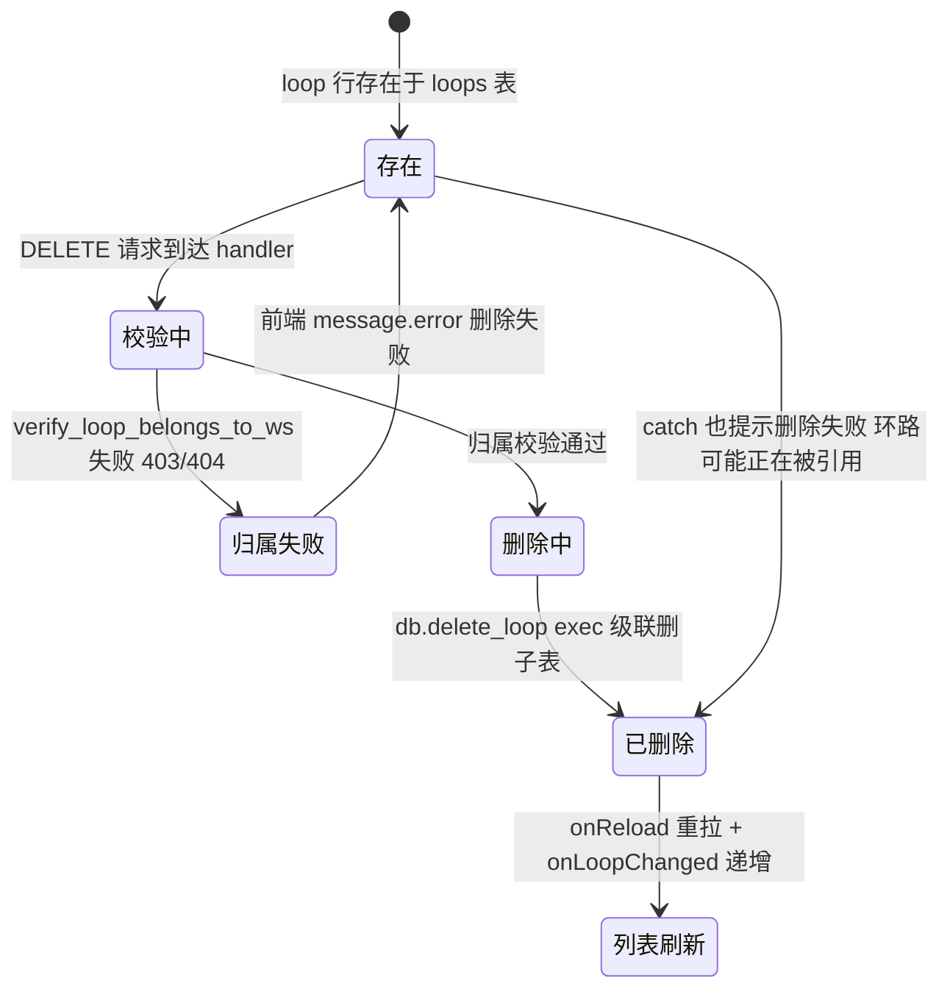

# 删除环路

## 功能位置

环路（列表） → `LoopListView` Table 行尾「操作」列 → `MoreOutlined` `Dropdown` 菜单「删除」项（`DeleteOutlined`，`danger: true`）。

## 数据流图（前端 → 后端）



## 调用关系链路图



## 数据结构图

```mermaid
classDiagram
  class LoopListItem {
    +id: number
    +name: string
    +status: string
  }
  class UseLoopRowActionsArgs {
    +workspaceId: number | null
    +onReload(): void
    +onLoopChanged?: () => void
  }
  class loops::Model {
    +id: i64
    +name: String
    +workspace_id: Option i64
    +status: String
  }
  class loop_steps::Model {
    +id: i64
    +loop_id: i64
  }
  class loop_executions::Model {
    +id: i64
    +loop_id: i64
  }
  loops::Model --> loop_steps::Model : Relation LoopSteps has_many
  loops::Model --> loop_executions::Model : Relation LoopExecutions has_many
```

## 数据变更图



## 开发指导

- **前端入口**：`frontend/src/components/loop-list/LoopListViewParts.tsx` 的 `buildRowActions`（删除菜单项，经 `guard` 包裹先 `domEvent.stopPropagation()` 挡冒泡再调 `onDelete`），回调 `frontend/src/components/loop-list/LoopListPageParts.tsx` 的 `useLoopRowActions.handleDelete`。
- **后端入口**：`backend/src/handlers/loop_.rs` 的 `delete_loop_v1`（路由 `DELETE /api/v1/workspaces/{ws}/loops/{id}`），DAO `backend/src/db/loop_.rs` 的 `Database::delete_loop`（`loops::Entity::delete_by_id`），靠 sea_orm Relation 的 `has_many` + DB 外键级联清 `loop_steps`/`loop_executions`/`loop_step_executions` 等子表。
- **注意**：菜单项必须先 `domEvent.stopPropagation()`——Dropdown 经 React Portal 渲染合成事件会沿组件树冒泡回表格行触发误跳详情；`workspaceId == null` 时 handleDelete 短路 return；catch 统一提示「删除失败，环路可能正在被引用」，不区分 403/500。
- **扩展**：要加批量删除，复用 `LoopListView` 顶部 `BatchButton`（`useBatchActions` 的 `loop` 模式）→ `dbLoops.batchDeleteLoops`（`POST .../loops/batch-delete`，handler `batch_delete_loops_v1` → `db.batch_delete_loops`），后端按 ids `is_in` 批删并级联。
