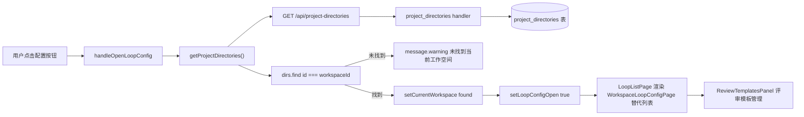
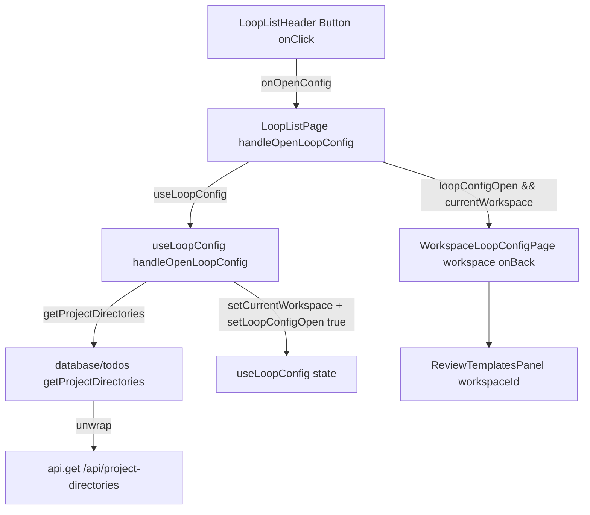
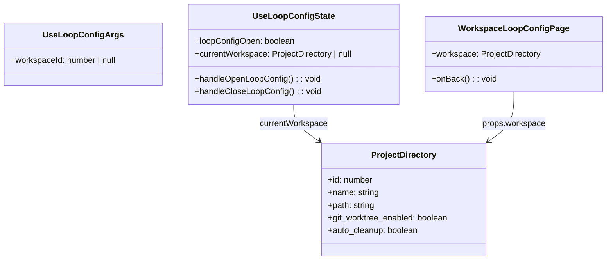
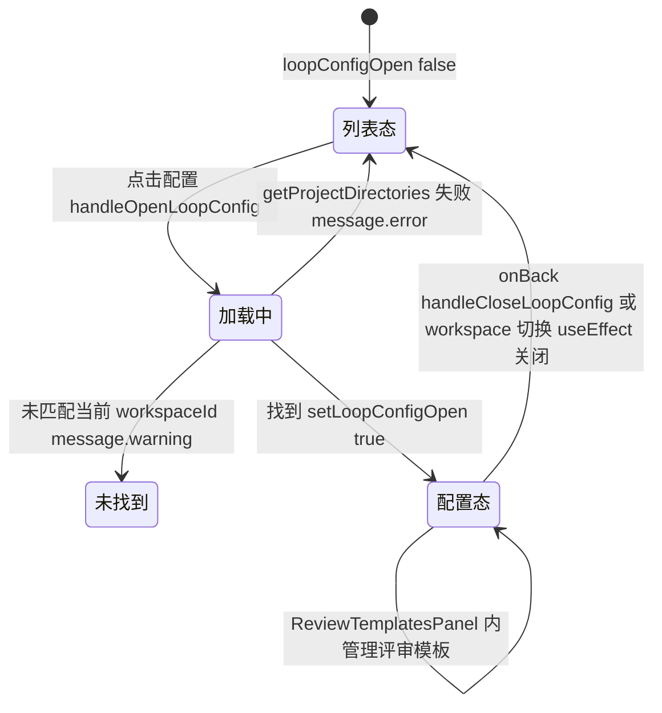

# 打开工作空间环路配置页

## 功能位置

环路（列表） → 顶部 `PageCard` 的 `extra` 区 → `LoopListHeader` 「配置」按钮（`Button` 带 `SettingOutlined`，`workspaceId == null` 时禁用）。

## 数据流图（前端 → 后端）

## 调用关系链路图

## 数据结构图

## 数据变更图

## 开发指导

- **前端入口**：`frontend/src/components/loop-list/LoopListPageParts.tsx` 的 `useLoopConfig` hook（`handleOpenLoopConfig`/`handleCloseLoopConfig`），渲染分支在 `frontend/src/components/loop-list/index.tsx` 的 `LoopListPage`（`if (loopConfigOpen && currentWorkspace) return <WorkspaceLoopConfigPage ...>`）。配置页本体在 `frontend/src/components/settings/workspace/WorkspaceLoopConfigPage.tsx`。
- **后端入口**：仅 `getProjectDirectories`（`GET /api/project-directories`）取工作空间目录，环路配置页本体是前端 `ReviewTemplatesPanel`（评审模板管理），不直接落环路后端接口。
- **注意**：`handleOpenLoopConfig` 在 `workspaceId == null` 时直接 return；工作空间切换时 `LoopListPage` 的 `useEffect([workspaceId, handleCloseLoopConfig])` 会自动关闭配置页回列表态；`handleCloseLoopConfig` 同步清 `currentWorkspace` 避免残留引用。
- **扩展**：要在配置页加环路相关设置，在 `WorkspaceLoopConfigPage` 内新增子面板，需要工作空间上下文时复用 `workspace.id`；`ReviewTemplatesPanel` 与环路「评审模板」概念在 044 后已解耦，保留是为了给工艺门禁制评审提供模板管理入口。
